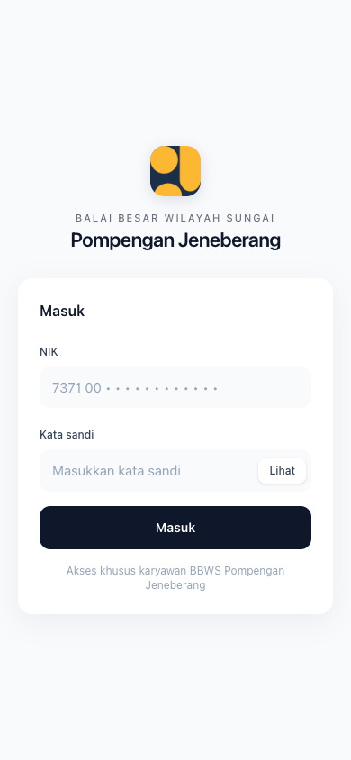
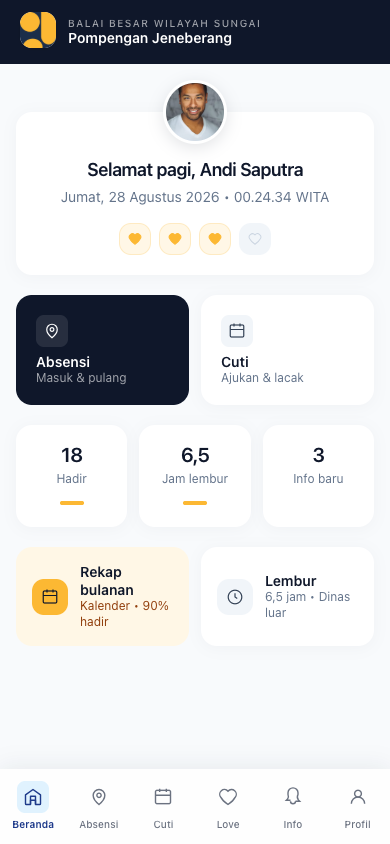
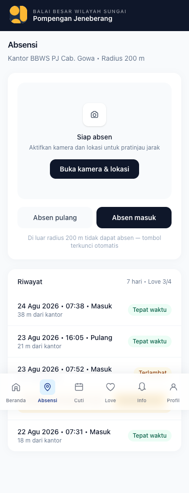
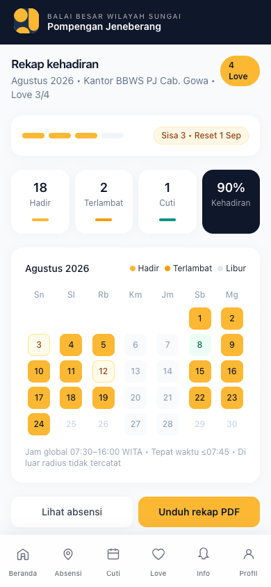
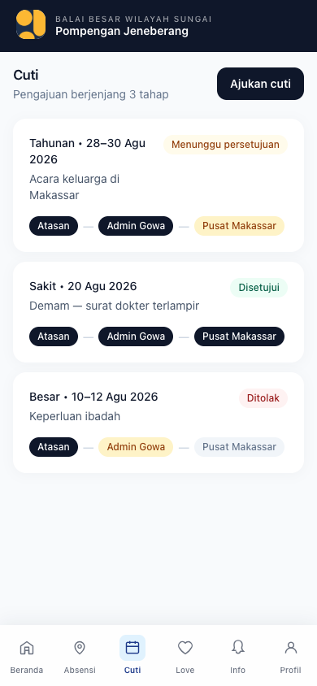
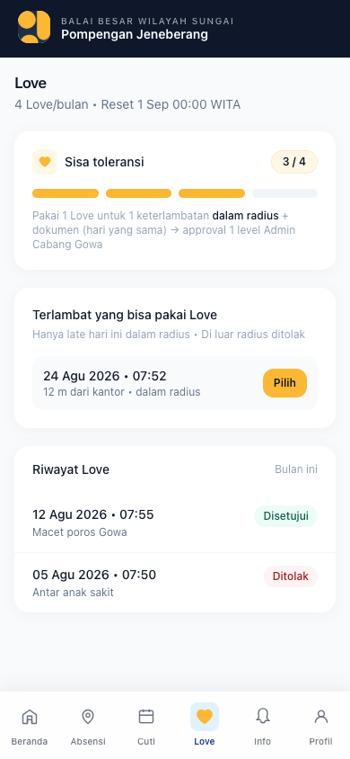
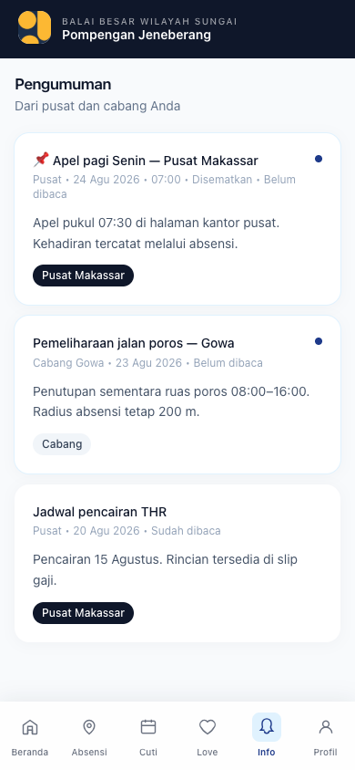
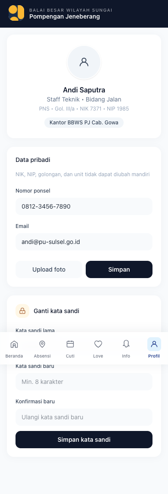

# BBWS Pompengan Jeneberang — Absensi PU

Aplikasi profil **Balai Besar Wilayah Sungai Pompengan Jeneberang** — pusat di **Makassar** + 24 Kantor Cabang Kabupaten/Kota se-Sulawesi Selatan — dengan portal HR multi-tenant dan **PWA Karyawan** (email login, absensi GPS+selfie radius, love system, cuti berjenjang, rekap, pengumuman).


> Stack terbaru per 24 Agu 2026: **Laravel 13 (PHP 8.4+) + React 19 + Inertia v2 + Tailwind v4 + Vite 7/8 + MySQL 8.4 LTS + AWS S3 + Sanctum 4.x + PWA** — Ubuntu 24.04, Node 22.

---

## Fitur

### Admin (RBAC + Region)
- **Super Admin Pusat Makassar**: CRUD 24 Kantor (lokasi lat/lng via map picker + radius 50–1000m), kelola Admin Cabang, jam kerja global (07:30–16:00 WITA, toleransi 15m, Senin–Jumat) + love_max, broadcast pengumuman, semua data.
- **Admin Cabang (per Kabupaten/Kota)**: CRUD karyawan Lengkap HR own region (NIK 16, NIP, golongan, jabatan, unit, status PNS/PPPK/Kontrak/Honorer, foto S3) — read all, write own; edit lokasi & radius kantornya sendiri; approve cuti level 2 + **approve Love 1 level**; kirim pengumuman wilayah.

### Karyawan — PWA Mobile-First (320px+, #FCB833)
1. **Login Email** — email + password, rate limit 5/15 menit per email+IP, Sanctum multi-guard.
2. **Dashboard** — foto overlap (Unsplash), sapaan dinamis pagi/siang/malam + live `Jumat, 28 Agu 2026 • 14:23:45 WITA`, 4 Love gold `#FCB833` (tanpa angka), stats hadir/info, rekap card.
3. **Absensi GPS+Selfie** — dalam radius kantor (di luar radius **ditolak 422**, tidak tercatat, tidak bisa pakai Love), selfie S3 `/attendance/...`, status `on_time/late/early_leave`, tombol terkunci di luar radius (1–3 lokasi per wilayah, radius fleksibel).
4. **Love — 4 Hati/Bulan** — reset `1st 00:00 WITA`, total fleksibel Super Admin (1–10, default 4), **pakai 1 Love untuk 1 late dalam radius** + dokumen/alasan → approval 1 level Admin Wilayah, hanya **bulan yang sama** (hari beda boleh), sisa `3/4` dot gold.
5. **Rekap Bulanan** — kalender 30 hari (gold hadir), ringkasan hadir/terlambat/cuti, 90% kehadiran.
6. **Cuti Berjenjang** — ajukan (jenis, tgl, alasan, dokumen) → Atasan → Admin Wilayah → Pusat Makassar.
7. **Pengumuman** — inbox global (Pusat) + region (Wilayah), pinned, unread dot, mark read.
8. **Profil** — view Lengkap HR, upload foto (preview), ganti kata sandi — frontend only.

Tanpa **slip gaji** (dihapus) dan tanpa `out_of_range` (di luar radius ditolak).

---

## Tech Stack

| Layer | Teknologi | Catatan |
| :--- | :--- | :--- |
| Backend | Laravel 13 (PHP 8.4+) | Sanctum 4.x multi-guard (admin/karyawan), Eloquent, Vite 7/8 |
| Frontend | React 19 + Inertia v2 | Vite, Tailwind v4 Oxide, PWA `vite-plugin-pwa` |
| Styling | Tailwind v4 | Theme gold `#FCB833`, navy `#0F172A`, Inter font |
| DB | MySQL 8.4 LTS / 9.x | Prisma schema source, region-scoped `region_id`, love tables |
| Storage | AWS S3 | Media, selfie `/attendance/...`, dokumen `/love-claims/...`, `/leaves/...` |
| Auth | Sanctum 4.x | Session HttpOnly, CSRF, rate limiting, region middleware |
| PWA | Workbox | `manifest.json`, `sw.js`, offline queue, VAPID push ready |
| Hosting | VPS Ubuntu 24.04 | Nginx, PHP-FPM 8.4, Node 22, Redis 7, Let's Encrypt |

---

## Screenshots — PWA Karyawan (Playwright, 390×844 mobile)

> Semua halaman sudah build `public/build` dan jalan di `http://127.0.0.1:8000/karyawan/*`

| Halaman | Preview |
| :--- | :--- |
| Login |  |
| Dashboard |  |
| Absensi |  |
| Rekap |  |
| Cuti |  |
| Love |  |
| Pengumuman |  |
| Profil |  |

*Logo kotak rounded navy/gold `#FCB833` — `app/public/logo.png`*

---

## Quick Start

```bash
# 1. Clone
git clone https://github.com/radacore/absensi-pu.git
cd absensi-pu/app

# 2. Env & deps
cp .env.example .env
composer install
npm install

# 3. Key & DB
php artisan key:generate
touch database/database.sqlite
php artisan migrate --force

# 4. Build & serve
npm run build
php artisan serve --host=0.0.0.0 --port=8000
# Buka http://127.0.0.1:8000/karyawan/login
```

Dev HMR (opsional, butuh vite dev):
```bash
npm run dev # http://127.0.0.1:5173 (PWA devOptions disabled, pakai build untuk PWA)
```

Global settings (Super Admin):
```env
APP_NAME="BBWS Pompengan Jeneberang"
ADMIN_PATH=/dashboard-admin-<hash>
KARYAWAN_PATH=/karyawan-<hash>
VAPID_PUBLIC_KEY=
VAPID_PRIVATE_KEY=
ATTENDANCE_STRICT_GEOFENCE=false
```

Seed 24 Kantor (Makassar pusat + 21 Kab + 2 Kota) + geofence via `database/seeders` atau input manual di `Kelola Kantor`.

---

## Struktur

```
sul proyek/
├── prd-profilkorp/        # 9 dokumen PRD (PRD, REQUIREMENTS, ARCHITECTURE, DATABASE, API, DESIGN_SYSTEM, ROADMAP, USER_FLOW, DEPLOYMENT)
│   └── BBWS Pompengan Jeneberang — FR-22 s/d FR-32 (tanpa publik & slip gaji, Love 4/bulan sebulan)
└── app/                   # Laravel 13 + React 19 PWA
    ├── resources/js/Pages/Karyawan/  # Login, Dashboard, Absensi, Rekap, Cuti, Love, Pengumuman, Profil
    ├── resources/js/Layouts/KaryawanLayout.jsx  # Header BBWS + bottom nav 5 tab (Love gold)
    ├── vite.config.js     # Tailwind v4 + React + PWA (gold #FCB833)
    ├── public/logo.png    # Logo kotak rounded navy/gold
    └── public/screenshots/ # Playwright screenshots (8 halaman)
```

---

## Dokumen

Semua PRD sudah sinkron BBWS Pompengan Jeneberang + Love + hari yang sama window + tanpa out_of_range:

- `prd-profilkorp/PRD.md` — FR-01 s/d FR-31
- `prd-profilkorp/DATABASE.md` — love_balances, love_claims, attendances status
- `prd-profilkorp/API.md` — POST /api/karyawan/love-claims (hari yang sama, dalam radius)
- `prd-profilkorp/ARCHITECTURE.md` — Love flow + reset cron 1st 00:00 WITA

---

## License

MIT
