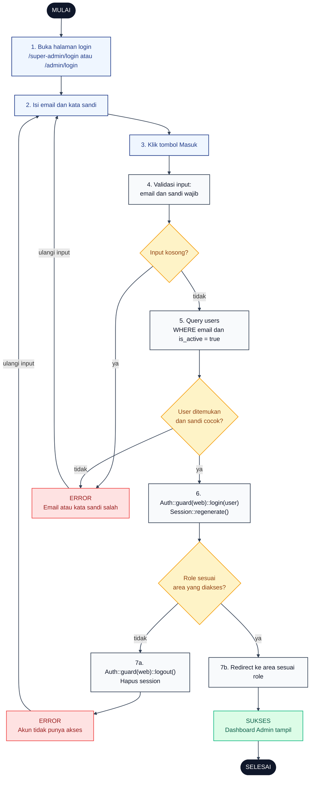

# 01 — Login Admin (Super Admin dan Admin Wilayah)

Alur autentikasi untuk akun admin. Rute `/super-admin/login` dan `/admin/login` sama-sama diproses oleh `AdminAuthController::store`, yang membedakan adalah role check setelah login sukses.

## Aktor
- **Admin** — Super Admin (role `super_admin`) atau Admin Wilayah (role `admin_wilayah`).
- **Sistem** — Laravel Auth guard `web` + `AdminAuthController`.

## Flowchart

## Legenda Warna Node

| Warna | Jenis |
|---|---|
| Hitam pekat | Start / End |
| Biru muda | Aksi Aktor (Admin) |
| Abu-abu putih | Proses Sistem |
| Kuning | Keputusan (kondisi if/else) |
| Merah muda | Jalur error |
| Hijau muda | Hasil sukses |

## Langkah-Langkah Detail

1. Admin membuka halaman `/super-admin/login` atau `/admin/login`.
2. Admin mengisi field email dan kata sandi.
3. Admin menekan tombol Masuk.
4. Sistem validasi bahwa email dan kata sandi terisi.
5. Sistem query tabel `users` dengan filter `email = ? AND is_active = true`.
6. Kalau ketemu dan `Hash::check` sandi cocok, `Auth::guard('web')->login($user)` + `session()->regenerate()`.
7. Sistem cek role user vs area yang diakses: `super_admin` untuk `/super-admin`, `admin_wilayah` untuk `/admin`. Kalau tidak cocok → logout paksa dan error.
8. Kalau semua lolos, redirect ke `/super-admin` atau `/admin` — dashboard tampil.

## Catatan implementasi
- `AdminAuthController::store` (`app/Http/Controllers/Auth/AdminAuthController.php`) memanggil `Auth::guard('web')->attempt($credentials + ['is_active' => true])` — akun nonaktif otomatis ditolak.
- Session regenerate untuk mitigasi session fixation.
- Role validasi ambil `$isSuper = str_starts_with($request->path(), 'super-admin')` lalu bandingkan dengan `$user->role`. Salah area → logout paksa dan lempar `ValidationException`.
- Toast error dirender oleh `ToastHost` global yang membaca `errors` dari Inertia shared props.
