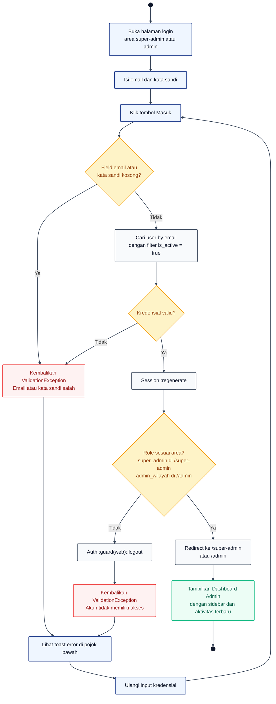

# 01 — Login Admin (Super Admin dan Admin Wilayah)

Alur autentikasi untuk akun admin. Rute `/super-admin/login` dan `/admin/login` sama-sama diproses oleh `AdminAuthController::store`, yang membedakan adalah role check setelah login sukses.

## Aktor
- **Admin** — Super Admin (role `super_admin`) atau Admin Wilayah (role `admin_wilayah`).
- **Sistem** — Laravel Auth guard `web` + `AdminAuthController`.

## Activity Diagram

## Legenda

| Warna | Jenis |
|---|---|
| Navy (bulat pekat) | Start / End |
| Biru muda | Aksi Aktor (Admin) |
| Abu-abu | Aksi Sistem |
| Kuning | Keputusan (kondisi) |
| Merah | Error / kegagalan |
| Hijau | Sukses / hasil akhir |

## Catatan implementasi
- `AdminAuthController::store` (`app/Http/Controllers/Auth/AdminAuthController.php`) memanggil `Auth::guard('web')->attempt($credentials + ['is_active' => true])` — akun nonaktif otomatis ditolak.
- Session regenerate untuk mitigasi session fixation.
- Role validasi ambil `$isSuper = str_starts_with($request->path(), 'super-admin')` lalu bandingkan dengan `$user->role`. Salah area, logout paksa dan lempar `ValidationException`.
- Toast error dirender oleh `ToastHost` global yang membaca `errors` dari Inertia shared props.
