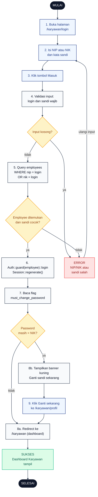

# 02 — Login Karyawan

Karyawan login memakai **NIP atau NIK** sebagai identifier. Rute `/karyawan/login` diproses `EmployeeAuthController::store` dengan guard `employee`. Kalau password masih sama dengan NIK, karyawan diarahkan untuk ganti password.

## Aktor
- **Karyawan** — pegawai dengan akun di tabel `employees`.
- **Sistem** — Laravel Auth guard `employee` + `EmployeeAuthController`.

## Flowchart

## Legenda Warna Node

| Warna | Jenis |
|---|---|
| Hitam pekat | Start / End |
| Biru muda | Aksi Aktor (Karyawan) |
| Abu-abu putih | Proses Sistem |
| Kuning | Keputusan (kondisi if/else) |
| Merah muda | Jalur error |
| Hijau muda | Hasil sukses |

## Langkah-Langkah Detail

1. Karyawan membuka halaman `/karyawan/login`.
2. Karyawan mengisi field NIP atau NIK dan kata sandi.
3. Karyawan menekan tombol Masuk.
4. Sistem validasi input `login` dan `password` wajib terisi.
5. Sistem query tabel `employees` dengan `Employee::where('nip', $login)->orWhere('nik', $login)->first()`.
6. Kalau employee ketemu dan `Hash::check` sandi cocok, `Auth::guard('employee')->login($employee)` + `session()->regenerate()`.
7. Sistem baca flag `employee.must_change_password` dan bagikan lewat shared prop `auth.employee`.
8. Kalau password masih sama dengan NIK, banner kuning tampil di dashboard; kalau tidak, langsung redirect ke `/karyawan`.
9. Karyawan klik tombol "Ganti sekarang" untuk masuk ke `/karyawan/profil` dan mengganti password.

## Catatan implementasi
- `EmployeeAuthController::store` (`app/Http/Controllers/Auth/EmployeeAuthController.php`) menerima input `login` yang bisa NIP atau NIK.
- Password di-hash bcrypt via cast `'password' => 'hashed'` di model `Employee`.
- `HandleInertiaRequests::share` mengekspor `auth.employee.must_change_password` untuk mendeteksi apakah karyawan perlu ganti password. Detail alur banner ada di [`18-ganti-password-karyawan.md`](./18-ganti-password-karyawan.md).
- Toast error dirender oleh `ToastHost` global yang membaca `errors` dari Inertia shared props.
