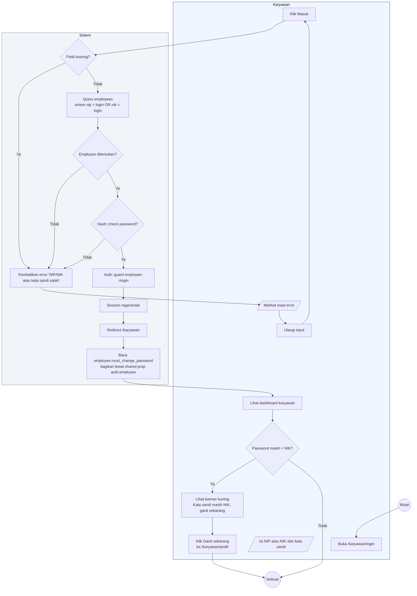

# 02 — Login Karyawan

Karyawan login memakai **NIP atau NIK** sebagai identifier dan kata sandi. Rute `/karyawan/login` diproses `EmployeeAuthController::store` dengan guard `employee`.

## Aktor
- **Karyawan** — pegawai dengan akun di tabel `employees`.
- **Sistem** — Laravel Auth guard `employee` + `EmployeeAuthController`.

## Alur

## Catatan implementasi
- `EmployeeAuthController::store` (`app/Http/Controllers/Auth/EmployeeAuthController.php`) menerima input `login` yang bisa NIP atau NIK: `Employee::where('nip', $login)->orWhere('nik', $login)->first()`.
- Password di-hash bcrypt via cast `'password' => 'hashed'` di model `Employee`.
- `HandleInertiaRequests::share` mengekspor `auth.employee.must_change_password` untuk mendeteksi apakah karyawan perlu ganti password. Detail alur banner ada di [`18-ganti-password-karyawan.md`](./18-ganti-password-karyawan.md).
