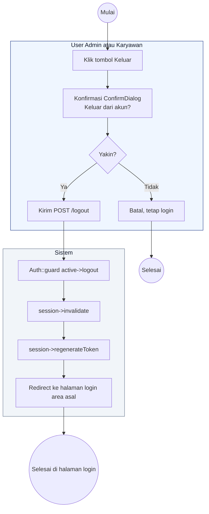

# 03 — Logout

Alur keluar untuk semua peran (Admin, Super Admin, Karyawan). Rute `/super-admin/logout`, `/admin/logout`, `/wilayah/logout` diproses `AdminAuthController::destroy`, dan `/karyawan/logout` diproses `EmployeeAuthController::destroy`.

## Aktor
- **User** — siapa pun yang login.
- **Sistem** — Laravel Auth + kontroler auth masing-masing.

## Alur

## Catatan implementasi
- Karyawan `Profil.jsx` dan Admin `AdminLayout.jsx` sama-sama pakai `useConfirm({ tone: 'danger' })` sebelum POST ke rute logout, konsisten dengan aturan konfirmasi untuk aksi destructive.
- Session invalidate mencegah reuse cookie lama, `regenerateToken` bikin CSRF token baru.
