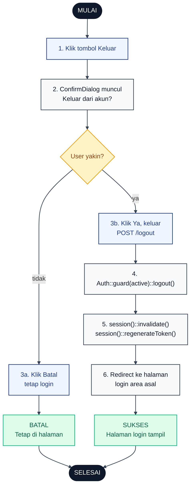

# 03 — Logout

Alur keluar untuk semua peran (Super Admin, Admin Wilayah, Karyawan). Ada ConfirmDialog tone danger sebelum request dikirim. Rute `/super-admin/logout`, `/admin/logout`, `/wilayah/logout` diproses `AdminAuthController::destroy`, dan `/karyawan/logout` diproses `EmployeeAuthController::destroy`.

## Aktor
- **User** — siapa pun yang sedang login (Admin atau Karyawan).
- **Sistem** — Laravel Auth + kontroler auth masing-masing area.

## Flowchart

## Legenda Warna Node

| Warna | Jenis |
|---|---|
| Hitam pekat | Start / End |
| Biru muda | Aksi Aktor (User) |
| Abu-abu putih | Proses Sistem |
| Kuning | Keputusan (kondisi if/else) |
| Merah muda | Jalur error |
| Hijau muda | Hasil (sukses atau batal) |

## Langkah-Langkah Detail

1. User klik tombol Keluar di header atau menu profil.
2. Sistem menampilkan `ConfirmDialog` dengan tone danger dan pesan "Keluar dari akun?".
3. User memilih:
   - **3a.** Klik Batal → dialog ditutup, user tetap login.
   - **3b.** Klik Ya → form POST ke endpoint logout area terkait dikirim.
4. Controller memanggil `Auth::guard($active)->logout()` sesuai guard (`web` untuk admin, `employee` untuk karyawan).
5. Sistem invalidate session dan regenerate CSRF token.
6. Sistem redirect user ke halaman login area asal (`/super-admin/login`, `/admin/login`, atau `/karyawan/login`).

## Catatan implementasi
- Karyawan `Profil.jsx` dan Admin `AdminLayout.jsx` sama-sama pakai `useConfirm({ tone: 'danger' })` sebelum POST ke rute logout — konsisten dengan aturan konfirmasi untuk aksi destructive.
- `session()->invalidate()` mencegah reuse cookie lama, `regenerateToken()` bikin CSRF token baru sebagai mitigasi session fixation.
- Guard aktif dideteksi otomatis dari controller: `AdminAuthController::destroy` untuk web, `EmployeeAuthController::destroy` untuk employee.
