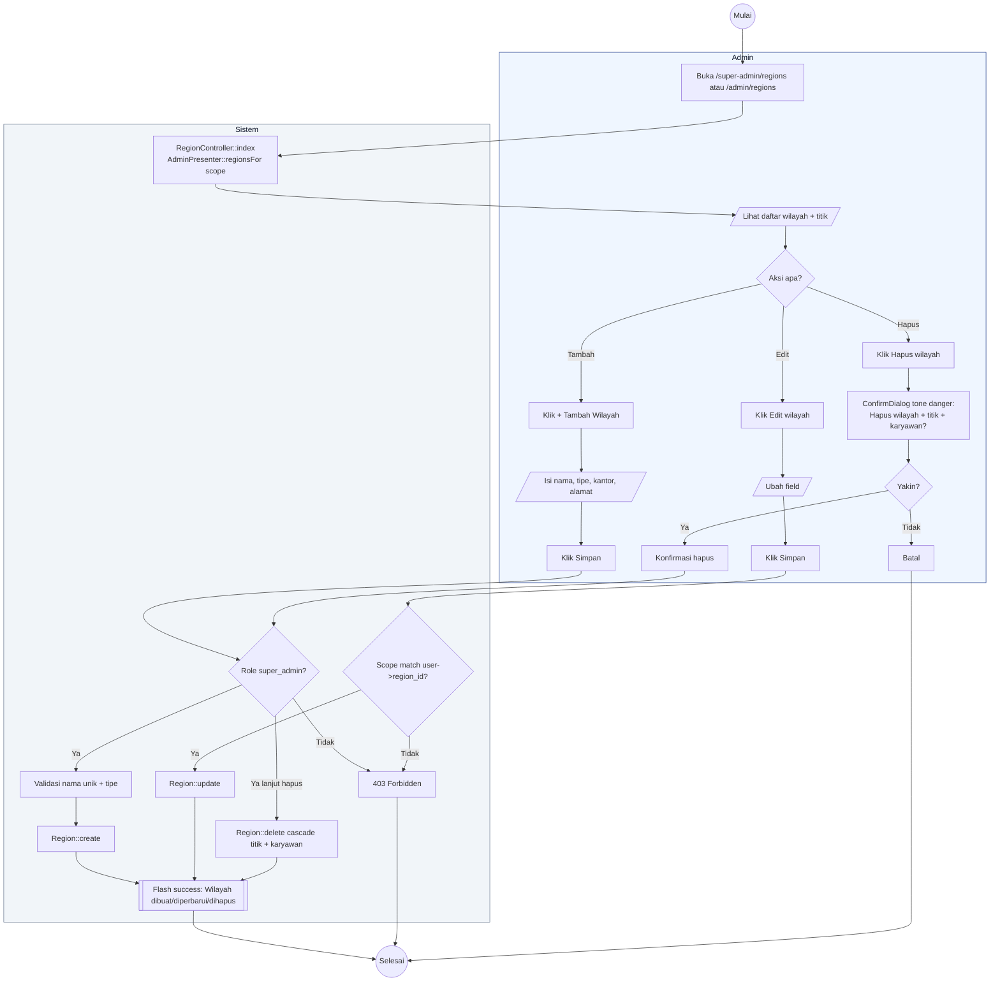

# 04 — Regions CRUD (Kantor Wilayah)

Alur Super Admin mengelola 24 kantor wilayah. Admin Wilayah hanya bisa lihat dan edit wilayahnya sendiri.

## Aktor
- **Super Admin** — akses penuh ke 24 wilayah.
- **Admin Wilayah** — hanya bisa update wilayah sendiri (`region_id == user->region_id`).
- **Sistem** — `Admin\RegionController` + `AdminPresenter::regionsFor($scope)`.

## Alur

## Catatan implementasi
- Store, update, delete route hanya diberikan ke Super Admin di `Admin/RegionController` via cek `$this->scopeRegion()`.
- Admin Wilayah tetap bisa GET `/admin/regions` untuk lihat wilayahnya via presenter yang di-scope.
- Cascade delete: menghapus wilayah otomatis menghapus semua titik dan karyawan di wilayah tersebut (foreign key `onDelete cascade`).
