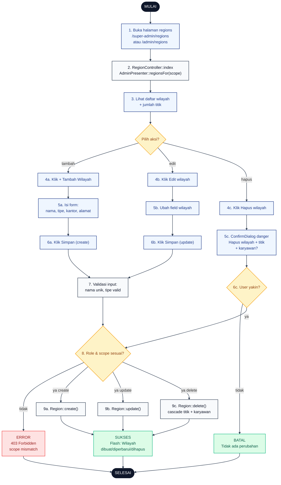

# 04 — Regions CRUD (Kantor Wilayah)

Alur Super Admin mengelola 24 kantor wilayah. Admin Wilayah hanya bisa lihat dan edit wilayahnya sendiri (scoped ke `region_id`).

## Aktor
- **Super Admin** — akses penuh ke 24 wilayah (create, update, delete).
- **Admin Wilayah** — hanya bisa lihat dan update wilayah sendiri.
- **Sistem** — `Admin\RegionController` + `AdminPresenter::regionsFor($scope)`.

## Flowchart

## Legenda Warna Node

| Warna | Jenis |
|---|---|
| Hitam pekat | Start / End |
| Biru muda | Aksi Aktor (Admin) |
| Abu-abu putih | Proses Sistem |
| Kuning | Keputusan (kondisi if/else) |
| Merah muda | Jalur error |
| Hijau muda | Hasil sukses / batal |

## Langkah-Langkah Detail

1. Admin membuka halaman daftar wilayah.
2. `RegionController::index` memanggil `AdminPresenter::regionsFor($scope)` — scope null untuk Super Admin, `region_id` untuk Admin Wilayah.
3. Admin melihat daftar wilayah dengan ringkasan jumlah titik proyek per wilayah.
4. Admin memilih salah satu aksi:
   - **4a.** Tambah wilayah (khusus Super Admin).
   - **4b.** Edit wilayah.
   - **4c.** Hapus wilayah (khusus Super Admin).
5. Admin mengisi form atau melihat konfirmasi:
   - **5a.** Form create: nama, tipe (`kanwil`/`unit`), kantor pusat, alamat.
   - **5b.** Form edit dengan field yang sudah terisi.
   - **5c.** `ConfirmDialog` tone danger yang menjelaskan efek cascade.
6. Admin submit atau konfirmasi aksi.
7. Sistem validasi payload (nama unik, tipe valid).
8. Sistem cek otorisasi: create/delete butuh `role = super_admin`; update butuh `scope == user->region_id` atau Super Admin.
9. Sistem eksekusi CRUD sesuai aksi. Delete cascade otomatis menghapus titik dan karyawan di wilayah tersebut.

## Catatan implementasi
- `Admin/RegionController` (`app/Http/Controllers/Admin/RegionController.php`) memakai `$this->scopeRegion()` untuk membedakan akses Super Admin vs Admin Wilayah.
- Admin Wilayah tetap bisa GET `/admin/regions` untuk melihat wilayahnya via presenter yang di-scope.
- Cascade delete: menghapus wilayah otomatis menghapus semua titik (`sites`) dan karyawan (`employees`) di wilayah tersebut lewat foreign key `onDelete cascade`.
- Route store, update, dan delete hanya terdaftar di grup Super Admin.
