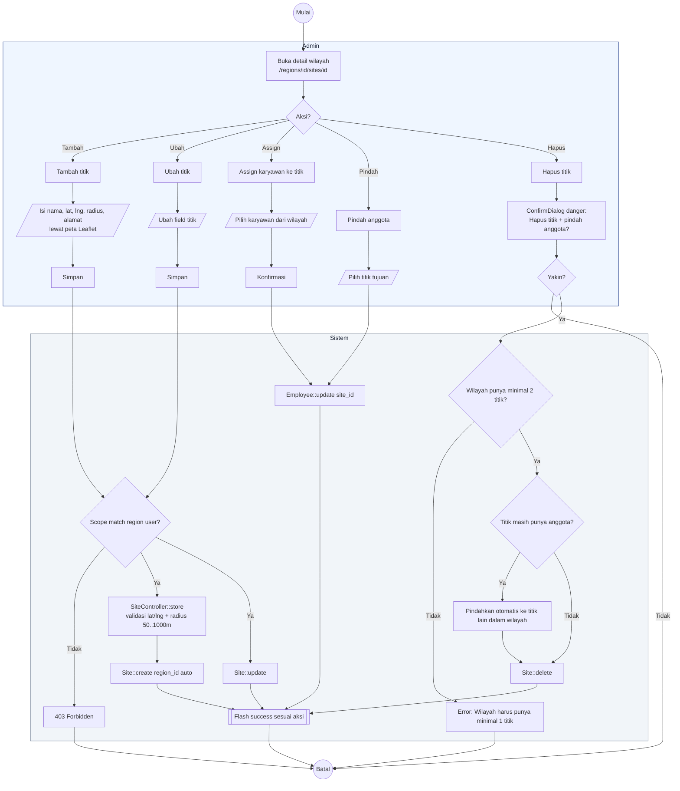

# 05 — Sites CRUD (Titik Proyek)

Alur kelola titik proyek per wilayah. Setiap titik punya koordinat lat/lng dan `radius_m` untuk verifikasi absensi.

## Aktor
- **Super Admin** — kelola titik semua wilayah.
- **Admin Wilayah** — kelola titik di wilayahnya saja.
- **Sistem** — `Admin\SiteController`.

## Alur

## Catatan implementasi
- `SiteController::destroy` menjaga invariant "1 wilayah minimal 1 titik" dan otomatis memindahkan anggota titik terhapus ke titik lain dalam wilayah yang sama.
- `1 karyawan = 1 titik` — karyawan tidak boleh tanpa titik, pindah dilakukan via `SiteController::move` atau `assignEmployees`.
- Radius validasi 50–1000 meter agar realistis untuk area kantor/bendungan.
