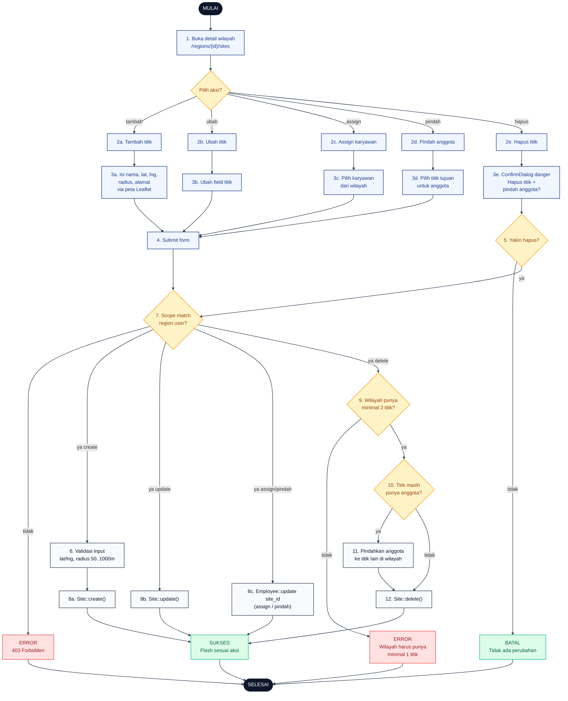

# 05 — Sites CRUD (Titik Proyek)

Alur kelola titik proyek per wilayah. Setiap titik punya koordinat lat/lng dan `radius_m` (50–1000m) untuk verifikasi absensi. Sistem menjaga invariant: **1 wilayah minimal 1 titik**, dan **1 karyawan = 1 titik**.

## Aktor
- **Super Admin** — kelola titik semua wilayah.
- **Admin Wilayah** — kelola titik di wilayahnya saja.
- **Sistem** — `Admin\SiteController`.

## Flowchart

## Legenda Warna Node

| Warna | Jenis |
|---|---|
| Hitam pekat | Start / End |
| Biru muda | Aksi Aktor (Admin) |
| Abu-abu putih | Proses Sistem |
| Kuning | Keputusan (kondisi if/else) |
| Merah muda | Jalur error |
| Hijau muda | Hasil sukses / batal |

## Langkah-Langkah Detail

1. Admin membuka halaman detail wilayah `/super-admin/regions/{id}/sites` atau `/admin/regions/{id}/sites`.
2. Admin memilih salah satu aksi:
   - **2a.** Tambah titik baru.
   - **2b.** Ubah titik existing.
   - **2c.** Assign karyawan ke titik.
   - **2d.** Pindah anggota ke titik lain di wilayah yang sama.
   - **2e.** Hapus titik.
3. Admin mengisi form sesuai aksi (koordinat via peta Leaflet untuk create/update titik).
4. Admin submit form.
5. Khusus aksi hapus: `ConfirmDialog` tone danger meminta konfirmasi karena akan memicu pemindahan anggota.
6. Sistem validasi payload — koordinat valid, `radius_m` antara 50–1000 meter.
7. Sistem cek scope wilayah: Admin Wilayah wajib `region_id == user->region_id`.
8. Sistem eksekusi aksi CRUD:
   - **8a.** `Site::create()` dengan `region_id` diisi otomatis dari route.
   - **8b.** `Site::update()`.
   - **8c.** `Employee::update(site_id)` untuk assign/pindah.
9. Khusus delete: cek invariant — wilayah harus tetap punya minimal 1 titik setelah delete (butuh minimal 2 titik sebelum delete).
10. Cek apakah titik yang akan dihapus masih punya anggota.
11. Kalau ada anggota, sistem otomatis memindahkan mereka ke titik lain dalam wilayah yang sama.
12. `Site::delete()` dieksekusi.

## Catatan implementasi
- `SiteController::destroy` (`app/Http/Controllers/Admin/SiteController.php`) menjaga invariant "1 wilayah minimal 1 titik" dan otomatis memindahkan anggota titik terhapus ke titik lain dalam wilayah.
- Aturan **1 karyawan = 1 titik** — karyawan tidak boleh tanpa titik. Pemindahan dilakukan via `SiteController::move` atau `SiteController::assignEmployees`.
- Radius 50–1000 meter dipilih agar realistis untuk area kantor/bendungan.
- Peta Leaflet dipakai untuk pilih koordinat, disimpan sebagai `latitude` + `longitude` decimal.
