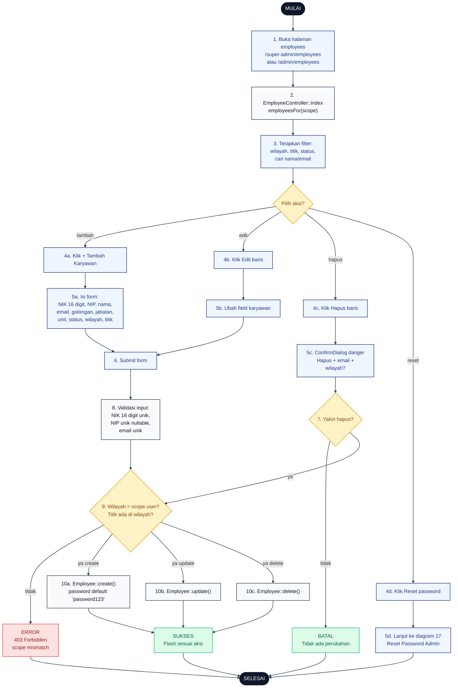

# 06 — Employees CRUD (Karyawan)

Alur Admin mengelola data karyawan. Setiap karyawan **wajib** punya `region_id` dan `site_id` (1 karyawan = 1 titik). Password default `password123` untuk karyawan baru.

## Aktor
- **Super Admin** — CRUD karyawan semua wilayah.
- **Admin Wilayah** — CRUD karyawan di wilayahnya saja.
- **Sistem** — `Admin\EmployeeController` + `AdminPresenter::employeesFor($scope)`.

## Flowchart

## Legenda Warna Node

| Warna | Jenis |
|---|---|
| Hitam pekat | Start / End |
| Biru muda | Aksi Aktor (Admin) |
| Abu-abu putih | Proses Sistem |
| Kuning | Keputusan (kondisi if/else) |
| Merah muda | Jalur error |
| Hijau muda | Hasil sukses / batal |

## Langkah-Langkah Detail

1. Admin membuka halaman daftar karyawan.
2. `EmployeeController::index` memanggil `AdminPresenter::employeesFor($scope)` — Admin Wilayah otomatis di-scope ke `region_id` sendiri.
3. Admin bisa memfilter berdasarkan wilayah, titik proyek, status kepegawaian, atau cari nama/email.
4. Admin memilih salah satu aksi:
   - **4a.** Tambah karyawan baru.
   - **4b.** Edit karyawan existing.
   - **4c.** Hapus karyawan.
   - **4d.** Reset password ke NIK (lanjut ke diagram 17).
5. Admin mengisi form atau melihat konfirmasi sesuai aksi:
   - **5a.** Form create dengan semua field wajib (NIK, NIP, nama, email, golongan, jabatan, unit, status, wilayah, titik). Field `foto_url` opsional.
   - **5b.** Form edit dengan field yang sudah terisi.
   - **5c.** `ConfirmDialog` tone danger menampilkan nama + email + wilayah karyawan.
   - **5d.** Redirect ke alur diagram 17.
6. Admin submit form.
7. Khusus hapus: tunggu konfirmasi user.
8. Sistem validasi: NIK harus 16 digit unik, NIP unik nullable, email unik.
9. Sistem cek otorisasi: wilayah target harus sesuai scope user, dan titik yang dipilih harus berada di wilayah tersebut.
10. Sistem eksekusi CRUD:
    - **10a.** `Employee::create()` dengan password default `password123` (bcrypt).
    - **10b.** `Employee::update()`.
    - **10c.** `Employee::delete()`.

## Catatan implementasi
- Karyawan baru mendapatkan password default `password123`. Admin bisa langsung reset ke NIK via tombol Reset — lihat [`17-reset-password-admin.md`](./17-reset-password-admin.md).
- Filter di halaman: wilayah, titik proyek, status kepegawaian, cari nama/email.
- Field `foto_url` opsional; kalau tidak ada, UI pakai avatar default.
- Admin Wilayah hanya lihat karyawan di wilayahnya (lewat `AdminPresenter::employeesFor($user->region_id)`).
- Validasi titik: sistem memastikan `site_id` yang dipilih benar-benar berada di `region_id` target.
