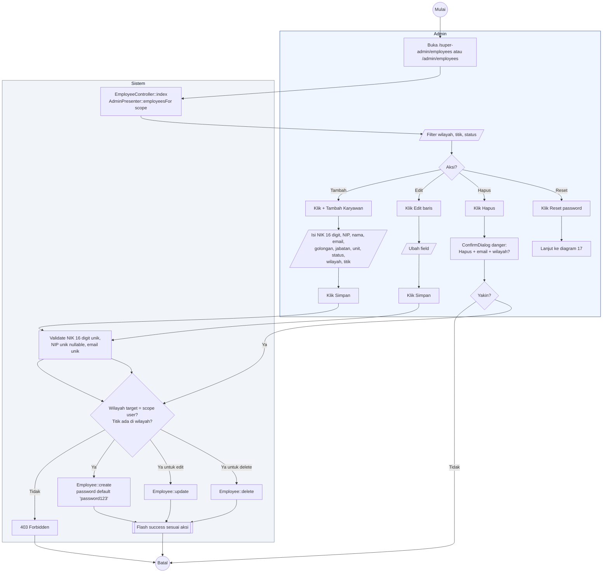

# 06 — Employees CRUD (Karyawan)

Alur Admin mengelola data karyawan. Setiap karyawan wajib punya `region_id` dan `site_id` (1 karyawan = 1 titik).

## Aktor
- **Super Admin** — CRUD karyawan semua wilayah.
- **Admin Wilayah** — CRUD karyawan di wilayahnya saja.
- **Sistem** — `Admin\EmployeeController`.

## Alur

## Catatan implementasi
- Karyawan baru mendapatkan password default `password123`. Admin bisa langsung reset ke NIK via tombol Reset — lihat [`17-reset-password-admin.md`](./17-reset-password-admin.md).
- Filter di halaman: wilayah, titik proyek, status kepegawaian, cari nama/email.
- Field `foto_url` opsional; kalau tidak ada, UI pakai avatar default.
- Admin Wilayah hanya lihat karyawan di wilayahnya (lewat `AdminPresenter::employeesFor(user->region_id)`).
