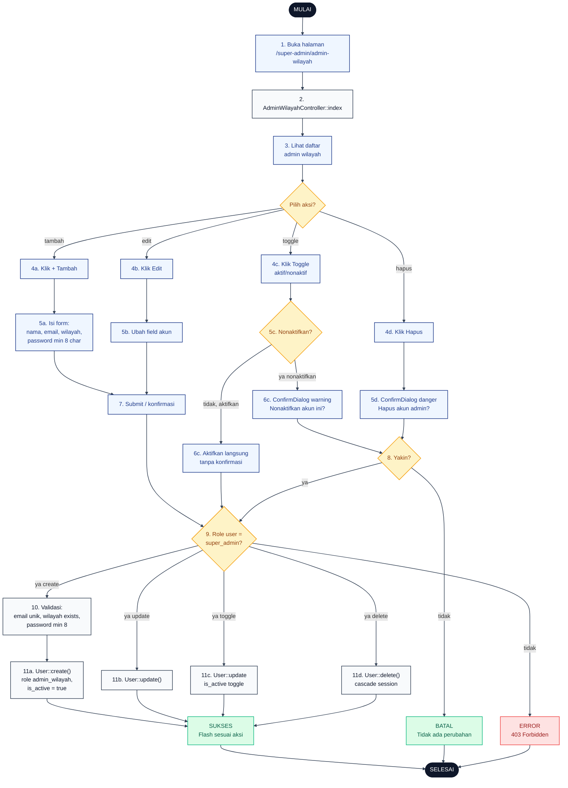

# 07 — Admin Wilayah CRUD

Alur Super Admin mengelola akun Admin Wilayah (role `admin_wilayah`). Fitur ini tidak tersedia untuk Admin Wilayah sendiri. Toggle aktif/nonaktif dipakai untuk enable/disable login tanpa hapus data.

## Aktor
- **Super Admin** — satu-satunya yang bisa CRUD akun admin wilayah.
- **Sistem** — `Admin\AdminWilayahController`.

## Flowchart

## Legenda Warna Node

| Warna | Jenis |
|---|---|
| Hitam pekat | Start / End |
| Biru muda | Aksi Aktor (Super Admin) |
| Abu-abu putih | Proses Sistem |
| Kuning | Keputusan (kondisi if/else) |
| Merah muda | Jalur error |
| Hijau muda | Hasil sukses / batal |

## Langkah-Langkah Detail

1. Super Admin membuka halaman `/super-admin/admin-wilayah`.
2. `AdminWilayahController::index` mengambil daftar user dengan role `admin_wilayah`.
3. Super Admin melihat daftar admin wilayah beserta status aktif dan wilayah yang dikelola.
4. Super Admin memilih salah satu aksi:
   - **4a.** Tambah admin wilayah baru.
   - **4b.** Edit data admin wilayah.
   - **4c.** Toggle status aktif/nonaktif.
   - **4d.** Hapus akun admin wilayah.
5. Super Admin mengisi form atau melihat konfirmasi:
   - **5a.** Form create: nama, email, wilayah, password (min 8 karakter).
   - **5b.** Form edit dengan field terisi.
   - **5c.** Cek arah toggle: menonaktifkan atau mengaktifkan.
   - **5d.** `ConfirmDialog` tone danger untuk hapus.
6. Untuk toggle: aksi menonaktifkan butuh `ConfirmDialog` warning; mengaktifkan langsung tanpa konfirmasi.
7. Super Admin submit atau klik Ya pada dialog.
8. Sistem cek konfirmasi user.
9. Sistem verifikasi role — semua aksi di controller ini butuh `role = super_admin`.
10. Sistem validasi payload — email unik di tabel `users`, `region_id` valid, password minimal 8 karakter (untuk create).
11. Sistem eksekusi aksi:
    - **11a.** `User::create()` dengan role `admin_wilayah` dan `is_active = true`.
    - **11b.** `User::update()`.
    - **11c.** `User::update(is_active)` toggle.
    - **11d.** `User::delete()` dengan cascade session (user logout otomatis kalau sedang login).

## Catatan implementasi
- Menu "Admin Wilayah" di sidebar hanya muncul untuk Super Admin (via flag `superOnly: true` di `AdminLayout.jsx` `menuDefs`).
- Admin nonaktif tidak bisa login karena guard `web` cek `is_active = true` di `AdminAuthController::store`.
- Toggle aktif/nonaktif hanya butuh `ConfirmDialog` saat menonaktifkan (aksi destructive terhadap akses); aktivasi langsung tanpa konfirmasi.
- Password disimpan bcrypt via cast `'password' => 'hashed'` di model `User`.
