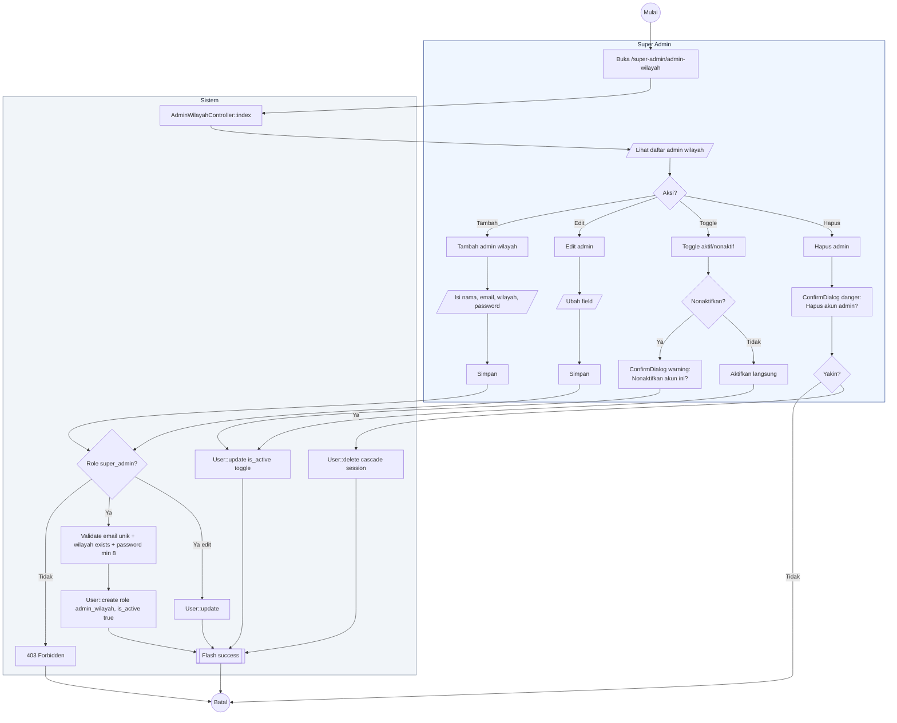

# 07 — Admin Wilayah CRUD

Alur Super Admin mengelola akun Admin Wilayah (role `admin_wilayah`). Tidak tersedia untuk Admin Wilayah sendiri.

## Aktor
- **Super Admin** — satu-satunya yang bisa CRUD akun admin wilayah.
- **Sistem** — `Admin\AdminWilayahController`.

## Alur

## Catatan implementasi
- Menu "Admin Wilayah" di sidebar hanya muncul untuk Super Admin (via `superOnly: true` di `AdminLayout.jsx` menuDefs).
- Admin nonaktif tidak bisa login karena guard `web` cek `is_active = true` di `AdminAuthController::store`.
- Toggle aktif/nonaktif hanya butuh ConfirmDialog saat menonaktifkan (aksi destructive); aktivasi langsung.
