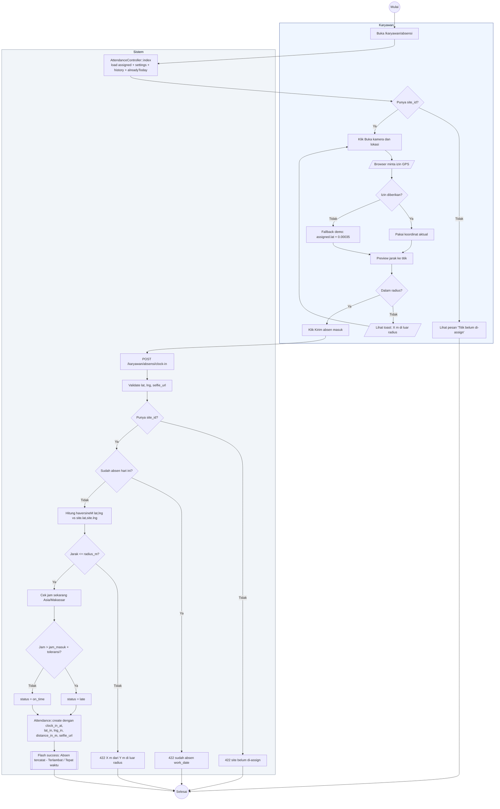

# 08 — Clock-In (Absen Masuk)

Alur karyawan absen masuk. Wajib berada dalam radius titik penugasan.

## Aktor
- **Karyawan** — akun aktif dengan `site_id`.
- **Sistem** — `Karyawan\AttendanceController::clockIn` + `AdminPresenter::haversineM`.

## Alur

## Catatan implementasi
- Haversine dihitung server-side di `AdminPresenter::haversineM` untuk konsistensi.
- Batas toleransi default 15 menit dari `AttendanceSetting::toleransi_late_menit`, dapat diubah oleh Super Admin.
- Kolom unik `[employee_id, work_date]` di migrasi mencegah double clock-in per hari.
- Selfie URL opsional; jika dikirim, disimpan sebagai path relatif.
