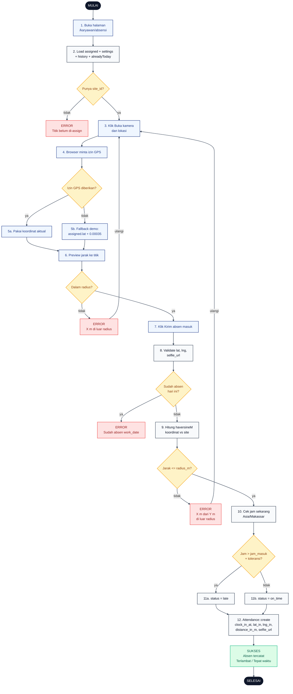

# 08 — Clock-In (Absen Masuk)

Alur karyawan absen masuk. Wajib berada dalam radius titik penugasan dan hanya boleh sekali per hari kerja.

## Aktor
- **Karyawan** — akun aktif dengan `site_id` yang sudah di-assign Admin.
- **Sistem** — `Karyawan\AttendanceController` (`index` + `clockIn`) dan helper `AdminPresenter::haversineM`.

## Flowchart

## Legenda Warna Node

| Warna | Jenis |
|---|---|
| Hitam pekat | Start / End |
| Biru muda | Aksi Aktor (Karyawan) |
| Abu-abu putih | Proses Sistem |
| Kuning | Keputusan (kondisi if/else) |
| Merah muda | Jalur error |
| Hijau muda | Hasil sukses |

## Langkah-Langkah Detail

1. Karyawan membuka halaman `/karyawan/absensi`.
2. `AttendanceController::index` memuat data `assigned` (site penugasan), `settings` (jam kerja + toleransi), `history` absensi, dan flag `alreadyToday`.
3. Karyawan menekan tombol Buka kamera dan lokasi.
4. Browser meminta izin akses GPS.
5. Kalau izin diberikan (5a), sistem pakai koordinat aktual. Kalau ditolak (5b), fallback ke koordinat demo (`assigned.lat + 0.00035`) supaya alur tetap bisa diuji.
6. UI menampilkan preview jarak dari posisi karyawan ke titik penugasan.
7. Karyawan menekan tombol Kirim absen masuk → POST `/karyawan/absensi/clock-in`.
8. Sistem validasi input `lat`, `lng`, dan `selfie_url` (opsional).
9. Sistem hitung jarak dengan `AdminPresenter::haversineM` (server-side, konsisten).
10. Jarak dibandingkan dengan `site.radius_m`. Lebih besar → 422 dengan pesan jarak aktual.
11. Cek jam sekarang zona `Asia/Makassar` vs `jam_masuk + toleransi_late_menit`. Lebih lambat → `status = late` (11a), kalau tepat/awal → `status = on_time` (11b).
12. `Attendance::create` menyimpan `clock_in_at`, `lat_in`, `lng_in`, `distance_in_m`, dan `selfie_url`. Flash success ditampilkan.

## Catatan implementasi
- Haversine dihitung server-side di `AdminPresenter::haversineM` (`app/Support/AdminPresenter.php`) untuk konsistensi dengan clock-out.
- Batas toleransi default 15 menit dari `AttendanceSetting::toleransi_late_menit`, dapat diubah oleh Super Admin.
- Constraint unik `[employee_id, work_date]` di migrasi mencegah double clock-in per hari (backup di level DB selain guard aplikasi).
- Selfie URL opsional; jika dikirim, disimpan sebagai path relatif ke storage.
- Fallback koordinat demo hanya untuk kenyamanan uji manual; validasi radius tetap dieksekusi.
