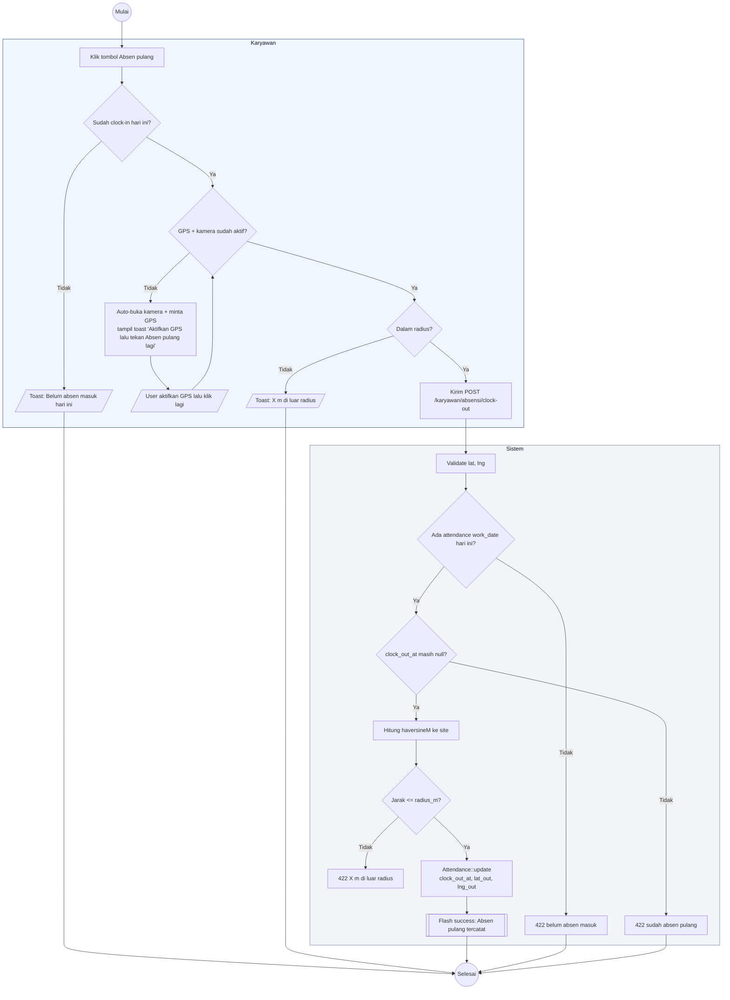

# 09 — Clock-Out (Absen Pulang)

Alur karyawan absen pulang. Harus sudah clock-in hari ini dan berada dalam radius.

## Aktor
- **Karyawan** — sudah clock-in hari ini.
- **Sistem** — `Karyawan\AttendanceController::clockOut`.

## Alur

## Catatan implementasi
- Tombol "Absen pulang" di UI Karyawan mengecek dulu apakah GPS sudah aktif. Kalau belum, otomatis membuka kamera + memancing izin GPS lalu meminta user menekan tombol lagi (UX ramah).
- Server tidak menghitung status "early_leave" otomatis; itu keputusan admin lewat filter waktu di UI absensi.
- Idempoten: kedua kali clock-out di hari yang sama akan ditolak 422.
