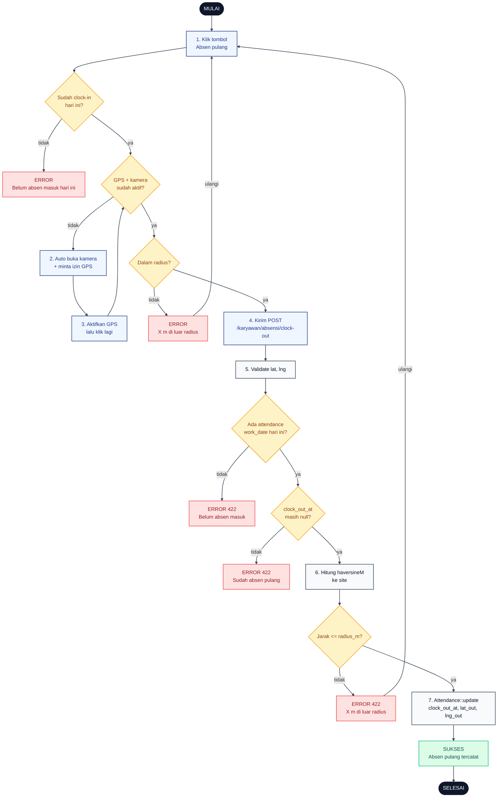

# 09 — Clock-Out (Absen Pulang)

Alur karyawan absen pulang. Harus sudah clock-in hari ini dan berada dalam radius titik penugasan. Kalau GPS belum siap, sistem otomatis buka kamera dan minta izin lokasi.

## Aktor
- **Karyawan** — sudah clock-in hari yang sama.
- **Sistem** — `Karyawan\AttendanceController::clockOut` + `AdminPresenter::haversineM`.

## Flowchart

## Legenda Warna Node

| Warna | Jenis |
|---|---|
| Hitam pekat | Start / End |
| Biru muda | Aksi Aktor (Karyawan) |
| Abu-abu putih | Proses Sistem |
| Kuning | Keputusan (kondisi if/else) |
| Merah muda | Jalur error |
| Hijau muda | Hasil sukses |

## Langkah-Langkah Detail

1. Karyawan menekan tombol Absen pulang di halaman `/karyawan/absensi`.
2. Kalau GPS/kamera belum aktif, UI otomatis membuka kamera dan memancing izin GPS, lalu menampilkan toast "Aktifkan GPS lalu tekan Absen pulang lagi".
3. Karyawan aktifkan GPS di browser dan menekan tombol Absen pulang sekali lagi.
4. UI kirim POST `/karyawan/absensi/clock-out` dengan `lat` + `lng`.
5. `AttendanceController::clockOut` validasi input `lat` dan `lng`.
6. Sistem hitung jarak `haversineM` dari koordinat karyawan ke koordinat site — bandingkan dengan `site.radius_m`.
7. Kalau semua guard lolos, `Attendance` di-update dengan `clock_out_at`, `lat_out`, `lng_out`. Flash success "Absen pulang tercatat".

### Guard yang dicek server

- `D4` — harus ada baris `Attendance` untuk `work_date` hari ini (karyawan sudah clock-in).
- `D5` — `clock_out_at` harus masih `null` (idempoten: sekali clock-out per hari).
- `D6` — jarak <= radius; kalau di luar, 422 dengan jarak aktual.

## Catatan implementasi
- Tombol Absen pulang di UI Karyawan mengecek dulu state GPS/kamera. Kalau belum aktif, otomatis membuka kamera dan memancing izin GPS lalu meminta user menekan tombol lagi (UX ramah, hindari toast error mentah).
- Server tidak menghitung status `early_leave` otomatis; itu keputusan admin lewat filter waktu di UI absensi admin.
- Idempoten: request clock-out kedua di hari yang sama akan ditolak dengan 422.
