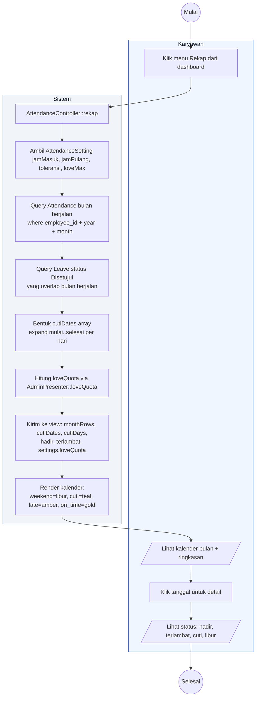

# 10 — Rekap Kehadiran Karyawan

Halaman `/karyawan/rekap` menampilkan kalender bulan berjalan dan ringkasan hadir/terlambat/cuti/toleransi.

## Aktor
- **Karyawan** — melihat rekap sendiri.
- **Sistem** — `Karyawan\AttendanceController::rekap`.

## Alur

## Catatan implementasi
- Cuti dihitung dengan expand rentang `mulai..selesai` yang berpotongan dengan bulan berjalan.
- Chip "Toleransi X/4" di header memakai sisa kuota real dari `AdminPresenter::loveQuota` (bukan hardcode).
- Tombol "Unduh PDF" sudah dihilangkan sampai backend PDF diimplementasikan.
