# 10 — Rekap Kehadiran Karyawan

Halaman `/karyawan/rekap` menampilkan kalender bulan berjalan plus ringkasan hadir, terlambat, cuti, dan sisa kuota toleransi.

## Aktor
- **Karyawan** — melihat rekap dirinya sendiri (tidak bisa lihat rekap orang lain).
- **Sistem** — `Karyawan\AttendanceController::rekap` + `AdminPresenter`.

## Flowchart

```mermaid
flowchart TD
    START([MULAI]):::se

    A1["1. Klik menu Rekap<br/>dari dashboard"]:::user
    S1["2. AttendanceController::rekap<br/>terpanggil"]:::sys
    S2["3. Ambil AttendanceSetting<br/>jam masuk/pulang, toleransi, loveMax"]:::sys
    S3["4. Query Attendance<br/>bulan berjalan employee_id"]:::sys
    S4["5. Query Leave status Disetujui<br/>yang overlap bulan berjalan"]:::sys
    S5["6. Expand cutiDates<br/>mulai..selesai per hari"]:::sys
    S6["7. Hitung loveQuota<br/>via AdminPresenter"]:::sys
    S7["8. Kirim ke view:<br/>monthRows, cutiDates, cutiDays,<br/>hadir, terlambat, loveQuota"]:::sys
    S8["9. Render kalender:<br/>weekend, cuti, late, on_time"]:::sys

    A2["10. Lihat kalender bulan<br/>+ ringkasan"]:::user
    A3["11. Klik tanggal untuk detail"]:::user
    A4["12. Lihat status hari itu:<br/>hadir, terlambat, cuti, libur"]:::user

    OK["SUKSES<br/>Rekap tampil lengkap"]:::ok
    END([SELESAI]):::se

    START --> A1
    A1 --> S1
    S1 --> S2
    S2 --> S3
    S3 --> S4
    S4 --> S5
    S5 --> S6
    S6 --> S7
    S7 --> S8
    S8 --> A2
    A2 --> A3
    A3 --> A4
    A4 --> OK
    OK --> END

    classDef se fill:#0F172A,stroke:#0F172A,color:#fff,stroke-width:2px
    classDef user fill:#EFF6FF,stroke:#1E3A8A,color:#1E3A8A,stroke-width:1.5px
    classDef sys fill:#F8FAFC,stroke:#334155,color:#0F172A,stroke-width:1.5px
    classDef dec fill:#FEF3C7,stroke:#F59E0B,color:#92400E,stroke-width:1.5px
    classDef err fill:#FEE2E2,stroke:#EF4444,color:#991B1B,stroke-width:1.5px
    classDef ok fill:#DCFCE7,stroke:#10B981,color:#065F46,stroke-width:1.5px

    linkStyle default stroke:#334155,stroke-width:1.5px
```

## Legenda Warna Node

| Warna | Jenis |
|---|---|
| Hitam pekat | Start / End |
| Biru muda | Aksi Aktor (Karyawan) |
| Abu-abu putih | Proses Sistem |
| Kuning | Keputusan (kondisi if/else) |
| Merah muda | Jalur error |
| Hijau muda | Hasil sukses |

## Langkah-Langkah Detail

1. Karyawan menekan menu Rekap di dashboard `/karyawan`.
2. Route memanggil `AttendanceController::rekap`.
3. Sistem load `AttendanceSetting` untuk `jam_masuk`, `jam_pulang`, `toleransi_late_menit`, dan `love_max`.
4. Query `Attendance` bulan berjalan `whereYear + whereMonth` sesuai zona Asia/Makassar untuk `employee_id` current user.
5. Query `Leave` dengan status `Disetujui` yang rentangnya overlap bulan berjalan (untuk menandai hari cuti di kalender).
6. Expand `mulai..selesai` per hari menjadi array `cutiDates` supaya setiap tanggal cuti bisa di-highlight di kalender.
7. Hitung sisa kuota toleransi lewat `AdminPresenter::loveQuota` (dinamis, bukan hardcode).
8. Kirim data ke view: `monthRows`, `cutiDates`, `cutiDays`, `hadir`, `terlambat`, dan `settings.loveQuota`.
9. Frontend render kalender dengan warna: weekend = libur, cuti = teal, late = amber, on_time = gold.
10. Karyawan melihat kalender + ringkasan agregat di header.
11. Klik salah satu tanggal untuk melihat detail hari itu.
12. Detail menampilkan status: hadir, terlambat, cuti, atau libur.

## Catatan implementasi
- Cuti dihitung dengan expand rentang `mulai..selesai` yang berpotongan dengan bulan berjalan — hari di luar bulan tidak ikut hitung.
- Chip "Toleransi X/4" di header memakai sisa kuota real-time dari `AdminPresenter::loveQuota` (bukan hardcode).
- Tombol "Unduh PDF" sengaja dihilangkan sampai backend PDF diimplementasikan supaya tidak menampilkan tombol dummy.
