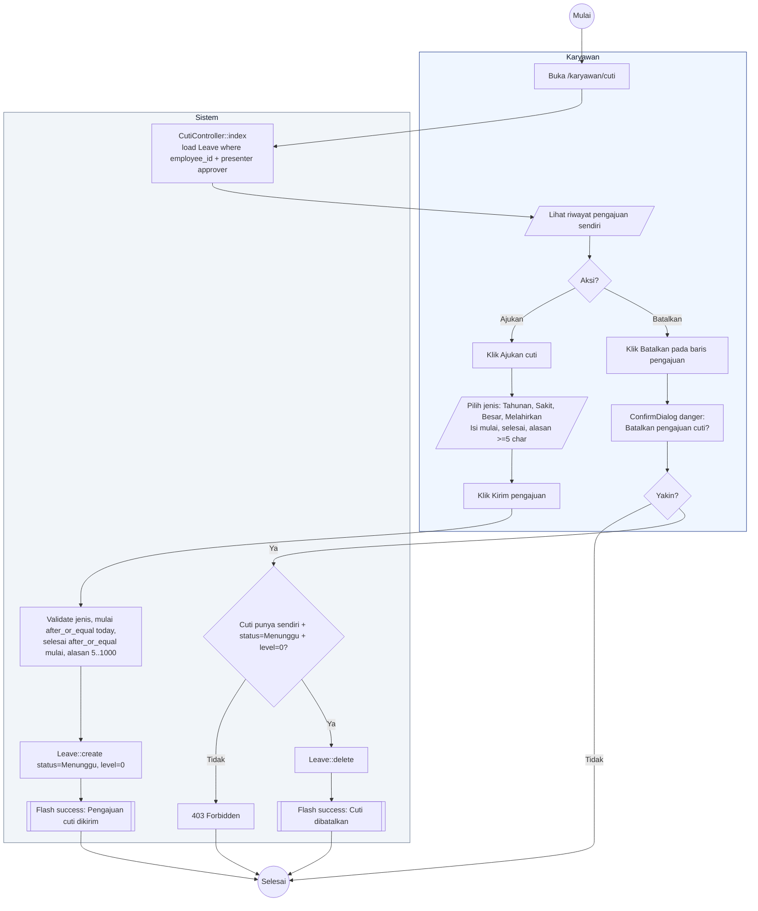

# 11 — Cuti Karyawan (Ajukan dan Batalkan)

Alur karyawan mengajukan cuti dan membatalkan pengajuan (hanya saat masih `Menunggu` level 0).

## Aktor
- **Karyawan** — pemohon cuti.
- **Sistem** — `Karyawan\CutiController`.

## Alur

## Catatan implementasi
- `mulai` tidak boleh lebih awal dari hari ini (`after_or_equal:today`).
- Karyawan hanya bisa membatalkan pengajuan sendiri yang statusnya `Menunggu` dan `level = 0`. Setelah admin mulai approve (level ≥ 1), tombol Batalkan tidak tampil.
- Alur approval berlanjut ke [`12-cuti-approval-3-level.md`](./12-cuti-approval-3-level.md).
