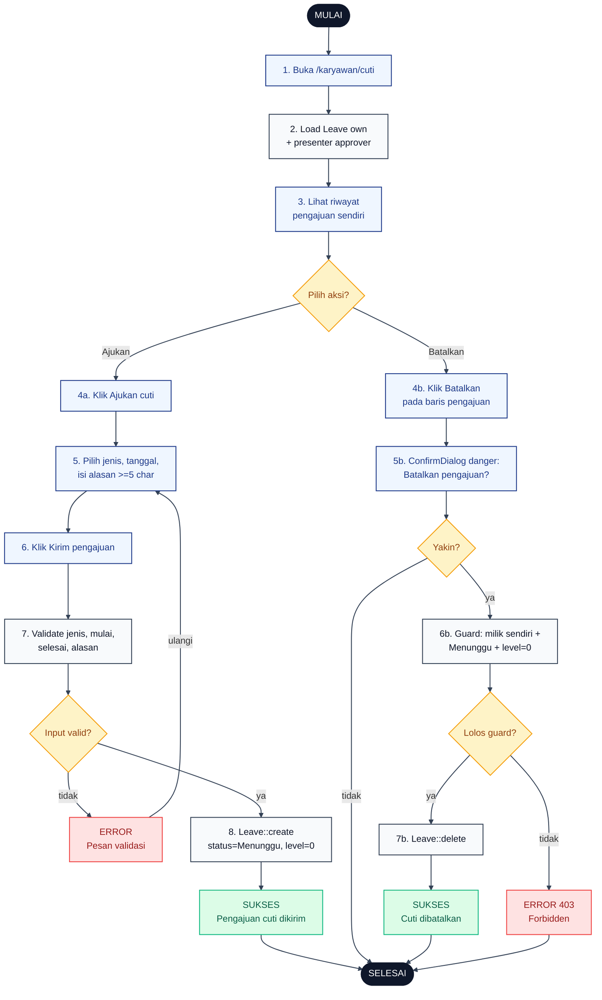

# 11 — Cuti Karyawan (Ajukan dan Batalkan)

Alur karyawan mengajukan cuti dan membatalkan pengajuan. Batalkan hanya boleh saat status masih `Menunggu` dan `level = 0` (belum disentuh admin).

## Aktor
- **Karyawan** — pemohon cuti.
- **Sistem** — `Karyawan\CutiController` (`index`, `store`, `destroy`).

## Flowchart

## Legenda Warna Node

| Warna | Jenis |
|---|---|
| Hitam pekat | Start / End |
| Biru muda | Aksi Aktor (Karyawan) |
| Abu-abu putih | Proses Sistem |
| Kuning | Keputusan (kondisi if/else) |
| Merah muda | Jalur error |
| Hijau muda | Hasil sukses |

## Langkah-Langkah Detail

1. Karyawan membuka `/karyawan/cuti`.
2. `CutiController::index` load daftar `Leave` milik karyawan + presenter data approver.
3. Karyawan melihat riwayat pengajuan sendiri.
4. Karyawan memilih salah satu aksi: **Ajukan (4a)** atau **Batalkan (4b)** pengajuan yang masih Menunggu.

### Cabang Ajukan

5. Karyawan memilih jenis cuti (Tahunan, Sakit, Besar, Melahirkan), tanggal mulai + selesai, dan isi alasan minimal 5 karakter.
6. Karyawan menekan Kirim pengajuan.
7. Sistem validasi: `jenis` enum, `mulai` `after_or_equal:today`, `selesai` `after_or_equal:mulai`, `alasan` `min:5|max:1000`.
8. Kalau lolos, `Leave::create` dengan `status = Menunggu` dan `level = 0`. Flash success "Pengajuan cuti dikirim".

### Cabang Batalkan

5b. UI tampilkan `ConfirmDialog` bertema danger: "Batalkan pengajuan cuti?".
6b. Kalau user konfirmasi, sistem cek guard: pengajuan milik user login, `status = Menunggu`, dan `level = 0`.
7b. Kalau semua lolos, `Leave::delete`. Kalau tidak, respons 403 Forbidden.

## Catatan implementasi
- `mulai` tidak boleh lebih awal dari hari ini (`after_or_equal:today`) supaya karyawan tidak backdated request.
- Karyawan hanya bisa membatalkan pengajuan sendiri yang statusnya `Menunggu` dan `level = 0`. Setelah admin mulai approve (level ≥ 1), tombol Batalkan tidak tampil di UI dan backend tetap 403 kalau di-force.
- Alur approval berlanjut ke [`12-cuti-approval-3-level.md`](./12-cuti-approval-3-level.md).
