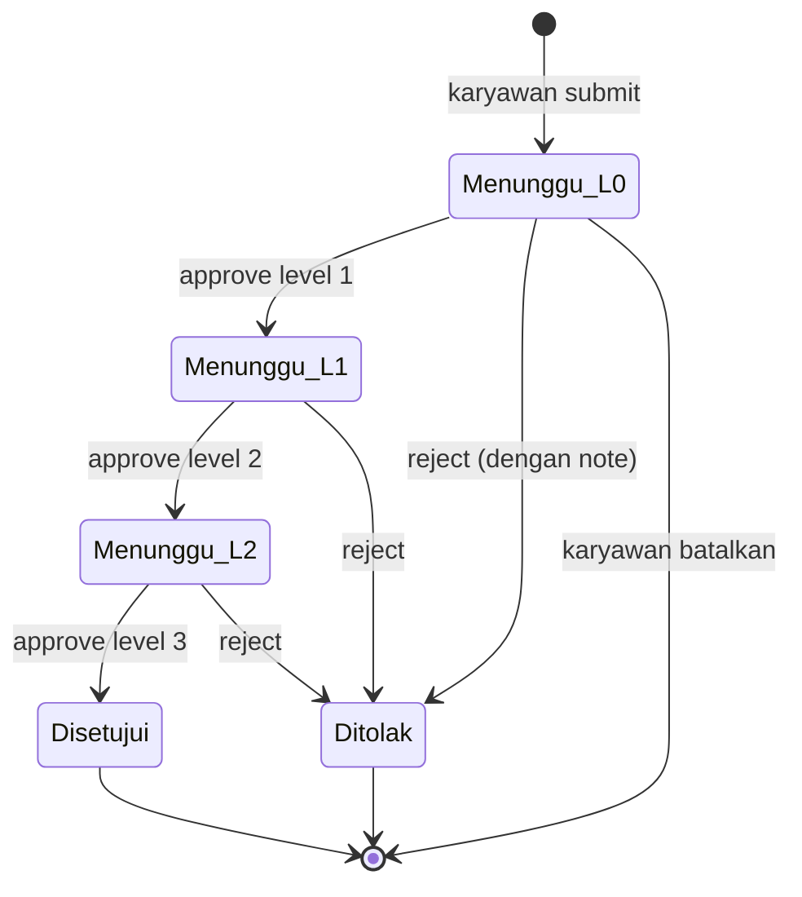
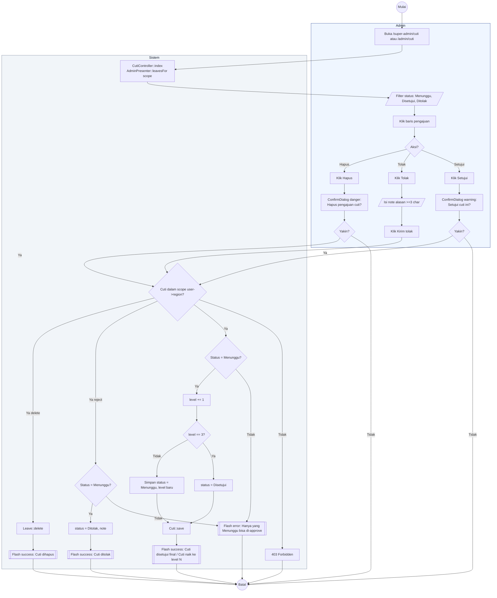

# 12 — Cuti Approval 3 Level

Alur persetujuan cuti berjenjang tiga tahap. Setiap approve menaikkan `level` +1. Reject terminal (langsung `Ditolak`). Approve pada `level=2` menjadikan status `Disetujui`.

## Aktor
- **Admin** — Super Admin atau Admin Wilayah (Admin Wilayah hanya lihat + approve cuti di wilayahnya).
- **Sistem** — `Admin\CutiController`.

## State Machine

## Alur Approve/Reject

## Catatan implementasi
- Admin Wilayah hanya bisa approve/reject cuti di wilayahnya (cek `$cuti->employee->region_id`).
- Approve pada `level=2` menaikkan level ke 3 sekaligus set `status=Disetujui` (final).
- Reject dari `level` berapa pun terminal — tidak bisa di-approve lagi.
- Reject butuh input `note` minimal 3 karakter (validasi backend + frontend).
