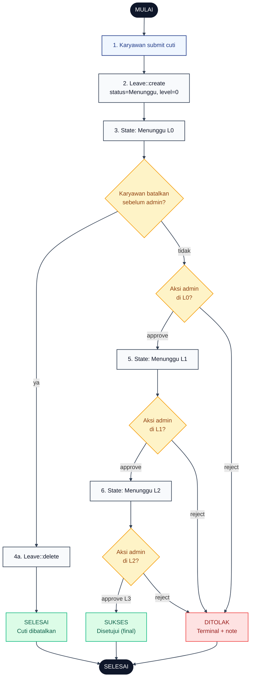
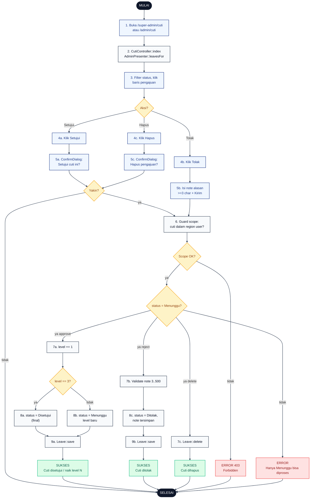

# 12 — Cuti Approval 3 Level

Alur persetujuan cuti berjenjang tiga tahap. Setiap approve menaikkan `level` +1. Reject terminal langsung menjadi `Ditolak`. Approve pada `level = 2` menaikkan ke `level = 3` sekaligus set `status = Disetujui` (final).

## Aktor
- **Karyawan** — pemohon cuti (submit + optional cancel di level 0).
- **Admin** — Super Admin atau Admin Wilayah. Admin Wilayah hanya lihat + approve cuti di wilayahnya.
- **Sistem** — `Admin\CutiController` (`update`, `destroy`) + `AdminPresenter::leavesFor` untuk scope.

## Diagram 1 — Flow Karyawan + State Cuti

Menggambarkan siklus hidup cuti dari sisi karyawan, plus transisi state yang dipicu admin (dilihat dari luar).

## Diagram 2 — Flow Admin (Approve / Reject / Hapus)

Detail interaksi admin per baris pengajuan dengan semua guard dan cabang aksi.

## Legenda Warna Node

| Warna | Jenis |
|---|---|
| Hitam pekat | Start / End |
| Biru muda | Aksi Aktor (Karyawan / Admin) |
| Abu-abu putih | Proses Sistem / State cuti |
| Kuning | Keputusan (kondisi if/else) |
| Merah muda | Jalur error / status Ditolak |
| Hijau muda | Hasil sukses / status Disetujui |

## Langkah-Langkah Detail

### Diagram 1 — Karyawan + State

1. Karyawan submit form pengajuan cuti (lihat [`11-cuti-karyawan-ajukan.md`](./11-cuti-karyawan-ajukan.md)).
2. `Leave::create` dengan `status = Menunggu` dan `level = 0`.
3. State awal cuti adalah `Menunggu L0`.
4. Kalau karyawan membatalkan sebelum admin sentuh (4a), record di-delete.
5. Admin approve di L0 → naik ke `Menunggu L1`.
6. Admin approve di L1 → naik ke `Menunggu L2`.
7. Admin approve di L2 → `level = 3` + `status = Disetujui` (final).
8. Reject di level manapun langsung terminal `Ditolak` dengan note wajib.

### Diagram 2 — Admin

1. Admin buka `/super-admin/cuti` atau `/admin/cuti`.
2. `CutiController::index` memakai `AdminPresenter::leavesFor` untuk scope (Admin Wilayah otomatis di-filter regionnya).
3. Admin bisa filter status (Menunggu, Disetujui, Ditolak) lalu klik salah satu baris.
4. Pilih salah satu aksi: **Setujui (4a)**, **Tolak (4b)**, atau **Hapus (4c)**.
5. Untuk Setujui/Hapus muncul `ConfirmDialog`; untuk Tolak muncul form note dengan minimal 3 karakter.
6. Guard scope: cek `$cuti->employee->region_id` cocok dengan `region_id` user (Super Admin lolos otomatis).
7. Guard status: hanya `Menunggu` yang bisa di-approve/reject; kalau bukan → flash error dan stop.
   - **7a Setujui**: `level += 1`. Kalau jadi `3`, `status = Disetujui`. Kalau belum, tetap `Menunggu` dengan level baru.
   - **7b Tolak**: validasi `note` 3..500, set `status = Ditolak` + simpan `note`.
   - **7c Hapus**: `Leave::delete` (idempotent cleanup).
8. Simpan model, flash success sesuai aksi.

## Catatan implementasi
- Controller: `app/Http/Controllers/Admin/CutiController.php`. Route grup `super-admin/cuti` dan `admin/cuti` share controller yang sama.
- Admin Wilayah hanya bisa approve/reject cuti di wilayahnya (cek `$cuti->employee->region_id` vs `Auth::user()->region_id`).
- Approve pada `level = 2` menaikkan level ke 3 sekaligus set `status = Disetujui` (final, tidak bisa direvisi).
- Reject dari `level` berapa pun terminal — tidak bisa di-approve lagi. Karyawan harus submit ulang.
- Reject butuh input `note` minimal 3 karakter (validasi backend + frontend), maks 500 char.
- State machine implicit di kolom `(status, level)`: `(Menunggu, 0..2)` → in-progress, `(Disetujui, 3)` → final approved, `(Ditolak, *)` → final rejected.
