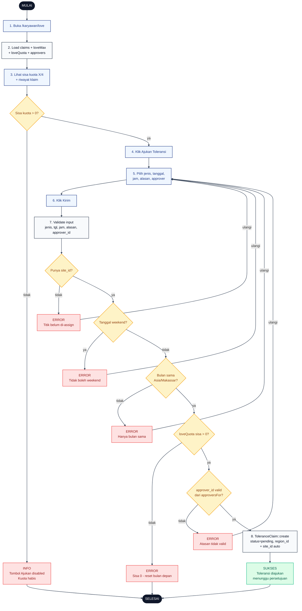

# 13 — Toleransi Karyawan Klaim (Lupa Absen)

Alur karyawan mengajukan klaim toleransi karena lupa absen datang atau lupa absen pulang. Batas maksimal 4 klaim per bulan (default `love_max = 4`), tidak boleh weekend, dan hanya untuk bulan berjalan.

## Aktor
- **Karyawan** — pemohon klaim.
- **Sistem** — `Karyawan\LoveController` + `AdminPresenter::loveQuota` + `AdminPresenter::approversFor`.

## Flowchart

## Legenda Warna Node

| Warna | Jenis |
|---|---|
| Hitam pekat | Start / End |
| Biru muda | Aksi Aktor (Karyawan) |
| Abu-abu putih | Proses Sistem |
| Kuning | Keputusan (kondisi if/else) |
| Merah muda | Jalur error / info kuota habis |
| Hijau muda | Hasil sukses |

## Langkah-Langkah Detail

1. Karyawan membuka `/karyawan/love`.
2. `LoveController::index` load daftar klaim milik karyawan, `loveMax`, sisa `loveQuota`, dan daftar `approvers` yang valid.
3. UI menampilkan sisa kuota `X/4` dan riwayat klaim.
4. Kalau kuota habis, tombol Ajukan disabled dan menampilkan info "Sisa Toleransi 0 - reset bulan depan".
5. Karyawan menekan Ajukan Toleransi. Form terbuka dengan field: jenis (`lupa_absen` atau `lupa_pulang`), tanggal (weekday, bulan berjalan), jam `HH:MM`, alasan minimal 5 char, pilih atasan (Admin Wilayah dari `approversFor`).
6. Karyawan menekan Kirim.
7. Sistem validasi payload: `jenis` enum, `tgl` `before_or_equal:today`, `jam` format `HH:MM`, `alasan` `5..1000`, `approver_id` present.
8. Kalau semua guard lolos, `ToleranceClaim::create` dengan `status = pending`, `region_id` + `site_id` otomatis dari data karyawan.

### Guard yang dicek server (berurutan)

- **D2** `site_id` sudah di-assign — kalau belum → error "Titik belum di-assign".
- **D3** Tanggal bukan Sabtu/Minggu — weekend ditolak.
- **D4** Bulan sama dengan sekarang zona `Asia/Makassar` — mencegah backdated ke bulan lalu.
- **D5** Sisa `loveQuota` > 0 — kalau habis, tolak.
- **D6** `approver_id` termasuk daftar `AdminPresenter::approversFor` untuk karyawan tersebut.

## Catatan implementasi
- Kuota dihitung `love_max - approved - pending` bulan berjalan Asia/Makassar. Pending juga potong kuota supaya tidak spam pengajuan.
- Approver harus salah satu Admin Wilayah `region_id` sama dengan karyawan (bisa juga admin site-spesifik). Detail resolver di `AdminPresenter::approversFor`.
- Weekend ditolak karena Sabtu/Minggu bukan hari kerja — tidak ada absen yang perlu dikompensasi.
- Cek `same-month` pakai timezone `Asia/Makassar`, bukan UTC, supaya karyawan WITA tidak keblokir di midnight rollover.
