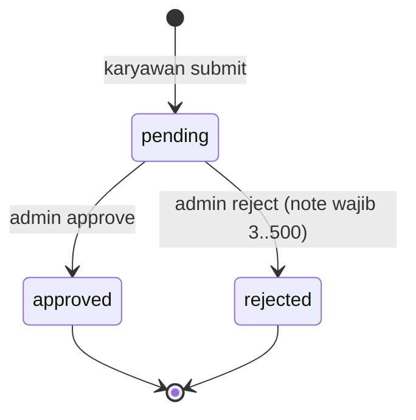
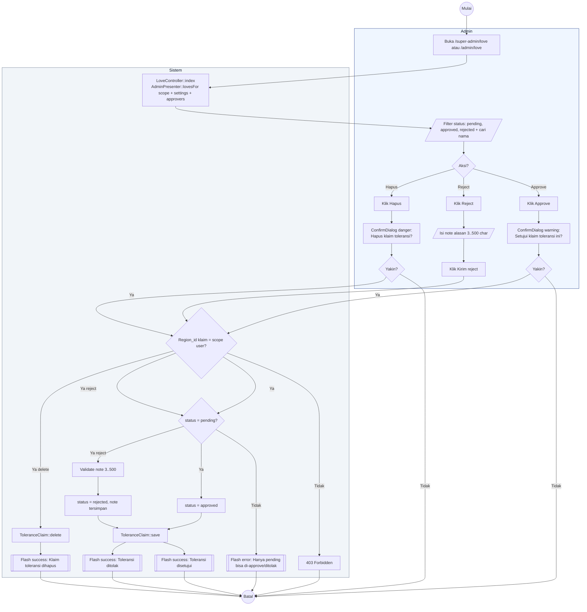

# 14 — Toleransi Approval oleh Admin

Alur Admin approve atau reject klaim toleransi. Single-level, tidak berjenjang.

## Aktor
- **Admin** — Super Admin atau Admin Wilayah (Admin Wilayah hanya klaim di wilayahnya).
- **Sistem** — `Admin\LoveController`.

## State Machine

## Alur Admin

## Catatan implementasi
- Approve klaim tidak otomatis membuat entri attendance dengan `status = excused_love`; itu masih manual admin atau bisa dipertimbangkan sebagai peningkatan masa depan.
- Note reject minimal 3 karakter, maks 500. Validasi di backend + frontend UI.
- Kuota `love_max` dikonfigurasi di `AttendanceSetting` (default 4/bulan). Berlaku bulan depan setelah diubah.
