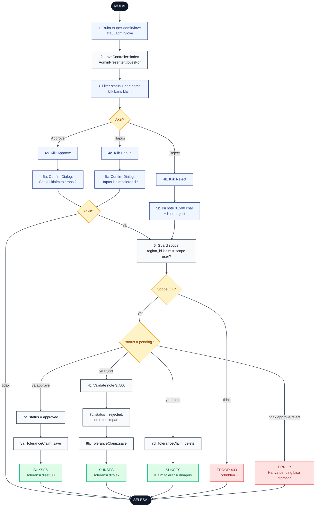

# 14 — Toleransi Approval oleh Admin

Alur Admin approve atau reject klaim toleransi. Single-level, tidak berjenjang. Reject wajib isi note alasan 3..500 karakter.

## Aktor
- **Admin** — Super Admin atau Admin Wilayah (Admin Wilayah hanya klaim di wilayahnya).
- **Sistem** — `Admin\LoveController` + `AdminPresenter::lovesFor` untuk scope.

## Flowchart

## Legenda Warna Node

| Warna | Jenis |
|---|---|
| Hitam pekat | Start / End |
| Biru muda | Aksi Aktor (Admin) |
| Abu-abu putih | Proses Sistem |
| Kuning | Keputusan (kondisi if/else) |
| Merah muda | Jalur error |
| Hijau muda | Hasil sukses |

## Langkah-Langkah Detail

1. Admin buka `/super-admin/love` atau `/admin/love`.
2. `LoveController::index` load klaim via `AdminPresenter::lovesFor` (Admin Wilayah auto-filter regionnya) + settings + approvers.
3. Admin bisa filter status (pending, approved, rejected) dan cari nama karyawan lalu klik baris klaim.
4. Pilih salah satu aksi: **Approve (4a)**, **Reject (4b)**, atau **Hapus (4c)**.
5. Untuk Approve/Hapus muncul `ConfirmDialog`. Untuk Reject muncul form note alasan wajib 3..500 karakter.
6. Guard scope: cek `region_id` klaim cocok dengan scope user (Super Admin lolos otomatis).
7. Guard status: hanya `pending` yang bisa di-approve/reject; kalau bukan → flash error.
   - **7a Approve**: `status = approved`.
   - **7b Reject**: validasi note 3..500, lalu `status = rejected` dengan note tersimpan.
   - **7d Hapus**: `ToleranceClaim::delete` (tersedia semua status).
8. Simpan model dan flash success sesuai aksi.

## Catatan implementasi
- Approve klaim tidak otomatis membuat entri attendance dengan `status = excused_love`; itu masih dikerjakan manual oleh admin atau bisa dipertimbangkan sebagai peningkatan masa depan.
- Note reject minimal 3 karakter, maks 500. Validasi di backend + frontend UI, keduanya harus konsisten.
- Kuota `love_max` dikonfigurasi di `AttendanceSetting` (default 4/bulan). Perubahan berlaku bulan berikutnya, tidak retroaktif.
- Controller: `app/Http/Controllers/Admin/LoveController.php`. Route grup `super-admin/love` dan `admin/love` share controller yang sama.
