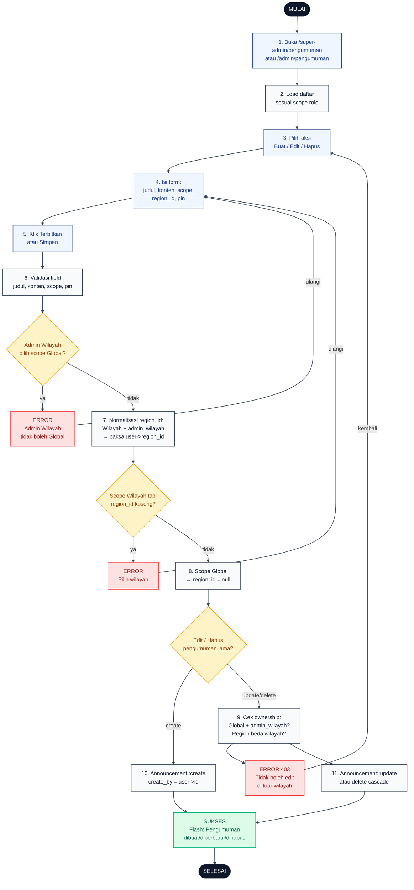

# 15 — Pengumuman Admin (CRUD)

Alur Admin mengelola pengumuman. Scope `Global` hanya bisa dibuat Super Admin; scope `Wilayah` bisa oleh Admin Wilayah tapi `region_id` dipaksa ke wilayahnya sendiri.

## Aktor
- **Super Admin** — CRUD scope Global dan Wilayah.
- **Admin Wilayah** — hanya scope Wilayah untuk region-nya sendiri.
- **Sistem** — `Admin\PengumumanController`.

## Flowchart

## Legenda Warna Node

| Warna | Jenis |
|---|---|
| Hitam pekat | Start / End |
| Biru muda | Aksi Aktor (Admin) |
| Abu-abu putih | Proses Sistem |
| Kuning | Keputusan (kondisi if/else) |
| Merah muda | Jalur error |
| Hijau muda | Hasil sukses |

## Langkah-Langkah Detail

1. Admin membuka `/super-admin/pengumuman` (Super Admin) atau `/admin/pengumuman` (Admin Wilayah).
2. Sistem memuat daftar via `PengumumanController::index` + `AdminPresenter::announcementsFor($scope)`.
3. Admin memilih aksi: Buat baru, Edit item, atau Hapus item.
4. Untuk Buat/Edit, Admin mengisi form: judul, konten, scope (`Global` / `Wilayah`), `region_id` opsional, dan flag `pin`.
5. Admin klik Terbitkan (buat) atau Simpan (edit).
6. Server validasi payload: judul & konten wajib, scope harus `Global` atau `Wilayah`, `pin` boolean.
7. Server enforce role rule: `admin_wilayah` + scope `Global` → tolak. Scope `Wilayah` + `admin_wilayah` → `region_id` dipaksa ke `user->region_id`.
8. Scope `Wilayah` tapi `region_id` masih kosong → error "Pilih wilayah". Scope `Global` → `region_id` di-set `null`.
9. Untuk edit/hapus, cek ownership: pengumuman `Global` tidak boleh diubah `admin_wilayah`; pengumuman `Wilayah` dari region lain → 403.
10. Buat baru: `Announcement::create` dengan `created_by = user->id`.
11. Edit/Hapus: `Announcement::update` atau `Announcement::delete` (cascade ke `announcement_reads`).

## Catatan implementasi
- Controller: `app/Http/Controllers/Admin/PengumumanController.php` untuk store/update/destroy.
- Field `pin` menaikkan pengumuman ke urutan teratas (admin maupun karyawan).
- Admin Wilayah otomatis `region_id` di-paksa ke wilayahnya walau frontend mengirim region_id lain.
- Delete cascade menghapus baris di `announcement_reads` sehingga counter unread karyawan konsisten.
- ConfirmDialog danger dipakai untuk aksi Hapus di UI, tidak digambar sebagai node terpisah agar diagram tetap ringkas.
