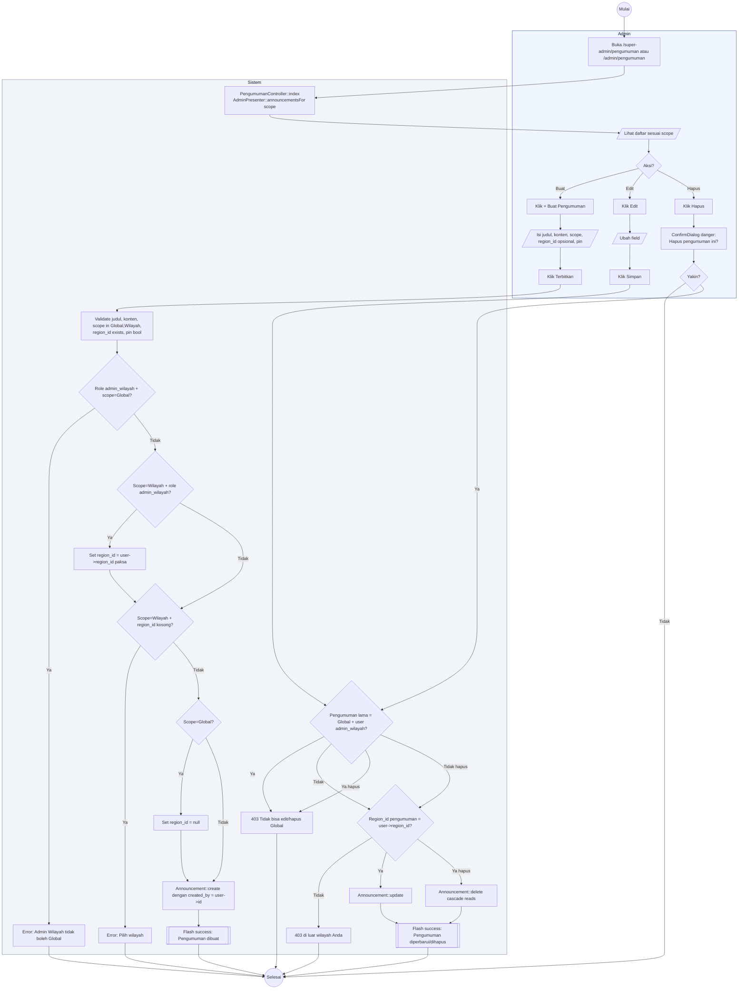

# 15 — Pengumuman Admin (CRUD)

Alur Admin membuat, mengedit, dan menghapus pengumuman. Scope `Global` hanya bisa dibuat oleh Super Admin; `Wilayah` bisa oleh Admin Wilayah (dipaksa ke region-nya).

## Aktor
- **Super Admin** — CRUD pengumuman scope Global dan Wilayah.
- **Admin Wilayah** — hanya scope Wilayah untuk region-nya sendiri.
- **Sistem** — `Admin\PengumumanController`.

## Alur

## Catatan implementasi
- Field `pin` bikin pengumuman muncul di paling atas daftar (baik admin maupun karyawan).
- Admin Wilayah otomatis `region_id` di-paksa ke wilayahnya walau frontend mengirim region_id lain.
- Delete cascade menghapus baris di `announcement_reads` juga.
