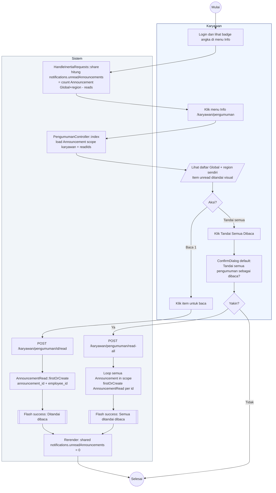

# 16 — Pengumuman Karyawan (Baca dan Tandai)

Karyawan melihat daftar pengumuman Global + wilayahnya. Badge unread muncul di sidebar Info.

## Aktor
- **Karyawan** — pembaca.
- **Sistem** — `Karyawan\PengumumanController` + `AdminPresenter::announcementsForKaryawan` + `HandleInertiaRequests` (share `notifications.unreadAnnouncements`).

## Alur

## Catatan implementasi
- Badge angka di sidebar `KaryawanLayout` diambil dari `props.notifications.unreadAnnouncements` (shared via `HandleInertiaRequests`). Berkurang otomatis setelah tandai baca karena Inertia refresh shared props saat back().
- Idempoten: `firstOrCreate` mencegah duplicate row read.
- Scope karyawan: `where scope=Global OR region_id=user->region_id`.
