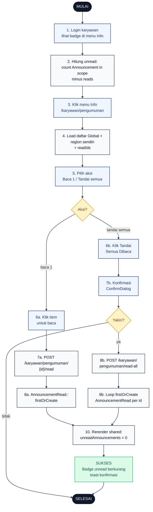

# 16 — Pengumuman Karyawan (Baca dan Tandai)

Karyawan melihat daftar pengumuman scope `Global` dan wilayahnya sendiri. Badge angka unread muncul di menu Info sidebar dan berkurang otomatis setelah item ditandai baca.

## Aktor
- **Karyawan** — pembaca pengumuman.
- **Sistem** — `Karyawan\PengumumanController` + `AdminPresenter::announcementsForKaryawan` + `HandleInertiaRequests` (share `notifications.unreadAnnouncements`).

## Flowchart

## Legenda Warna Node

| Warna | Jenis |
|---|---|
| Hitam pekat | Start / End |
| Biru muda | Aksi Aktor (Karyawan) |
| Abu-abu putih | Proses Sistem |
| Kuning | Keputusan (kondisi if/else) |
| Merah muda | Jalur error |
| Hijau muda | Hasil sukses |

## Langkah-Langkah Detail

1. Karyawan login, layout Karyawan menampilkan badge angka di menu Info.
2. `HandleInertiaRequests::share` menghitung `notifications.unreadAnnouncements = count(Announcement scope karyawan) - count(reads)`.
3. Karyawan klik menu Info menuju `/karyawan/pengumuman`.
4. `PengumumanController::index` memuat daftar scope karyawan (`Global` OR `region_id = user->region_id`) beserta `readIds`.
5. Karyawan memilih aksi: baca satu item atau tandai semua sekaligus.
6. (a) Klik satu item pengumuman untuk membacanya. (b) Klik tombol Tandai Semua Dibaca.
7. (a) POST ke `/karyawan/pengumuman/{id}/read`. (b) Konfirmasi lewat `ConfirmDialog` sebelum eksekusi.
8. (a) `AnnouncementRead::firstOrCreate(['announcement_id' => $id, 'employee_id' => $me])`. (b) Jika user konfirmasi ya → POST `/karyawan/pengumuman/read-all`.
9. Untuk read-all: loop semua pengumuman in-scope dan `firstOrCreate` `AnnouncementRead` per id.
10. Inertia rerender shared props `notifications.unreadAnnouncements` (biasanya jadi 0 setelah tandai semua).

## Catatan implementasi
- Controller: `app/Http/Controllers/Karyawan/PengumumanController.php`.
- Badge angka di sidebar `resources/js/Layouts/KaryawanLayout.jsx` mengambil `props.notifications.unreadAnnouncements` (di-share via `HandleInertiaRequests`).
- Operasi idempoten: `firstOrCreate` mencegah duplicate row read walau user klik ulang.
- Scope karyawan konsisten: `where scope = 'Global' OR region_id = user->region_id`.
- Setelah `back()` dari Inertia, shared props di-refresh otomatis sehingga badge sinkron tanpa reload penuh.
