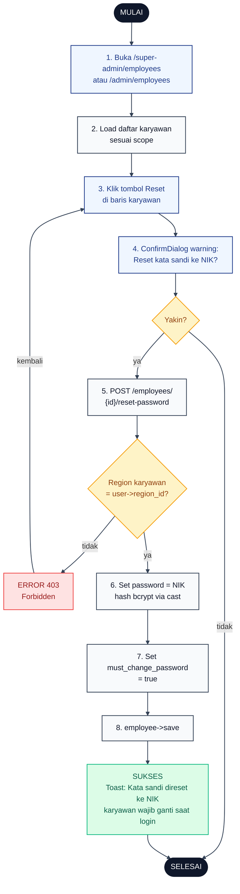

# 17 — Reset Password Karyawan oleh Admin

Alur Admin mereset kata sandi karyawan menjadi NIK dan mengaktifkan flag `must_change_password = true` sehingga karyawan wajib ganti sandi saat login berikutnya.

## Aktor
- **Admin** — Super Admin (semua karyawan) atau Admin Wilayah (karyawan di wilayahnya).
- **Sistem** — `Admin\EmployeeController::resetPassword`.

## Flowchart

## Legenda Warna Node

| Warna | Jenis |
|---|---|
| Hitam pekat | Start / End |
| Biru muda | Aksi Aktor (Admin) |
| Abu-abu putih | Proses Sistem |
| Kuning | Keputusan (kondisi if/else) |
| Merah muda | Jalur error |
| Hijau muda | Hasil sukses |

## Langkah-Langkah Detail

1. Admin membuka halaman daftar karyawan (`/super-admin/employees` atau `/admin/employees`).
2. Sistem memuat daftar karyawan sesuai scope role (Super Admin lihat semua, Admin Wilayah difilter `region_id`).
3. Admin klik tombol **Reset** pada baris karyawan target.
4. UI menampilkan `ConfirmDialog` warning: "Reset kata sandi {nama}? Kata sandi baru = NIK karyawan".
5. Kalau Admin konfirmasi, FE POST ke `/super-admin/employees/{id}/reset-password` (atau `/admin/…`).
6. Server cek scope: kalau `admin_wilayah` dan `employee->region_id` beda dari `user->region_id` → 403 Forbidden.
7. Set `employee->password = employee->nik` (dihash otomatis via cast `bcrypt`).
8. Set `employee->must_change_password = true`.
9. Simpan employee dan flash success dengan payload `reset_password: { employee_id, nama, nik }`.

## Catatan implementasi
- Controller: `app/Http/Controllers/Admin/EmployeeController.php::resetPassword`.
- Password lama langsung invalid karena hash ditimpa. Karyawan wajib login pakai NIK.
- Flag `must_change_password` di-share ke shared props Inertia lewat `HandleInertiaRequests::share` (`auth.employee.must_change_password`) sehingga banner peringatan otomatis muncul di layout Karyawan.
- Admin Wilayah 403 kalau target karyawan di luar wilayahnya, sesuai pola scoping global.
- Kelanjutan alur karyawan setelah reset ada di [`18-ganti-password-karyawan.md`](./18-ganti-password-karyawan.md).
