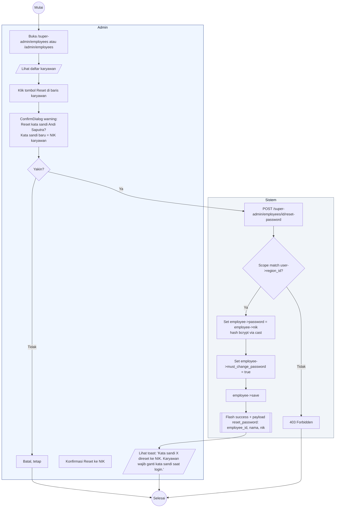

# 17 — Reset Password Karyawan oleh Admin

Alur Admin mereset kata sandi karyawan ke NIK dan mengaktifkan flag `must_change_password = true`.

## Aktor
- **Admin** — Super Admin (semua karyawan) atau Admin Wilayah (karyawan di wilayahnya).
- **Sistem** — `Admin\EmployeeController::resetPassword`.

## Alur

## Catatan implementasi
- Password lama langsung invalid karena hash ditimpa. Karyawan wajib login pakai NIK.
- `must_change_password` flag di-share ke shared props Inertia lewat `HandleInertiaRequests::share` (`auth.employee.must_change_password`) sehingga banner peringatan otomatis muncul di layout Karyawan.
- Admin Wilayah 403 kalau target karyawan di luar wilayahnya, sesuai pola scoping.
- Kelanjutan alur karyawan setelah reset ada di [`18-ganti-password-karyawan.md`](./18-ganti-password-karyawan.md).
