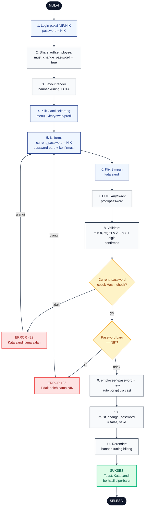

# 18 — Ganti Password Karyawan setelah Reset

Karyawan login dengan NIK sebagai password, melihat banner peringatan kuning, lalu mengganti password baru dengan aturan minimal 8 karakter + wajib huruf besar + kecil + angka + tidak sama dengan NIK.

## Aktor
- **Karyawan** — akun dengan flag `must_change_password = true` (biasanya baru direset admin).
- **Sistem** — `Karyawan\ProfilController::updatePassword` + `HandleInertiaRequests`.

## Flowchart

## Legenda Warna Node

| Warna | Jenis |
|---|---|
| Hitam pekat | Start / End |
| Biru muda | Aksi Aktor (Karyawan) |
| Abu-abu putih | Proses Sistem |
| Kuning | Keputusan (kondisi if/else) |
| Merah muda | Jalur error |
| Hijau muda | Hasil sukses |

## Langkah-Langkah Detail

1. Karyawan login pakai NIP/NIK dan NIK sebagai password (karena baru direset admin).
2. `HandleInertiaRequests::share` menaruh `auth.employee.must_change_password = true` di shared props Inertia.
3. Layout Karyawan render banner kuning "Kata sandi Anda masih NIK, Ganti sekarang" + CTA link.
4. Karyawan klik CTA menuju `/karyawan/profil` section Kata sandi.
5. Karyawan mengisi `current_password` (= NIK), `password` baru, dan konfirmasi.
6. Karyawan klik tombol Simpan kata sandi.
7. FE PUT ke `/karyawan/profil/password`.
8. Server validasi: `password` min 8, regex `[A-Z]`, `[a-z]`, `\d`, plus `confirmed` matching field konfirmasi.
9. Cek `Hash::check(current_password, employee->password)` — kalau salah → 422 "Kata sandi lama salah".
10. Cek `password === employee->nik` — kalau ya → 422 "Kata sandi baru tidak boleh sama dengan NIK".
11. Simpan: `employee->password = new` (di-hash otomatis via cast), `must_change_password = false`, `save()`. Rerender banner hilang.

## Catatan implementasi
- Controller: `app/Http/Controllers/Karyawan/ProfilController.php::updatePassword`.
- Banner hanya muncul di layout Karyawan (`resources/js/Layouts/KaryawanLayout.jsx`). CTA "Ganti sekarang" disembunyikan saat user sudah berada di halaman profil untuk hindari redundansi.
- Aturan password ketat divalidasi baik client-side (`toast.error` preview) maupun server-side (source of truth).
- Sistem tidak memblokir aksi lain (absen, cuti, dll) — banner hanya peringatan, bukan hard gate.
- Setelah berhasil, login berikutnya banner tidak muncul lagi.
