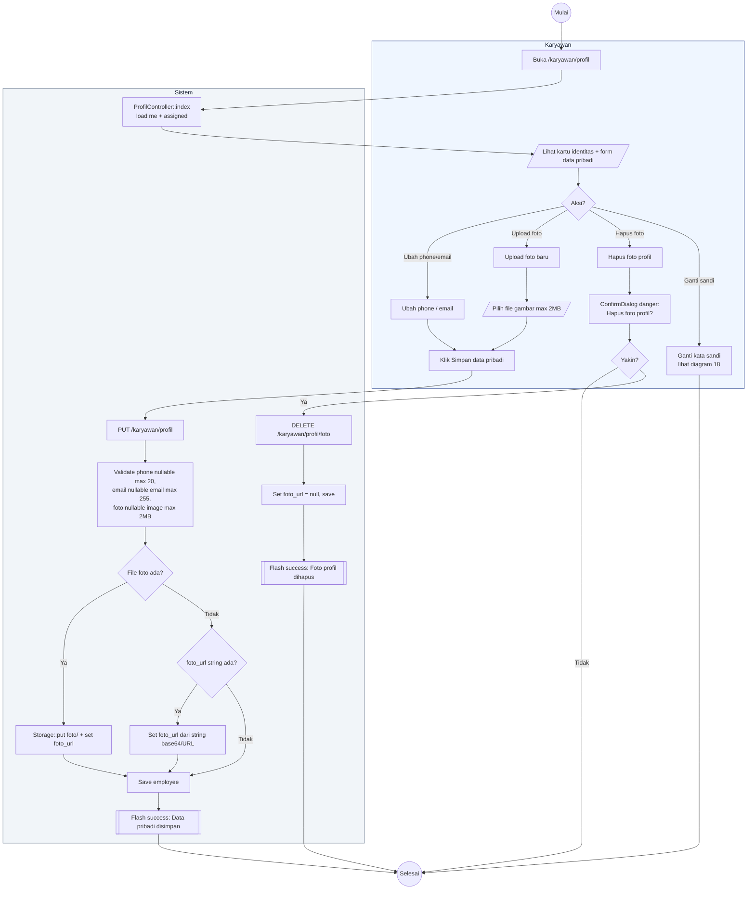

# 19 — Profil Karyawan

Karyawan mengubah data pribadi yang bisa diedit sendiri: nomor telepon, email, foto profil. NIK/NIP/golongan/unit tidak bisa diubah mandiri (butuh admin).

## Aktor
- **Karyawan** — pemilik akun.
- **Sistem** — `Karyawan\ProfilController::index`, `update`, `destroyFoto`.

## Alur

## Catatan implementasi
- Foto disimpan ke `storage/app/public/foto/` via `Storage::put` dan diakses via symlink `public/storage/foto/*`.
- Ada dua jalur upload: multipart file (server store) atau string `foto_url` (URL/base64 dari FE, misalnya crop preview).
- Ganti password punya alur sendiri di [`18-ganti-password-karyawan.md`](./18-ganti-password-karyawan.md).
- NIK, NIP, golongan, jabatan, unit, region, site hanya bisa diubah oleh Admin lewat halaman Employees.
