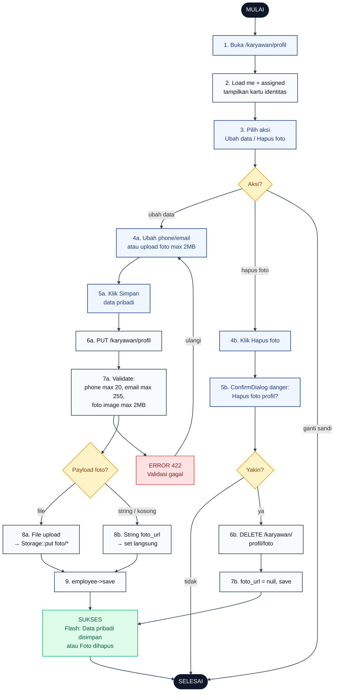

# 19 — Profil Karyawan

Karyawan mengubah data pribadi yang bisa diedit sendiri: nomor telepon, email, dan foto profil. NIK/NIP/golongan/jabatan/unit/region/site hanya boleh diubah oleh Admin.

## Aktor
- **Karyawan** — pemilik akun.
- **Sistem** — `Karyawan\ProfilController::index`, `update`, `destroyFoto`.

## Flowchart

## Legenda Warna Node

| Warna | Jenis |
|---|---|
| Hitam pekat | Start / End |
| Biru muda | Aksi Aktor (Karyawan) |
| Abu-abu putih | Proses Sistem |
| Kuning | Keputusan (kondisi if/else) |
| Merah muda | Jalur error |
| Hijau muda | Hasil sukses |

## Langkah-Langkah Detail

1. Karyawan membuka `/karyawan/profil`.
2. `ProfilController::index` memuat data `me` + `assigned` dan menampilkan kartu identitas + form data pribadi.
3. Karyawan memilih aksi: Ubah data pribadi (phone/email/foto), Hapus foto profil, atau Ganti sandi (dialihkan ke [diagram 18](./18-ganti-password-karyawan.md)).
4. (a) Untuk ubah data: edit phone/email dan/atau pilih file foto baru (max 2MB). (b) Untuk hapus: klik tombol Hapus foto.
5. (a) Klik Simpan data pribadi. (b) Konfirmasi lewat `ConfirmDialog` danger.
6. (a) FE PUT ke `/karyawan/profil`. (b) FE DELETE ke `/karyawan/profil/foto`.
7. (a) Server validate: `phone` nullable max 20, `email` nullable email max 255, `foto` nullable image max 2MB. (b) Server set `foto_url = null` lalu save.
8. Cek payload foto: file multipart → `Storage::put('foto/…')` dan set `foto_url`; string base64/URL → set `foto_url` langsung dari string; kosong → skip.
9. `employee->save()` dan flash success.

## Catatan implementasi
- Controller: `app/Http/Controllers/Karyawan/ProfilController.php` (`index`, `update`, `destroyFoto`).
- Foto disimpan ke `storage/app/public/foto/` via `Storage::put`, diakses publik via symlink `public/storage/foto/*`.
- Dua jalur upload: multipart file (server store) atau string `foto_url` (URL/base64 dari FE, misalnya crop preview).
- NIK, NIP, golongan, jabatan, unit, region, dan site hanya bisa diubah oleh Admin lewat halaman Employees.
- Ganti password punya alur sendiri di [`18-ganti-password-karyawan.md`](./18-ganti-password-karyawan.md).
