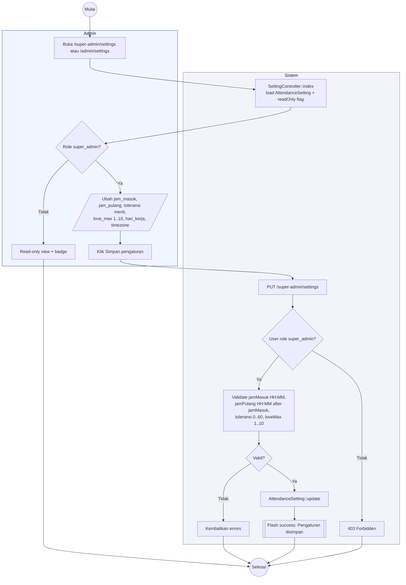

# 20 — Settings Admin

Pengaturan absensi global. Hanya Super Admin yang boleh menulis; Admin Wilayah read-only.

## Aktor
- **Super Admin** — full akses.
- **Admin Wilayah** — hanya lihat (badge "read-only" di sidebar).
- **Sistem** — `Admin\SettingController`.

## Alur

## Catatan implementasi
- `AttendanceSetting` adalah singleton (single row, id=1). Update selalu mengubah baris ini.
- Perubahan `love_max` berlaku bulan berikutnya (reset di 1st 00:00 WITA). Sisa bulan berjalan tetap pakai kuota lama.
- `hari_kerja` dan `timezone` tidak diubah dari UI saat ini (default Sen–Jum Asia/Makassar).
