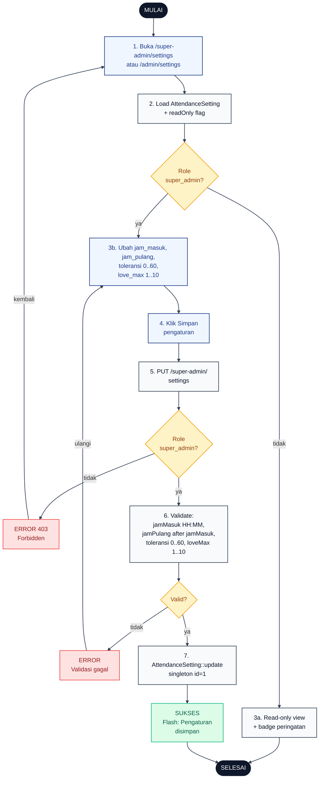

# 20 — Settings Admin

Pengaturan absensi global (jam kerja, toleransi, kuota love). Hanya Super Admin yang boleh menulis; Admin Wilayah hanya read-only dengan badge peringatan.

## Aktor
- **Super Admin** — full akses read + write.
- **Admin Wilayah** — hanya read-only view (badge di sidebar).
- **Sistem** — `Admin\SettingController`.

## Flowchart

## Legenda Warna Node

| Warna | Jenis |
|---|---|
| Hitam pekat | Start / End |
| Biru muda | Aksi Aktor (Admin) |
| Abu-abu putih | Proses Sistem |
| Kuning | Keputusan (kondisi if/else) |
| Merah muda | Jalur error |
| Hijau muda | Hasil sukses |

## Langkah-Langkah Detail

1. Admin membuka `/super-admin/settings` (Super Admin) atau `/admin/settings` (Admin Wilayah).
2. `SettingController::index` memuat singleton `AttendanceSetting` beserta flag `readOnly` untuk FE.
3. Cek role: (a) bukan `super_admin` → tampilkan view read-only + badge peringatan, alur berhenti. (b) `super_admin` → form editable dengan field jam kerja, toleransi, `love_max`, dsb.
4. Super Admin klik tombol Simpan pengaturan.
5. FE PUT ke `/super-admin/settings`.
6. Server re-check role. Admin Wilayah yang bypass FE → 403 Forbidden.
7. Validate payload: `jamMasuk` format `HH:MM`, `jamPulang` `HH:MM` dan setelah `jamMasuk`, `toleransi` 0..60 menit, `loveMax` 1..10. Kalau invalid → kembalikan errors.
8. `AttendanceSetting::update(...)` menimpa singleton (single row `id=1`).

## Catatan implementasi
- Controller: `app/Http/Controllers/Admin/SettingController.php`.
- `AttendanceSetting` adalah singleton (single row, `id=1`). Update selalu mengubah baris ini.
- Perubahan `love_max` berlaku bulan berikutnya (reset di tanggal 1, 00:00 WITA). Sisa bulan berjalan tetap pakai kuota lama.
- Field `hari_kerja` dan `timezone` tidak diubah dari UI saat ini (default Sen–Jum, Asia/Makassar).
- Badge read-only untuk Admin Wilayah ditentukan lewat `readOnly = user->role !== 'super_admin'` yang di-share ke FE.
