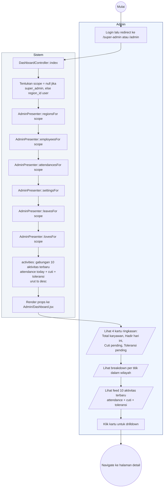

# 21 — Dashboard Admin

Ringkasan wilayah dan aktivitas terbaru. Menampilkan statistik hadir hari ini, cuti/toleransi pending, dan feed aktivitas (attendance + cuti + toleransi terbaru).

## Aktor
- **Super Admin** — lihat semua wilayah.
- **Admin Wilayah** — lihat wilayahnya saja.
- **Sistem** — `Admin\DashboardController::index` + `AdminPresenter`.

## Alur

## Catatan implementasi
- Aktivitas terbaru dihitung real-time dari model `Attendance`, `Leave`, `ToleranceClaim`, bukan dari daftar hardcode. Setiap aktivitas punya field `t` (label), `tag` (kategori: on_time/late/cuti/love), `color` (mapping warna badge), `ts` (timestamp untuk sorting).
- Scope wilayah otomatis diterapkan lewat `AdminPresenter::*For(scope)` sehingga Admin Wilayah tidak pernah melihat data wilayah lain.
- Empty state ditampilkan bila belum ada aktivitas hari ini.
