# 21 — Dashboard Admin

Ringkasan wilayah dan aktivitas terbaru untuk Admin. Menampilkan 4 kartu statistik (total karyawan, hadir hari ini, cuti pending, toleransi pending), breakdown per titik, dan feed 10 aktivitas terbaru dari attendance + leave + tolerance.

## Aktor
- **Super Admin** — lihat semua wilayah.
- **Admin Wilayah** — lihat wilayahnya saja (scoped otomatis).
- **Sistem** — `Admin\DashboardController::index` + `AdminPresenter`.

## Flowchart

```mermaid
flowchart TD
    START([MULAI]):::se

    A1["1. Login sukses<br/>redirect ke /super-admin<br/>atau /admin"]:::user
    S1["2. DashboardController::index"]:::sys
    D1{"3. Role user?"}:::dec

    S2a["4a. Scope = null<br/>(super_admin)"]:::sys
    S2b["4b. Scope = user->region_id<br/>(admin_wilayah)"]:::sys

    S3["5. Presenter::regionsFor(scope)"]:::sys
    S4["6. Presenter::employeesFor(scope)"]:::sys
    S5["7. Presenter::attendancesFor(scope)"]:::sys
    S6["8. Presenter::settingsFor()"]:::sys
    S7["9. Presenter::leavesFor(scope)"]:::sys
    S8["10. Presenter::lovesFor(scope)"]:::sys

    S9["11. Compose activities:<br/>10 aktivitas terbaru<br/>attendance + cuti +<br/>toleransi, urut ts desc"]:::sys
    S10["12. Render props ke<br/>Admin/Dashboard.jsx"]:::sys

    A2["13. Lihat 4 kartu ringkasan:<br/>total karyawan, hadir hari ini,<br/>cuti pending, toleransi pending"]:::user
    A3["14. Lihat breakdown<br/>per titik dalam wilayah"]:::user
    A4["15. Lihat feed<br/>10 aktivitas terbaru"]:::user
    A5["16. Klik kartu untuk<br/>drilldown ke halaman detail"]:::user

    OK["SUKSES<br/>Navigasi ke halaman detail"]:::ok
    END([SELESAI]):::se

    START --> A1
    A1 --> S1
    S1 --> D1

    D1 -->|super_admin| S2a
    D1 -->|admin_wilayah| S2b

    S2a --> S3
    S2b --> S3
    S3 --> S4
    S4 --> S5
    S5 --> S6
    S6 --> S7
    S7 --> S8
    S8 --> S9
    S9 --> S10
    S10 --> A2
    A2 --> A3
    A3 --> A4
    A4 --> A5
    A5 --> OK
    OK --> END

    classDef se fill:#0F172A,stroke:#0F172A,color:#fff,stroke-width:2px
    classDef user fill:#EFF6FF,stroke:#1E3A8A,color:#1E3A8A,stroke-width:1.5px
    classDef sys fill:#F8FAFC,stroke:#334155,color:#0F172A,stroke-width:1.5px
    classDef dec fill:#FEF3C7,stroke:#F59E0B,color:#92400E,stroke-width:1.5px
    classDef err fill:#FEE2E2,stroke:#EF4444,color:#991B1B,stroke-width:1.5px
    classDef ok fill:#DCFCE7,stroke:#10B981,color:#065F46,stroke-width:1.5px

    linkStyle default stroke:#334155,stroke-width:1.5px
```

## Legenda Warna Node

| Warna | Jenis |
|---|---|
| Hitam pekat | Start / End |
| Biru muda | Aksi Aktor (Admin) |
| Abu-abu putih | Proses Sistem |
| Kuning | Keputusan (kondisi if/else) |
| Merah muda | Jalur error |
| Hijau muda | Hasil sukses |

## Langkah-Langkah Detail

1. Admin login dan browser diarahkan ke `/super-admin` atau `/admin`.
2. `DashboardController::index` dijalankan.
3. Sistem cek role user untuk menentukan scope.
4. Set scope:
   - **4a.** Super Admin → scope null (semua wilayah).
   - **4b.** Admin Wilayah → scope `user->region_id`.
5. `AdminPresenter::regionsFor($scope)` — ambil daftar wilayah.
6. `AdminPresenter::employeesFor($scope)` — ambil karyawan.
7. `AdminPresenter::attendancesFor($scope)` — ambil attendance hari ini.
8. `AdminPresenter::settingsFor()` — ambil pengaturan sistem.
9. `AdminPresenter::leavesFor($scope)` — ambil cuti pending.
10. `AdminPresenter::lovesFor($scope)` — ambil toleransi pending.
11. Sistem menyusun `activities`: gabungan 10 aktivitas terbaru dari attendance + cuti + toleransi, urut `ts` descending.
12. Semua props dikirim ke `Admin/Dashboard.jsx` untuk dirender.
13. Admin melihat 4 kartu ringkasan di bagian atas dashboard.
14. Admin melihat breakdown karyawan hadir per titik proyek.
15. Admin melihat feed aktivitas terbaru dengan badge kategori (on_time, late, cuti, love).
16. Admin bisa klik kartu ringkasan untuk drilldown ke halaman detail (attendances, leaves, tolerances).

## Catatan implementasi
- Aktivitas terbaru dihitung real-time dari model `Attendance`, `Leave`, `ToleranceClaim` — bukan daftar hardcode. Setiap aktivitas punya field `t` (label), `tag` (kategori: `on_time`/`late`/`cuti`/`love`), `color` (mapping warna badge), `ts` (timestamp untuk sorting).
- Scope wilayah otomatis diterapkan lewat `AdminPresenter::*For($scope)` sehingga Admin Wilayah tidak pernah melihat data wilayah lain.
- Empty state ditampilkan bila belum ada aktivitas hari ini.
- Semua presenter method dipanggil sekuensial di controller — tidak ada N+1 karena masing-masing menggunakan `eager loading` yang sesuai.
