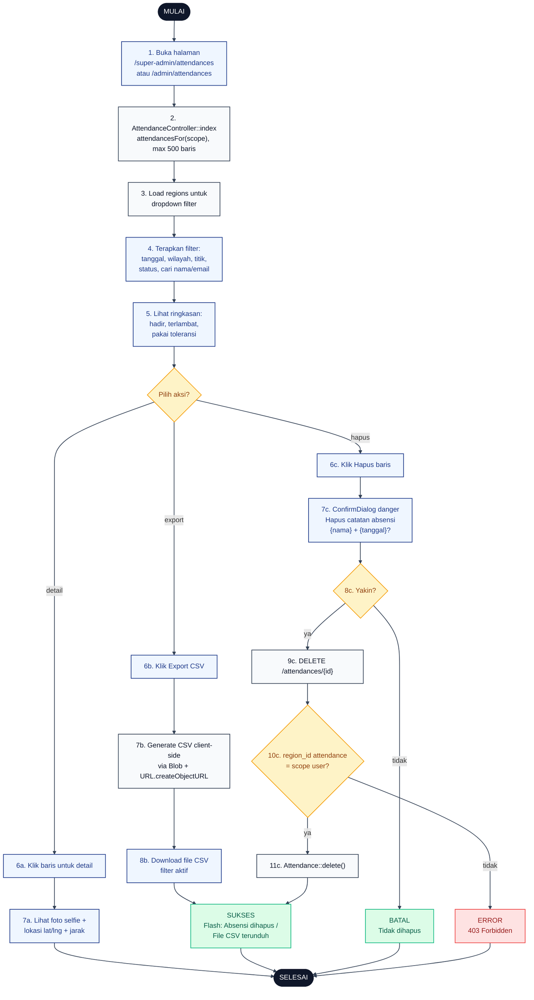

# 22 — Admin Attendances (Kelola Kehadiran)

Halaman `/admin/attendances` untuk Admin lihat, filter, ekspor CSV, dan hapus catatan kehadiran. Super Admin lihat semua wilayah; Admin Wilayah hanya wilayahnya.

## Aktor
- **Super Admin** — akses semua data attendance.
- **Admin Wilayah** — hanya `region_id` sendiri.
- **Sistem** — `Admin\AttendanceController::index` + `destroy`.

## Flowchart

## Legenda Warna Node

| Warna | Jenis |
|---|---|
| Hitam pekat | Start / End |
| Biru muda | Aksi Aktor (Admin) |
| Abu-abu putih | Proses Sistem |
| Kuning | Keputusan (kondisi if/else) |
| Merah muda | Jalur error |
| Hijau muda | Hasil sukses / batal |

## Langkah-Langkah Detail

1. Admin membuka halaman daftar attendance.
2. `AttendanceController::index` memanggil `AdminPresenter::attendancesFor($scope)` — max 500 baris terakhir.
3. Controller juga load daftar wilayah untuk dropdown filter.
4. Admin bisa memfilter data berdasarkan tanggal, wilayah, titik proyek, status (hadir/terlambat/pakai toleransi), atau cari nama/email.
5. Admin melihat ringkasan angka di header: total hadir, total terlambat, total pakai toleransi.
6. Admin memilih salah satu aksi:
   - **6a.** Klik baris untuk lihat detail.
   - **6b.** Export data ke CSV.
   - **6c.** Hapus catatan absensi tertentu.
7. Sistem/user menjalankan langkah berikutnya sesuai aksi:
   - **7a.** Panel detail muncul dengan foto selfie, koordinat lat/lng, dan jarak ke titik proyek.
   - **7b.** FE generate CSV dari data terfilter menggunakan `Blob` + `URL.createObjectURL`.
   - **7c.** `ConfirmDialog` tone danger meminta konfirmasi dengan nama karyawan + tanggal absensi.
8. Untuk hapus: user konfirmasi lewat dialog.
9. Kalau konfirmasi, browser kirim `DELETE /attendances/{id}`.
10. Controller cek scope: `region_id` attendance harus sesuai scope user.
11. Kalau lolos, `Attendance::delete()` dieksekusi dan flash success ditampilkan.

## Catatan implementasi
- Data attendance dibatasi 500 baris terakhir untuk performa; filter dilakukan client-side.
- Export CSV pakai `Blob` + `URL.createObjectURL` di FE, tidak melalui server.
- Hanya Admin yang punya akses hapus. Kalau Admin Wilayah coba hapus baris di luar `region_id`-nya → 403.
- Foto selfie ditampilkan dari `attendance.selfie_url` (fallback avatar default).
- Filter dropdown wilayah untuk Admin Wilayah hanya menampilkan wilayahnya sendiri (auto-select).
