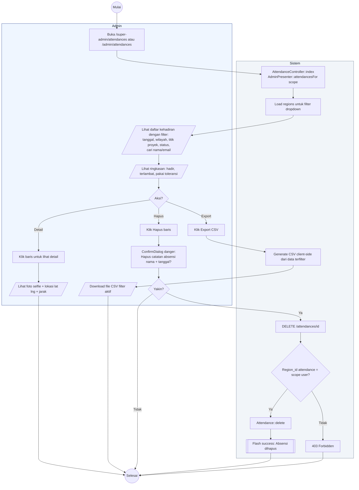

# 22 — Admin Attendances (Kelola Kehadiran)

Halaman `/admin/attendances` untuk Admin lihat, filter, ekspor CSV, dan hapus catatan kehadiran. Super Admin lihat semua wilayah; Admin Wilayah hanya wilayahnya.

## Aktor
- **Super Admin** — akses semua data attendance.
- **Admin Wilayah** — hanya `region_id` sendiri.
- **Sistem** — `Admin\AttendanceController::index`, `destroy`.

## Alur

## Catatan implementasi
- Data attendance dibatasi 500 baris terakhir untuk performa; filter dilakukan client-side.
- Export CSV pakai `Blob` + `URL.createObjectURL` di FE, tidak melalui server.
- Hanya Admin yang punya akses hapus. Kalau Admin Wilayah coba hapus baris di luar region → 403.
- Foto selfie ditampilkan dari `attendance.selfie_url` (fallback avatar default).
