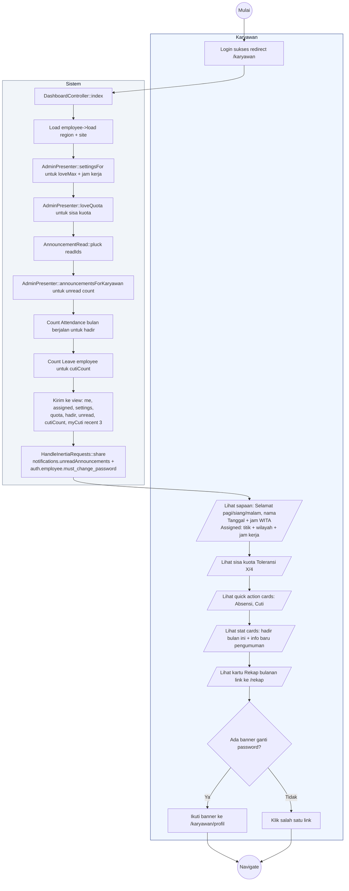

# 23 — Karyawan Dashboard (Home)

Halaman `/karyawan` yang jadi home setelah login. Menampilkan sapaan, ringkasan status, quick action, dan sisa kuota toleransi.

## Aktor
- **Karyawan** — user aktif.
- **Sistem** — `Karyawan\DashboardController::index` + shared props Inertia.

## Alur

## Catatan implementasi
- Sapaan berdasarkan waktu WITA: `< 11 = pagi`, `< 15 = siang`, `< 18 = sore`, `else = malam`.
- Banner "Kata sandi masih NIK" muncul di layout, bukan di dashboard, jadi sticky di semua halaman karyawan (lihat [`18-ganti-password-karyawan.md`](./18-ganti-password-karyawan.md)).
- Badge Info di navigation bar menampilkan `unreadAnnouncements` real-time.
- Data hadir bulan ini di-count dari `Attendance` table dengan filter `whereYear` + `whereMonth` sesuai Asia/Makassar.
