# 23 — Karyawan Dashboard (Home)

Halaman `/karyawan` yang jadi home setelah login. Menampilkan sapaan waktu, ringkasan status hari ini, sisa kuota toleransi, quick action, stat cards, dan optional banner ganti password.

## Aktor
- **Karyawan** — user aktif dengan sesi valid.
- **Sistem** — `Karyawan\DashboardController::index` + shared props Inertia (`HandleInertiaRequests`) + `AdminPresenter`.

## Flowchart

```mermaid
flowchart TD
    START([MULAI]):::se

    A1["1. Login sukses<br/>redirect /karyawan"]:::user
    S1["2. DashboardController::index"]:::sys
    S2["3. Load employee<br/>+ region + site"]:::sys
    S3["4. AdminPresenter::settingsFor<br/>loveMax + jam kerja"]:::sys
    S4["5. AdminPresenter::loveQuota<br/>sisa kuota bulan ini"]:::sys
    S5["6. AnnouncementRead::pluck<br/>readIds"]:::sys
    S6["7. announcementsForKaryawan<br/>hitung unread"]:::sys
    S7["8. Count Attendance<br/>bulan berjalan (hadir)"]:::sys
    S8["9. Count Leave<br/>karyawan (cutiCount)"]:::sys
    S9["10. Kirim ke view:<br/>me, assigned, settings, quota,<br/>hadir, unread, cutiCount, myCuti"]:::sys
    S10["11. HandleInertiaRequests::share<br/>unreadAnnouncements +<br/>must_change_password"]:::sys

    A2["12. Lihat sapaan waktu<br/>+ tanggal jam WITA<br/>+ assigned site/region"]:::user
    A3["13. Lihat sisa kuota<br/>Toleransi X/4"]:::user
    A4["14. Lihat quick action:<br/>Absensi, Cuti"]:::user
    A5["15. Lihat stat cards:<br/>hadir + info pengumuman"]:::user
    A6["16. Lihat kartu Rekap<br/>bulanan link ke /rekap"]:::user
    D1{"Ada banner<br/>ganti password?"}:::dec
    A7a["17a. Ikuti banner<br/>ke /karyawan/profil"]:::user
    A7b["17b. Klik salah satu<br/>link/quick action"]:::user

    OK["SUKSES<br/>Navigate ke halaman tujuan"]:::ok
    END([SELESAI]):::se

    START --> A1
    A1 --> S1
    S1 --> S2
    S2 --> S3
    S3 --> S4
    S4 --> S5
    S5 --> S6
    S6 --> S7
    S7 --> S8
    S8 --> S9
    S9 --> S10
    S10 --> A2
    A2 --> A3
    A3 --> A4
    A4 --> A5
    A5 --> A6
    A6 --> D1
    D1 -->|ya| A7a
    D1 -->|tidak| A7b
    A7a --> OK
    A7b --> OK
    OK --> END

    classDef se fill:#0F172A,stroke:#0F172A,color:#fff,stroke-width:2px
    classDef user fill:#EFF6FF,stroke:#1E3A8A,color:#1E3A8A,stroke-width:1.5px
    classDef sys fill:#F8FAFC,stroke:#334155,color:#0F172A,stroke-width:1.5px
    classDef dec fill:#FEF3C7,stroke:#F59E0B,color:#92400E,stroke-width:1.5px
    classDef err fill:#FEE2E2,stroke:#EF4444,color:#991B1B,stroke-width:1.5px
    classDef ok fill:#DCFCE7,stroke:#10B981,color:#065F46,stroke-width:1.5px

    linkStyle default stroke:#334155,stroke-width:1.5px
```

## Legenda Warna Node

| Warna | Jenis |
|---|---|
| Hitam pekat | Start / End |
| Biru muda | Aksi Aktor (Karyawan) |
| Abu-abu putih | Proses Sistem |
| Kuning | Keputusan (kondisi if/else) |
| Merah muda | Jalur error |
| Hijau muda | Hasil sukses |

## Langkah-Langkah Detail

1. Karyawan login sukses, otomatis redirect ke `/karyawan`.
2. Route memanggil `DashboardController::index`.
3. Load model `employee` beserta relasi `region` dan `site`.
4. `AdminPresenter::settingsFor` mengambil `loveMax` dan jam kerja untuk site tersebut.
5. `AdminPresenter::loveQuota` menghitung sisa kuota toleransi bulan berjalan.
6. `AnnouncementRead::pluck` ambil id pengumuman yang sudah dibaca karyawan.
7. `AdminPresenter::announcementsForKaryawan` hitung jumlah pengumuman unread.
8. Count `Attendance` bulan berjalan (`whereYear` + `whereMonth` sesuai Asia/Makassar) untuk metrik hadir.
9. Count `Leave` milik employee untuk metrik `cutiCount`.
10. Kirim data ke view Inertia: `me`, `assigned`, `settings`, `quota`, `hadir`, `unread`, `cutiCount`, dan `myCuti` (recent 3).
11. Middleware `HandleInertiaRequests::share` inject `notifications.unreadAnnouncements` + `auth.employee.must_change_password` sebagai shared props.
12. UI menampilkan sapaan (Selamat pagi/siang/sore/malam berdasarkan jam WITA) + tanggal/jam + info assigned site + wilayah + jam kerja.
13. Chip sisa kuota Toleransi `X/4` dari `quota`.
14. Quick action cards: Absensi, Cuti.
15. Stat cards: jumlah hadir bulan ini, info pengumuman baru.
16. Kartu Rekap bulanan sebagai shortcut ke `/karyawan/rekap`.
17. Kalau `must_change_password = true`, banner muncul mengarah ke `/karyawan/profil` (17a). Kalau tidak, karyawan bebas klik quick action manapun (17b).

## Catatan implementasi
- Sapaan berdasarkan jam WITA: `< 11 = pagi`, `< 15 = siang`, `< 18 = sore`, `else = malam`.
- Banner "Kata sandi masih NIK" muncul di layout (bukan di dashboard), jadi sticky di semua halaman karyawan (lihat [`18-ganti-password-karyawan.md`](./18-ganti-password-karyawan.md)).
- Badge Info di navigation bar menampilkan `unreadAnnouncements` real-time dari shared props.
- Data hadir bulan ini di-count dari tabel `Attendance` dengan filter `whereYear` + `whereMonth` sesuai zona `Asia/Makassar`, bukan UTC.
- Controller: `app/Http/Controllers/Karyawan/DashboardController.php`.
