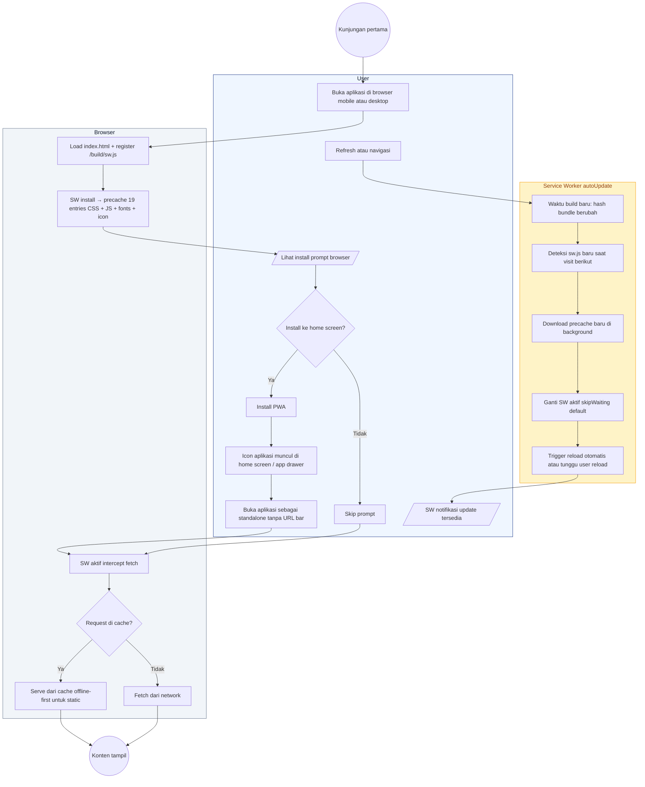
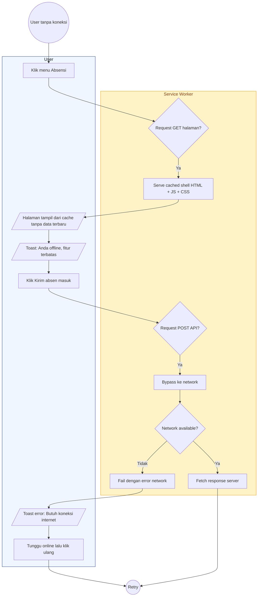

# 24 — PWA Install & Offline

Aplikasi dibundle sebagai Progressive Web App via `vite-plugin-pwa` mode `generateSW` + `registerType: autoUpdate`. Karyawan bisa install ke home screen dan akses beberapa fitur offline.

## Aktor
- **Karyawan / Admin** — pengguna browser modern (Chrome, Edge, Safari).
- **Browser** — engine PWA + service worker.
- **Service Worker** — file `/build/sw.js` hasil Workbox precache 19 entries.

## Alur Install & Update

## Alur Offline (Attempt)

## Catatan implementasi
- Konfigurasi PWA di `vite.config.js`: `registerType: 'autoUpdate'`, precache 19 entries (~894 KiB) meliputi CSS, JS bundle, font woff2, dan icon PWA 192/512.
- Icon manifest: `public/pwa-192x192.png`, `public/pwa-512x512.png`. Nama aplikasi "BBWS Pompengan Jeneberang".
- Tidak ada background sync atau IndexedDB untuk offline queue clock-in. Fitur POST butuh network aktif; ini keputusan sadar untuk mencegah absensi palsu dari cache.
- Auto-update: user tidak perlu manual re-install. Refresh halaman setelah SW update selesai memasang bundle baru.
