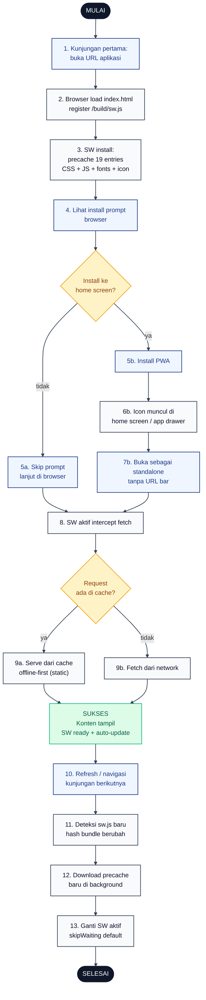
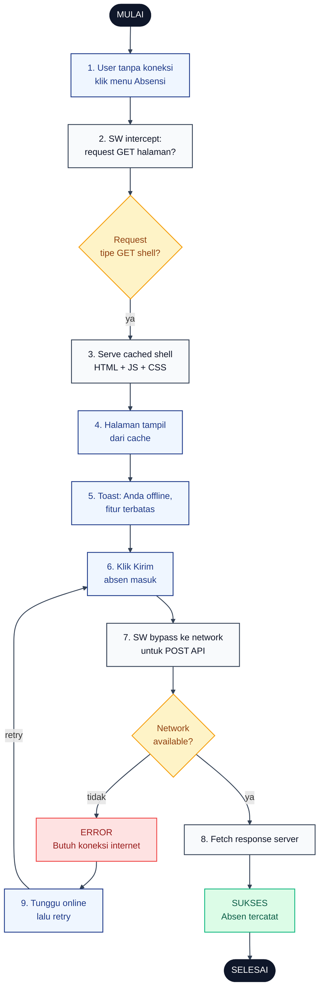

# 24 — PWA Install & Offline

Aplikasi dibundle sebagai Progressive Web App via `vite-plugin-pwa` mode `generateSW` + `registerType: autoUpdate`. User bisa install ke home screen dan mengakses shell aplikasi walau offline.

## Aktor
- **User** — Karyawan / Admin di browser modern (Chrome, Edge, Safari).
- **Browser** — engine PWA yang meng-register service worker.
- **Service Worker** — file `/build/sw.js` hasil Workbox precache 19 entries (~894 KiB).

## Flowchart — Install & Auto-Update

## Flowchart — Alur Offline

## Legenda Warna Node

| Warna | Jenis |
|---|---|
| Hitam pekat | Start / End |
| Biru muda | Aksi Aktor (User) |
| Abu-abu putih | Proses Sistem / Browser / Service Worker |
| Kuning | Keputusan (kondisi if/else) |
| Merah muda | Jalur error |
| Hijau muda | Hasil sukses |

## Langkah-Langkah Detail

### Install & Auto-Update
1. User membuka URL aplikasi untuk pertama kali dari browser mobile/desktop.
2. Browser load `index.html` dan meregister `/build/sw.js`.
3. SW jalankan `install` phase: precache 19 entries (CSS, JS bundle, font woff2, icon PWA 192/512).
4. Browser menawarkan install prompt (Add to Home Screen).
5. (a) User skip → tetap jalan di tab browser. (b) User install → PWA di-install.
6. Icon aplikasi muncul di home screen / app drawer.
7. User membuka aplikasi sebagai standalone (tanpa URL bar).
8. SW aktif intercept semua request `fetch`.
9. Cek cache: (a) hit → serve dari cache (offline-first untuk static). (b) miss → fetch dari network.
10. Pada kunjungan berikutnya (refresh atau navigasi), SW cek update.
11. Deteksi `sw.js` baru karena hash bundle berubah setelah build ulang.
12. Download precache baru di background tanpa mengganggu sesi user.
13. `skipWaiting` (default `registerType: autoUpdate`) → SW baru langsung aktif untuk kunjungan selanjutnya.

### Offline
1. User tanpa koneksi internet klik menu Absensi.
2. SW intercept request; cek apakah ini GET untuk halaman/shell.
3. Kalau ya → serve cached shell HTML + JS + CSS.
4. Halaman tampil dari cache, meskipun tanpa data terbaru.
5. Toast informasi: "Anda offline, fitur terbatas".
6. User tetap coba klik Kirim absen masuk.
7. SW bypass request POST ke network (tidak di-cache).
8. Cek network: kalau ada → fetch response server, absen tercatat. Kalau tidak ada → error network.
9. User diminta tunggu online lalu retry.

## Catatan implementasi
- Konfigurasi PWA di `vite.config.js`: `registerType: 'autoUpdate'`, precache 19 entries (~894 KiB).
- Icon manifest: `public/pwa-192x192.png`, `public/pwa-512x512.png`. Nama aplikasi "BBWS Pompengan Jeneberang".
- Tidak ada background sync atau IndexedDB untuk offline queue clock-in. Fitur POST butuh network aktif — keputusan sadar untuk mencegah absensi palsu dari cache.
- Auto-update: user tidak perlu manual re-install. Refresh halaman setelah SW baru terpasang → bundle terbaru aktif.
