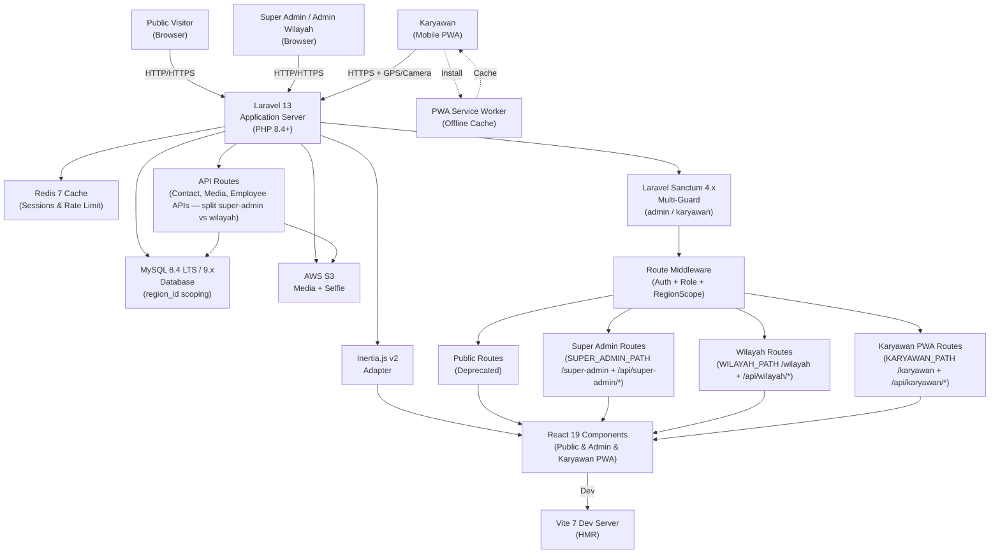
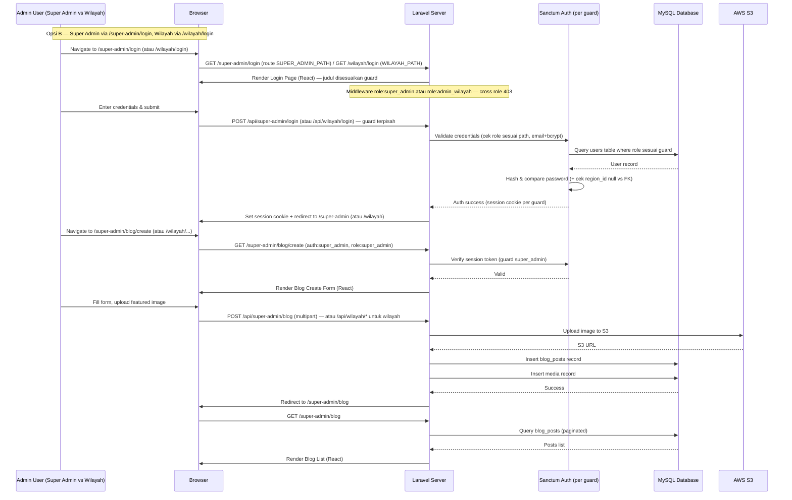
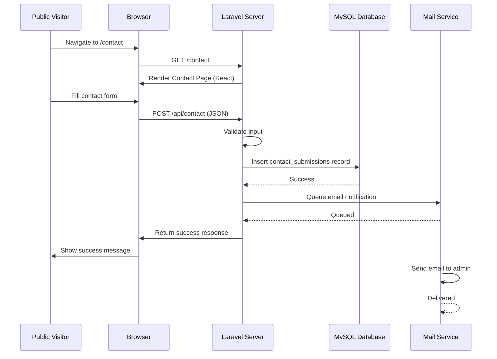

# ARCHITECTURE.md: BBWS Pompengan Jeneberang

## System Overview

BBWS Pompengan Jeneberang — **BBWS Pompengan Jeneberang** is a monolithic Laravel 13 application (PHP 8.4+) with a React 19 frontend via Inertia.js v2. Pusat di **Makassar**, cabang di **Kabupaten/Kota se-Sulsel** (24 wilayah). Each Kantor Wilayah has **N titik proyek per wilayah** (contoh Bendungan A, Jembatan B, Embung C — masing-masing **lat/lng via map picker + radius absen meter**, dedicated page per titik `GET /regions/{region}/sites/{site}`) di-input admin untuk geofence validasi absensi GPS+selfie karyawannya — **1 karyawan = 1 titik (`office_location_id`)**, karyawan valid hanya jika `distance <= radius_m(titik assigned)` via `GeofenceService::isWithinAssignedSite`; `office_location_id IS NULL` (tanpa titik) → **tidak bisa absen 422** (bukan `isWithinAnySite`). Architecture SSR + Inertia reactive, no separate API. Styling Tailwind v4, Vite 7, assets (media, selfie) on AWS S3, MySQL 8.4 LTS / 9.x region-scoped per kantor cabang, VPS Ubuntu 24.04 LTS. Roles: Super Admin Pusat (Makassar, CRUD all kantor + N titik/radius + assign/pindah per titik, atur Love max & jam global — via `SUPER_ADMIN_PATH` `/super-admin` + `/api/super-admin/*`), Admin Wilayah/Wilayah (tambah/edit N titik proyek di wilayahnya sendiri + assign karyawan per titik 1=1, approve Love 1 level cek titik assigned, write own region — via `WILAYAH_PATH` `/wilayah` + `/api/wilayah/*`), Karyawan (email login, own-data-only, **absensi hanya ke titik assigned-nya** — di luar assigned / tanpa titik ditolak 422, Love 4/bulan reset cek assigned, ajukan dokumen untuk excuse late, PWA via `KARYAWAN_PATH` `/karyawan`) — **Opsi B: dua URL admin terpisah, tidak saling tukar**.

## High-Level Architecture Diagram



## Component Breakdown

### Laravel 13 Application Server (PHP 8.4+)

The core backend application handles all business logic, routing, and data persistence. It serves as the single source of truth for regional admin, and karyawan PWA. Requires PHP 8.4+, leverages Laravel 13's slimmer skeleton, improved Eloquent and native Vite 7 integration. Multi-tenant per region via `region_id`. Key responsibilities include:

- **Request Routing:** Directs requests to public / admin / karyawan PWA controllers with role & region middleware. Includes scheduled job `love:reset-monthly` (1st 00:00 WITA).
- **Authentication & Authorization:** Multi-guard Sanctum 4.x (`admin` guard via email, `karyawan` guard via NIK) + RBAC (Super Admin, Admin Wilayah, Karyawan) + region scope policies.
- **Data Validation:** Validates all inputs including NIK/NIP, GPS geofence, selfie image, cuti dates, love claim alasan/dokumen, love window hari yang sama, love_sisa >0, dalam radius.
- **Database Queries:** Optimized eager loading, region-scoped queries, query caching per region.
  - **File Operations:** Handles uploads to S3: media, absensi selfies (`/attendance/{region}/{employee}/{date}` validated **hanya terhadap titik assigned** `employee.office_location_id` via `GeofenceService::isWithinAssignedSite` — `NULL`=422 tidak bisa absen / di luar assigned 422 ditolak), love dokumen (`/love-claims/{region}/{employee}/{uuid}.pdf` — hanya dalam radius assigned).
  - **Geofence Service:** Central service `GeofenceService::isWithinAssignedSite(karyawanLat, karyawanLng, OfficeLocation assigned) → {within: bool, distanceM: int}` — Haversine ke `assigned` + `within = dist <= radius_m(assigned)`; helper `isWithinAnySite` **hanya untuk list / nearest reporting (Dashboard breakdown / filter)**, **bukan untuk validasi absen/Love** — validasi absen/Love wajib `isWithinAssignedSite` only. `Employee.office_location_id == null` → 422 belum di-assign titik. Used by AttendanceController & LoveClaimController.
- **PWA Support:** Serves `manifest.json` + `service-worker.js`, VAPID keys for push, offline queue sync for absensi.

### Inertia.js v2 Adapter

Inertia.js v2 bridges Laravel 13 and React 19, enabling server-side routing with client-side reactivity. It eliminates the need for a separate REST API by passing data directly from Laravel controllers to React components as props.

- **Server-Side Rendering:** Renders React 19 components on the server for the initial page load, improving SEO and performance (supports React Server Components patterns).
- **Client-Side Navigation:** Enables smooth, SPA-like navigation with prefetching, deferred props, and automatic poll optimization (new in v2).
- **Props Serialization:** Automatically serializes Laravel data (models, arrays) into JSON props for React components.

### React 19 Components (Public & Admin & Karyawan PWA)

React 19 components are organized into three sections, all using Tailwind CSS v4 and React 19 features (Actions, useOptimistic).

  - **Admin Components:** Dashboard (role-scoped **+ breakdown per Titik** — `OWN_REGION`/`wilayah` filter, `siteFilter`, cards per titik `anggota`/`lat/lng•radius`/`Kelola` Link `GET /regions/{region}/sites/{site}`, stats `totalTanpaTitik`), Regions CRUD + **N Titik per wilayah — dedicated page per titik `GET /regions/{region}/sites/{site}` (`super_admin|admin|wilayah.sites.show`)** dengan Leaflet draggable+circle per titik + edit titik + **anggota per titik saja** (`office_location_id == site.id`, 1 karyawan=1 titik, assign `kandidatTambah` filtered `regionId==region.id && office_location_id==null` / pindah), Employees (kolom+filter `Titik Proyek` `office_location_id` select, LS `_shared.js` `bbws_mock_*_v3` sync), Attendances (filter `Wilayah→Titik Proyek→Status` incl. `__null` tanpa titik, `siteById` kolom Titik link+`Dalam/Di luar`+`jarak/radius`+detail drawer S3 `/attendance/{region}/{employee}/{date}`), Cuti/Love (filter `Titik Proyek` + kolom link, Love badge `Dalam/Di luar` + Approve guard `sisa===0||!inRadius`), Announcement/Global Settings (jam kerja + love_max).
  - **Karyawan PWA Components (Mobile-first, 320px+, 1 Karyawan = 1 Titik):** `MOCK_KARYAWAN_ID=1` Andi Saputra assigned `site 201 Bendungan Bili-Bili — Gowa 200m` via `loadRegions/loadEmployees` sync (`_shared.js`), `tanpaTitik` branch 422; Absensi (banner `Ditugaskan di: {nama} — {region} • lat,lng • radius`, preview `jarak/radius` + badge `Dalam/Di luar radius titik assigned`, buttons disabled `!inRadius||tanpaTitik`, history `jarak/radius`), Dashboard (greeting badge titik assigned), Love (sisa/max + `jarak<=radius(assigned)` gate, `tanpaTitik` block, disabled `!hit||sisa0`), Profil (header+card titik assigned lat/lng•radius), Rekap (header note + calendar `Di luar {radius}m tidak tercatat 422`). Bottom nav, Offline banner + queue indicator, PWA install prompt + SW cache.
- **Shared Components:** Navigation, footer, modals, form inputs, pagination, loading skeletons, permission gates.

### MySQL 8.4 LTS / 9.x Database

Stores all application data with a relational schema optimized for the corporate profile use case. MySQL 8.4 LTS is the recommended production target (long-term support); MySQL 9.x innovation release also supported by Laravel 13.

**Core Tables (Public + Admin):**
- `users` — Admin accounts (Super Admin Makassar + Admin Wilayah/Wilayah) with `role` + `region_id` (nullable for Super Admin), hashed password.
  - `regions` — Kantor BBWS PJ (Kantor Pusat + Wilayah Kab/Kota se-Sulsel, 24 wilayah) — `name, slug, kantor_name, tipe (pusat/cabang), address, is_active` — **geofence config dipindah ke `office_locations` N titik per wilayah (N≤20, last delete 422)**.
  - `office_locations` — N titik proyek per wilayah (nama_titik ex Bendungan A/Jembatan B, lat/lng/radius_m 50–1000 per titik, address, is_active) — Leaflet picker per titik, minimal 1 per wilayah, dedicated page `GET /regions/{region}/sites/{site}` + anggota per titik.
 - `pages` — Static pages with meta tags.
- `page_versions` — Historical versions for rollback.
- `services`, `projects`, `team_members`, `blog_posts`, `blog_categories`, `blog_tags`, `testimonials`, `contact_submissions`, `media`, `settings` — as before.

**Karyawan/HR Tables (Region-Scoped):**
- `employees` — Karyawan Lengkap HR (NIK UK, NIP UK, name, golongan, jabatan, unit_kerja, status, region_id FK, **office_location_id FK NULLABLE (1 karyawan = 1 titik; NULL=belum assign, tidak bisa absen 422)**, foto S3, kontak, dokumen) + auth password — `OfficeLocation.onDelete:SetNull`.
  - `attendances` — Absensi (employee_id, region_id, **office_location_id (titik assigned karyawan, harus == employee.office_location_id)**, type in/out, timestamp, lat, lng, selfie_url S3 `/attendance/{region}/{employee}/{date}/`, status on_time/late/early_leave/excused_love, distance_m ke assigned, device_info — **tanpa titik / di luar assigned ditolak 422** via `isWithinAssignedSite`).
- `leave_requests` — Cuti berjenjang (employee_id, region_id, jenis, tgl mulai/selesai, alasan, dokumen S3, status enum pending/approved_level1/approved_level2/approved/rejected, approved_by/at per level).
- `announcements` — Pengumuman (title, content HTML, attachment S3, scope global/region, region_id nullable, published_at, is_pinned, created_by).
- `love_balances` — Love per karyawan per bulan (employee_id, period YYYY-MM, love_sisa, love_max, reset_at) — reset 1st 00:00 WITA, fleksibel max.
- `love_claims` — Love Claim (employee_id, attendance_id UK, region_id, alasan, dokumen_url S3, status pending/approved/rejected, reviewed_by/at) — 1 level Admin Wilayah, **bulan yang sama (hari beda boleh)**, **hanya dalam radius titik assigned (`distance <= radius_m(assigned)`)**, tanpa titik tidak bisa claim.
- `announcement_reads` — Pivot (announcement_id, employee_id, read_at) for read/unread.

### AWS S3 Media Storage

Cloud-based file storage for all company media assets (images, videos, documents). Provides high availability, durability, and scalability.

- **Bucket Configuration:** Versioning enabled for data recovery; lifecycle policies to archive old versions; public read access for media served to visitors.
- **IAM Policy:** Restrictive permissions for the application user (upload, delete, list only within the application's designated folder).
- **CDN Integration:** Optional CloudFront distribution for faster global asset delivery.

### Redis 7 Cache (Optional)

In-memory cache layer (Redis 7+) for reducing database load and improving response times.

- **Query Caching:** Cache frequently accessed data (settings, service listings, team members).
- **Session Storage:** Optional session driver for distributed deployments.
- **Rate Limiting:** Stores rate limit counters for login and contact form endpoints.

### Laravel Sanctum 4.x & Multi-Guard Session Authentication — Opsi B Pisah URL

Multi-guard auth for 3 roles, all session-based via Sanctum, **pisah URL** (Opsi B).

- **Guards:** `super_admin` (users table, email, role=super_admin, region_id=null) untuk Super Admin via `SUPER_ADMIN_PATH`; `wilayah` (users table, email, role=admin_wilayah, region_id=FK) untuk Admin Wilayah via `WILAYAH_PATH`; `karyawan` (employees table, email) untuk employees via `KARYAWAN_PATH`. Legacy `admin` guard dipertahankan sebagai alias ke `super_admin` untuk backward compat. Separate session cookies & CSRF handling per guard — tidak cross-login.
- **Session Tokens:** HTTP-only cookies, Sanctum 4.x. Login validates email + bcrypt password per guard.
- **CSRF Protection:** Built-in middleware for all state-changing requests.
- **Login Endpoints:** `POST /super-admin/login` (super_admin guard) di `SUPER_ADMIN_PATH`, `POST /wilayah/login` (wilayah guard) di `WILAYAH_PATH`, `POST /karyawan/login` (karyawan guard, email). Legacy `POST /admin/login` alias ke super-admin. Masing-masing rate-limited 5/15min per IP per guard (super-admin vs wilayah terpisah).
- **Logout:** Invalidates session per guard (`/super-admin/logout`, `/wilayah/logout`, `/karyawan/logout`).
- **Web Routes (Inertia):** `Route::prefix(env('SUPER_ADMIN_PATH','/super-admin'))->middleware(['auth:super_admin','role:super_admin'])`, `Route::prefix(env('WILAYAH_PATH','/wilayah'))->middleware(['auth:wilayah','role:admin_wilayah'])`, `Route::prefix(env('KARYAWAN_PATH','/karyawan'))->middleware(['auth:karyawan'])`. Production: ketiga path di-obfuscate via env hash (mis. `/super-admin-a7f3k9x2`, `/wilayah-m2p8q1z4`, `/karyawan-b4n6r9w0`).

### Route Middleware & Guards (RBAC + RegionScope — Pisah URL)

Middleware enforces auth + role + region isolation, **split per path**.

- **Auth Guards:** `auth:super_admin` untuk `SUPER_ADMIN_PATH` / `/api/super-admin/*`, `auth:wilayah` (alias `auth:admin` dengan role check) untuk `WILAYAH_PATH` / `/api/wilayah/*`, `auth:karyawan` untuk `KARYAWAN_PATH` / `/api/karyawan/*`.
- **Role Middleware:** `role:super_admin` hanya di SUPER_ADMIN_PATH (region_id harus null), `role:admin_wilayah` hanya di WILAYAH_PATH (region_id FK required), `role:karyawan` hanya di KARYAWAN_PATH — request dengan role mismatch 403.
- **RegionScope Middleware:** Untuk Admin Wilayah (`/wilayah/*`), injects `region_id` dari session dan scopes all writes: `where region_id = auth()->user()->region_id`. Read allows all tapi UI tandai "Read Only" untuk region lain. Super Admin (`/super-admin/*`) bypasses scope (unscoped, CRUD all regions). Karyawan own-data via policy.
- **Own-Data Policy:** Karyawan policies enforce `employee_id == auth()->id()` untuk profile/attendance/leave/love/announcement reads. Love claim hanya untuk own attendance late dalam radius.
- **Rate Limiting:** Login **terpisah per guard** (super-admin 5/15min, wilayah 5/15min, karyawan 5/15min per IP) + contact form + absensi spam throttled via Redis.
- **HTTPS Enforcement:** Redirect all HTTP to HTTPS. PWA requires secure context untuk GPS/camera.

## Critical Flow Sequence Diagrams

### Admin Login & Content Update Flow



### Karyawan Absensi GPS + Selfie Flow (PWA, Validasi Kantor Wilayah)

```mermaid
sequenceDiagram
    participant K as Karyawan (PWA)
    participant PWA as Service Worker
    participant L as Laravel Server
    participant S3 as AWS S3
    participant DB as MySQL

    K->>PWA: Tap Absen Masuk
    PWA->>K: Request GPS + Camera permission
    K->>K: Capture GPS lat/lng + selfie + preview jarak ke kantor
    K->>L: POST /api/karyawan/attendances (lat,lng,selfie, timestamp)
    L->>DB: Fetch employee.office_location_id → assigned OfficeLocation (NULL → 422 "Belum di-assign titik")
    DB-->>L: Assigned: Bendungan Bili-Bili (site 201) lat/lng/radius 200m (atau NULL)
    L->>L: GeofenceService::isWithinAssignedSite(lat,lng, assigned) — Haversine + within = dist <= radius_m(assigned); if NULL or !within → return 422 rejected (tidak simpan, di luar titik assigned / tanpa titik)
    L->>L: Check status on_time/late/early_leave (jam global 07:30–16:00 WITA toleransi 15m) + fake GPS heuristic
    L->>S3: Upload selfie to /attendance/{region}/{employee}/{date}/ (hanya jika dalam assigned)
    S3-->>L: S3 URL
    L->>DB: Insert attendances (employee_id, region_id, office_location_id=assigned.id, lat,lng,selfie_url,status,distance_m)
    DB-->>L: Success
    L->>K: Return success + status + distance_m + titik assigned nama (Bendungan Bili-Bili) + badge Dalam radius assigned
    K->>PWA: Cache attendance history offline (jarak/radius assigned)
```

### Love Claim Flow (4 Hati — Dalam Radius, 1 Level Admin Wilayah)

```mermaid
sequenceDiagram
    participant K as Karyawan (PWA)
    participant L as Laravel
    participant DB as MySQL
    participant S3 as AWS S3

    K->>L: Late attendance tercatat (07:52, 12m dalam radius titik assigned Bendungan Bili-Bili 200m, status=late)
    K->>K: Lihat late → Tap "Gunakan Love (3 sisa)" + isi alasan + upload dokumen (bulan yang sama, hari beda boleh — cek jarak<=radius assigned)
    K->>L: POST /api/karyawan/love-claims (attendance_id, alasan, dokumen)
    L->>DB: Validate: own attendance, status=late, isWithinAssignedSite(distance<=radius_m(assigned)) — bukan any site, no existing claim, same month (bulan sama), love_sisa>0, office_location_id!=null (tanpa titik → 422)
    L->>S3: Upload dokumen to /love-claims/{region}/{employee}/{uuid}.pdf
    L->>DB: Insert love_claims status=pending
    DB-->>L: Success
    L->>K: Return pending + love_sisa

    Note over L: Admin Wilayah (Gowa) di dashboard melihat pending queue (filter per titik)
    K->>L: (Admin) POST /api/admin/love-claims/{id}/approve — guard cek within assigned (distance<=radius assigned)
    L->>DB: Update love_claims approved, love_balances love_sisa-1, attendances status=excused_love
    DB-->>L: Success
    L->>K: Notifikasi: Love disetujui, late di-excuse (rekap jadi on_time); di luar assigned/tanpa titik tidak bisa approve
```

### Public Contact Form Submission Flow



## Deployment Strategy

### Application Server (VPS)

The Laravel application is deployed on a VPS (Linode, DigitalOcean, or AWS EC2) running Ubuntu 24.04 LTS.

- **Web Server:** Nginx configured as a reverse proxy to the Laravel application.
- **PHP Runtime:** PHP 8.4+ with FPM (FastCGI Process Manager) for handling requests.
- **Node Runtime:** Node.js 22 LTS for Vite 7 builds.
- **Process Manager:** Supervisor manages Laravel queue workers for asynchronous tasks (email sending, media processing).
- **SSL/TLS:** Let's Encrypt certificate for HTTPS enforcement.
- **Deployment:** Git-based deployment via GitHub Actions or manual SSH deployment.

### Database Server

MySQL 8.4 LTS / 9.x runs on the same VPS or a managed database service (AWS RDS, DigitalOcean Managed Databases).

- **Backups:** Automated daily backups with 30-day retention.
- **Replication:** Optional read replicas for high-traffic scenarios.
- **Monitoring:** Query performance monitoring and slow query logging.

### Media Storage (AWS S3)

All media assets are stored in a dedicated S3 bucket with the following configuration:

- **Bucket Name:** `profilkorp-media` (or similar).
- **Region:** Closest to the primary user base for latency optimization.
- **Versioning:** Enabled for data recovery.
- **Public Access:** Configured to allow public read access for media served to visitors.
- **CDN:** Optional CloudFront distribution for global asset delivery.

### Caching Layer (Redis)

Redis is deployed on the VPS or as a managed service (AWS ElastiCache, DigitalOcean Managed Redis).

- **Configuration:** Configured as the session driver and cache store in Laravel.
- **Memory:** Allocated based on expected cache size (typically 512MB–2GB for this application).
- **Persistence:** Optional RDB snapshots for durability.

### DNS & Domain

The domain is registered with a DNS provider and configured to point to the VPS's public IP address.

- **DNS Records:** A record for the domain, CNAME for `www` subdomain.
- **SSL Certificate:** Managed via Let's Encrypt with auto-renewal.

### Monitoring & Logging

- **Application Logs:** Stored in `/storage/logs` with daily rotation.
- **Server Monitoring:** CPU, memory, disk usage monitored via VPS provider dashboard or third-party tools (e.g., New Relic, Datadog).
- **Error Tracking:** Optional integration with Sentry for real-time error notifications.
- **Analytics:** Google Analytics integration for visitor tracking and behavior analysis.

## Data Flow Architecture

### Public Page Request Flow

1. Visitor requests a public page (e.g., `/services`).
2. Nginx routes the request to the Laravel application.
3. Laravel router matches the route to a controller action.
4. Controller queries the database for page content (with caching if available).
5. Controller passes data to an Inertia response, which renders the React component.
6. React component receives props and renders HTML with Tailwind CSS styling.
7. Inertia serializes the response as JSON for client-side hydration.
8. Browser receives the HTML and JavaScript, hydrates the React component.
9. Visitor sees the fully rendered page with interactive elements.

### Admin Wilayah Employee Input Flow (Region-Scoped)

1. Admin Wilayah/Wilayah logs in via `ADMIN_PATH` with email+password.
2. Sanctum validates, creates session with `region_id` (kantor cabangnya).
3. Admin navigates to "Kelola Karyawan" → list filtered to own cabang, toggle "Lihat cabang lain (read-only)" available.
4. Clicks "Tambah Karyawan" → form Lengkap HR (NIK, NIP, golongan, jabatan, unit, status, foto, kontak).
5. Submits → middleware injects `region_id` automatically, validates NIK unique, uploads foto S3, insert `employees` with `region_id = session.region_id`.

### N Titik Proyek per Wilayah — Input Flow (1 Karyawan = 1 Titik + Dedicated Page per Titik)

1. Super Admin (Makassar) navigates "Kelola Kantor/Wilayah" (prefix `super-admin`/`admin`) → list 24 wilayah (Kantor Pusat + 23 cabang), tiap wilayah expand list **N titik proyek** (Bendungan A, Jembatan B) dengan **breakdown per Titik** di Dashboard (cards `anggota`/`lat/lng•radius`/`Kelola` Link `GET /regions/{region}/sites/{site}`).
2. Untuk tiap titik: **dedicated page** `GET /regions/{region}/sites/{site}` (`Admin/SiteDetail`) — Leaflet draggable marker+circle per titik + form edit titik (**nama/lat/lng/radius 50–1000/address/is_active**) + **anggota per titik saja** (`office_location_id == site.id`, badge karyawan, select **kandidatTambah hanya `regionId==region.id && office_location_id==null`** + aksi `Tambah`/`Pindah` per titik saja) + hapus titik (blocked jika last site 422).
3. Admin Wilayah (wilayah `OWN_REGION` ex Kab. Gowa) navigates own region Dashboard (auto `activeRegion` from `wilayah`/`OWN_REGION`) + Regions/Cuti/Love filtered `Wilayah→Titik Proyek→Status` (`__null` tanpa titik); dapat **tambah titik baru** (mis. sudah ada Bendungan Bili-Bili 201, tambah Jembatan Pampang) via `POST /regions/{regionId}/office-locations`, edit/hapus titik sendiri + view wilayah lain read-only; `_shared.js` `DUMMY_REGIONS/DUMMY_EMPLOYEES` + `bbws_mock_*_v3` LS sync.
4. On save → validates lat/lng range, radius 50–1000 per titik, minimal 1 & N≤20 per wilayah, `office_location_id` 1=1 karyawan (pindah via SiteDetail), upsert `office_locations` (region_id FK). Invalidate geofence cache per region.
5. Karyawan PWA absensi validates **hanya ke titik assigned** `GeofenceService::isWithinAssignedSite(dist <= radius_m(assigned))` → shows `Ditugaskan di: Bendungan Bili-Bili — Kab. Gowa lat/lng•radius 200m • Dalam/Di luar radius titik assigned` badge; tanpa titik warning 422 disabled; di luar assigned ditolak 422 (bukan `isWithinAnySite`).

### Admin Content Update Flow

1. Admin logs in via `ADMIN_PATH` with credentials.
2. Laravel Sanctum validates credentials and creates a session token.
3. Admin navigates to the admin dashboard.
4. Middleware verifies session + role + region scope; if valid, dashboard rendered.
5. Admin clicks "Edit" on a page or post.
6. React form component is rendered with existing content pre-filled.
7. Admin modifies content and submits the form.
8. Laravel controller validates the input and updates the database record.
9. If media is uploaded, it is sent to AWS S3 and the S3 URL is stored in the database.
10. A success response is returned to the browser.
11. React component updates the UI to reflect the changes.

## Security Architecture

### Authentication & Authorization (RBAC + Region + Titik Isolation — 1 Karyawan = 1 Titik)

- **Three Roles:** Super Admin Pusat (all, manages regions & **N titik + 1 karyawan=1 titik assign/pindah**, love max & jam global), Admin Wilayah (CRUD own region employees **+ assign 1 titik per karyawan**, read all, approve Love cek assigned), Karyawan (own-data-only, email login, **absen/Love hanya titik assigned**, tanpa titik 422, PWA 320px+).
- **Multi-Guard:** `super_admin` (email, region_id null) vs `wilayah` (email, region_id FK) vs `karyawan` (email, region_id + office_location_id via `_shared.js`) via Sanctum 4.x, Opsi B pisah URL (`SUPER_ADMIN_PATH` vs `WILAYAH_PATH` vs `KARYAWAN_PATH`) — tidak cross-login.
- **Credentials:** Bcrypt hash `users` (admin) + `employees` (karyawan). email UK unique; **employee.office_location_id FK NULLABLE 1=1 titik** (SetNull on delete).
- **Session-Based Auth:** HTTP-only cookies, CSRF token required.
- **Region + Titik Isolation:** Policies + global scopes enforce `region_id` + **per-titik `office_location_id`** (Dashboard/Attendances/Cuti/Love filter `Titik Proyek` + `__null` tanpa titik, kolom Titik link SiteDetail). Admin Wilayah writes blocked if `region_id` mismatch (403) atau cross-region pindah. Karyawan blocked from other `employee_id`+other `office_location_id`; absen/Love `isWithinAssignedSite` only.
- **Rate Limiting:** Admin login (`super_admin` vs `wilayah` 5/15min per IP terpisah), karyawan email login (5/15min per IP+per email), contact, absensi spam, love 4/month per employee.

### Data Protection

- **HTTPS Enforcement:** All traffic is encrypted in transit via TLS 1.2+.
- **Input Validation:** All user inputs are validated server-side using Laravel's validation rules.
- **SQL Injection Prevention:** Parameterized queries via Laravel's query builder prevent SQL injection.
- **XSS Prevention:** React automatically escapes content; WYSIWYG editor output is sanitized server-side.
- **File Upload Security:** Uploaded files are validated for type and size; stored outside the web root on S3.

### AWS S3 Security

- **IAM Policy:** Restrictive permissions limit the application's access to only the designated bucket and folder.
- **Bucket Policy:** Public read access is configured only for media files; all other operations require authentication.
- **Versioning:** Enabled to recover from accidental deletions or malicious overwrites.
- **Encryption:** Server-side encryption (AES-256) is enabled for all objects.

## Performance Optimization

### Caching Strategy

- **Page Caching:** Static pages (About, Services overview) are cached for 1 hour.
- **Query Caching:** Frequently accessed data (settings, team members) are cached for 24 hours.
- **Asset Caching:** CSS, JavaScript, and images are cached with long expiration headers (1 year).
- **Cache Invalidation:** Cache is automatically invalidated when content is updated via the admin panel.

### Database Optimization

- **Eager Loading:** Related data is loaded in a single query using Laravel's `with()` method to prevent N+1 queries.
- **Indexing:** Indexes are created on frequently queried columns (slug, status, created_at).
- **Query Optimization:** Slow queries are identified and optimized using EXPLAIN analysis.

### Frontend Optimization

- **Code Splitting:** React components are code-split by route to reduce initial bundle size.
- **Lazy Loading:** Images are lazy-loaded using the `loading="lazy"` attribute.
- **Minification:** CSS and JavaScript are minified in production via Vite 7.
- **Compression:** Gzip compression is enabled on the web server for all text-based responses.

## Scalability Considerations

### Horizontal Scaling

- **Stateless Application:** The Laravel application is stateless, allowing multiple instances to run behind a load balancer.
- **Session Storage:** Sessions are stored in Redis (not file-based), enabling session sharing across instances.
- **Database Connection Pooling:** Connection pooling is configured to efficiently manage database connections across multiple application instances.

### Vertical Scaling

- **VPS Upgrade:** If traffic increases, the VPS can be upgraded to a larger instance size with more CPU and memory.
- **Database Optimization:** Query optimization and indexing can improve performance without additional hardware.

### Load Balancing

- **Nginx Load Balancer:** Multiple application instances can be deployed behind an Nginx load balancer for traffic distribution.
- **CDN:** CloudFront can be used to cache static assets and reduce load on the origin server.

## Development & Build Pipeline

### Local Development

- **Laravel Vite 7:** Vite 7 is configured for hot module replacement (HMR) during development, enabling instant feedback on code changes (requires Node 22+).
- **Database Seeding:** Laravel seeders populate the database with sample data for testing.
- **Artisan Commands:** Custom Artisan commands are available for common tasks (cache clearing, database migrations).

### Production Build

- **Vite Build:** `npm run build` compiles React 19 components and Tailwind v4 CSS into optimized production bundles via Vite 7 (Rolldown).
- **Asset Versioning:** Vite automatically versions assets to prevent caching issues.
- **Minification & Optimization:** CSS and JavaScript are minified; unused CSS is purged via Tailwind v4's native engine (no PurgeCSS needed).

### Deployment

- **Git-Based Deployment:** Code is pushed to a Git repository (GitHub, GitLab); deployment is triggered via webhook or manual SSH.
- **Database Migrations:** Laravel migrations are run automatically during deployment to update the schema.
- **Cache Clearing:** Application cache is cleared after deployment to ensure fresh data.