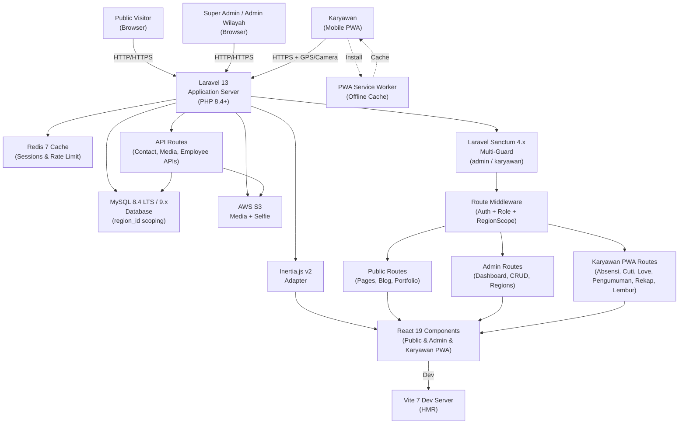
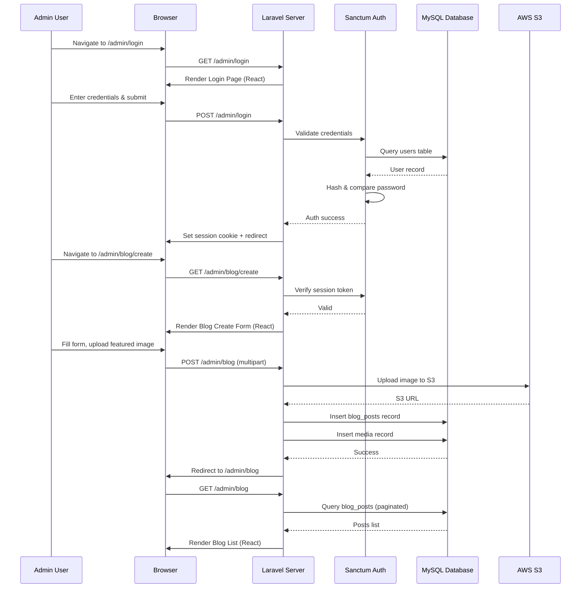
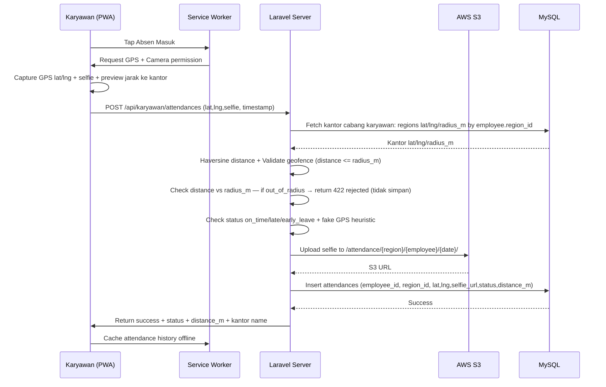
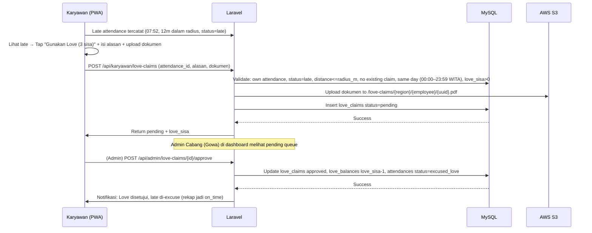
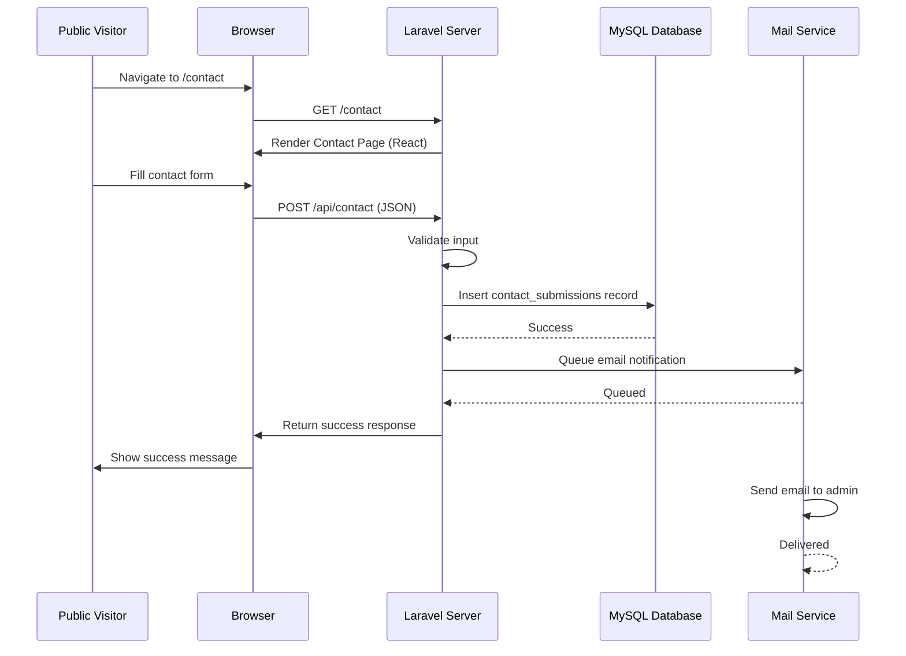

# ARCHITECTURE.md: BBWS Pompengan Jeneberang

## System Overview

BBWS Pompengan Jeneberang — **BBWS Pompengan Jeneberang** is a monolithic Laravel 13 application (PHP 8.4+) with a React 19 frontend via Inertia.js v2. Pusat di **Makassar**, cabang di **Kabupaten/Kota se-Sulsel** (24 wilayah). Each Kantor Cabang has **lokasi kantor (lat/lng via map picker) + radius absen (meter)** di-input admin untuk geofence validasi absensi GPS+selfie karyawan cabangnya. Architecture SSR + Inertia reactive, no separate API. Styling Tailwind v4, Vite 7, assets (media, selfie) on AWS S3, MySQL 8.4 LTS / 9.x region-scoped per kantor cabang, VPS Ubuntu 24.04 LTS. Roles: Super Admin Pusat (Makassar, CRUD all kantor + lokasi/radius, atur Love max & jam global), Admin Wilayah/Cabang (edit lokasi/radius kantornya sendiri, approve Love 1 level, write own region), Karyawan (NIK login, own-data-only, absensi cek jarak ke kantor cabangnya — di luar radius ditolak, Love 4/bulan reset, ajukan dokumen untuk excuse late dalam radius, PWA).

## High-Level Architecture Diagram

## Component Breakdown

### Laravel 13 Application Server (PHP 8.4+)

The core backend application handles all business logic, routing, and data persistence. It serves as the single source of truth for public website, regional admin, and karyawan PWA. Requires PHP 8.4+, leverages Laravel 13's slimmer skeleton, improved Eloquent and native Vite 7 integration. Multi-tenant per region via `region_id`. Key responsibilities include:

- **Request Routing:** Directs requests to public / admin / karyawan PWA controllers with role & region middleware. Includes scheduled job `love:reset-monthly` (1st 00:00 WITA).
- **Authentication & Authorization:** Multi-guard Sanctum 4.x (`admin` guard via email, `karyawan` guard via NIK) + RBAC (Super Admin, Admin Wilayah, Karyawan) + region scope policies.
- **Data Validation:** Validates all inputs including NIK/NIP, GPS geofence, selfie image, cuti dates, love claim alasan/dokumen, love window hari yang sama, love_sisa >0, dalam radius.
- **Database Queries:** Optimized eager loading, region-scoped queries, query caching per region.
- **File Operations:** Handles uploads to S3: media, absensi selfies (`/attendance/{region}/{employee}/{date}` validated against kantor's lat/lng/radius_m — di luar radius ditolak), love dokumen (`/love-claims/{region}/{employee}/{uuid}.pdf`).
- **Geofence Service:** Central service `GeofenceService::isWithinRadius(karyawanLat, karyawanLng, kantorLat, kantorLng, radius_m)` + Haversine distance calc, used by AttendanceController.
- **PWA Support:** Serves `manifest.json` + `service-worker.js`, VAPID keys for push, offline queue sync for absensi.

### Inertia.js v2 Adapter

Inertia.js v2 bridges Laravel 13 and React 19, enabling server-side routing with client-side reactivity. It eliminates the need for a separate REST API by passing data directly from Laravel controllers to React components as props.

- **Server-Side Rendering:** Renders React 19 components on the server for the initial page load, improving SEO and performance (supports React Server Components patterns).
- **Client-Side Navigation:** Enables smooth, SPA-like navigation with prefetching, deferred props, and automatic poll optimization (new in v2).
- **Props Serialization:** Automatically serializes Laravel data (models, arrays) into JSON props for React components.

### React 19 Components (Public & Admin & Karyawan PWA)

React 19 components are organized into three sections, all using Tailwind CSS v4 and React 19 features (Actions, useOptimistic).

- **Public Components:** Homepage, About, Services, Portfolio, Team, Blog, Testimonials, Contact Form, detail pages.
- **Admin Components:** Dashboard (role-scoped + love stats), Regions CRUD (Super Admin), Employee management (region-scoped), Attendance/Leave/Love Claims (1 level Admin Cabang approve)/Announcement management, media library, SEO editor, Global Settings (jam kerja + love_max).
- **Karyawan PWA Components (Mobile-first, 320px+):** Login (NIK+password), Bottom nav, Profile view/edit, Absensi (GPS+camera capture + geofence distance UI — di luar radius ditolak 422, tombol terkunci), Love (4 dot gold #FCB833, sisa 3/4, ajukan dokumen pakai Love untuk late dalam radius, history), Cuti form & status timeline (berjenjang), Pengumuman inbox (read/unread), Rekap Kalender, Lembur/Dinas Luar, Offline banner + queue indicator. PWA install prompt + service worker cache.
- **Shared Components:** Navigation, footer, modals, form inputs, pagination, loading skeletons, permission gates.

### MySQL 8.4 LTS / 9.x Database

Stores all application data with a relational schema optimized for the corporate profile use case. MySQL 8.4 LTS is the recommended production target (long-term support); MySQL 9.x innovation release also supported by Laravel 13.

**Core Tables (Public + Admin):**
- `users` — Admin accounts (Super Admin Makassar + Admin Wilayah/Cabang) with `role` + `region_id` (nullable for Super Admin), hashed password.
- `regions` — Kantor BBWS PJ (Pusat Makassar + Cabang Kab/Kota se-Sulsel, 24 wilayah) — `name, slug, kantor_name, tipe (pusat/cabang), lat, lng, radius_m (50–1000m, input admin via map picker), address, is_active` + geofence config per kantor.
- `pages` — Static pages with meta tags.
- `page_versions` — Historical versions for rollback.
- `services`, `projects`, `team_members`, `blog_posts`, `blog_categories`, `blog_tags`, `testimonials`, `contact_submissions`, `media`, `settings` — as before.

**Karyawan/HR Tables (Region-Scoped):**
- `employees` — Karyawan Lengkap HR (NIK UK, NIP UK, name, golongan, jabatan, unit_kerja, status, region_id FK, foto S3, kontak, dokumen) + auth password.
- `attendances` — Absensi (employee_id, region_id, type in/out, timestamp, lat, lng, selfie_url S3, status on_time/late/early_leave, distance_m, device_info — tidak ada out_of_range, di luar radius ditolak 422).
- `leave_requests` — Cuti berjenjang (employee_id, region_id, jenis, tgl mulai/selesai, alasan, dokumen S3, status enum pending/approved_level1/approved_level2/approved/rejected, approved_by/at per level).
- `announcements` — Pengumuman (title, content HTML, attachment S3, scope global/region, region_id nullable, published_at, is_pinned, created_by).
- `love_balances` — Love per karyawan per bulan (employee_id, period YYYY-MM, love_sisa, love_max, reset_at) — reset 1st 00:00 WITA, fleksibel max.
- `love_claims` — Love Claim (employee_id, attendance_id UK, region_id, alasan, dokumen_url S3, status pending/approved/rejected, reviewed_by/at) — 1 level Admin Cabang, hari yang sama, hanya dalam radius.
- `announcement_reads` — Pivot (announcement_id, employee_id, read_at) for read/unread.

### AWS S3 Media Storage

Cloud-based file storage for all company media assets (images, videos, documents). Provides high availability, durability, and scalability.

- **Bucket Configuration:** Versioning enabled for data recovery; lifecycle policies to archive old versions; public read access for media served to visitors.
- **IAM Policy:** Restrictive permissions for the application user (upload, delete, list only within the application's designated folder).
- **CDN Integration:** Optional CloudFront distribution for faster global asset delivery.

### Redis 7 Cache (Optional)

In-memory cache layer (Redis 7+) for reducing database load and improving response times.

- **Query Caching:** Cache frequently accessed data (settings, service listings, team members).
- **Session Storage:** Optional session driver for distributed deployments.
- **Rate Limiting:** Stores rate limit counters for login and contact form endpoints.

### Laravel Sanctum 4.x & Multi-Guard Session Authentication

Multi-guard auth for 3 roles, all session-based via Sanctum.

- **Guards:** `admin` (users table, email) for Super Admin & Admin Wilayah; `karyawan` (employees table, NIK) for employees. Separate session cookies & CSRF handling.
- **Session Tokens:** HTTP-only cookies, Sanctum 4.x. Login validates NIK/email + bcrypt password.
- **CSRF Protection:** Built-in middleware for all state-changing requests.
- **Login Endpoints:** `POST /admin/login` (admin guard), `POST /karyawan/login` (karyawan guard, NIK). Rate-limited 5/15min per IP + per NIK.
- **Logout:** Invalidates session per guard.

### Route Middleware & Guards (RBAC + RegionScope)

Middleware enforces auth + role + region isolation.

- **Auth Guards:** `auth:admin` for admin routes, `auth:karyawan` for PWA routes.
- **Role Middleware:** `role:super_admin` vs `role:admin_wilayah` vs `role:karyawan` — gates dashboard access.
- **RegionScope Middleware:** For Admin Wilayah, injects `region_id` from session and scopes all writes: `where region_id = auth()->user()->region_id`. Read allows all but UI marks other regions "Read Only". Super Admin bypasses scope.
- **Own-Data Policy:** Karyawan policies enforce `employee_id == auth()->id()` for profile/attendance/leave/love/announcement reads. Love claim hanya untuk own attendance late dalam radius.
- **Rate Limiting:** Login (per guard) + contact form + absensi (prevent spam) throttled via Redis.
- **HTTPS Enforcement:** Redirect all HTTP to HTTPS. PWA requires secure context for GPS/camera.

## Critical Flow Sequence Diagrams

### Admin Login & Content Update Flow

### Karyawan Absensi GPS + Selfie Flow (PWA, Validasi Kantor Cabang)

### Love Claim Flow (4 Hati — Dalam Radius, 1 Level Admin Cabang)

### Public Contact Form Submission Flow

## Deployment Strategy

### Application Server (VPS)

The Laravel application is deployed on a VPS (Linode, DigitalOcean, or AWS EC2) running Ubuntu 24.04 LTS.

- **Web Server:** Nginx configured as a reverse proxy to the Laravel application.
- **PHP Runtime:** PHP 8.4+ with FPM (FastCGI Process Manager) for handling requests.
- **Node Runtime:** Node.js 22 LTS for Vite 7 builds.
- **Process Manager:** Supervisor manages Laravel queue workers for asynchronous tasks (email sending, media processing).
- **SSL/TLS:** Let's Encrypt certificate for HTTPS enforcement.
- **Deployment:** Git-based deployment via GitHub Actions or manual SSH deployment.

### Database Server

MySQL 8.4 LTS / 9.x runs on the same VPS or a managed database service (AWS RDS, DigitalOcean Managed Databases).

- **Backups:** Automated daily backups with 30-day retention.
- **Replication:** Optional read replicas for high-traffic scenarios.
- **Monitoring:** Query performance monitoring and slow query logging.

### Media Storage (AWS S3)

All media assets are stored in a dedicated S3 bucket with the following configuration:

- **Bucket Name:** `profilkorp-media` (or similar).
- **Region:** Closest to the primary user base for latency optimization.
- **Versioning:** Enabled for data recovery.
- **Public Access:** Configured to allow public read access for media served to visitors.
- **CDN:** Optional CloudFront distribution for global asset delivery.

### Caching Layer (Redis)

Redis is deployed on the VPS or as a managed service (AWS ElastiCache, DigitalOcean Managed Redis).

- **Configuration:** Configured as the session driver and cache store in Laravel.
- **Memory:** Allocated based on expected cache size (typically 512MB–2GB for this application).
- **Persistence:** Optional RDB snapshots for durability.

### DNS & Domain

The domain is registered with a DNS provider and configured to point to the VPS's public IP address.

- **DNS Records:** A record for the domain, CNAME for `www` subdomain.
- **SSL Certificate:** Managed via Let's Encrypt with auto-renewal.

### Monitoring & Logging

- **Application Logs:** Stored in `/storage/logs` with daily rotation.
- **Server Monitoring:** CPU, memory, disk usage monitored via VPS provider dashboard or third-party tools (e.g., New Relic, Datadog).
- **Error Tracking:** Optional integration with Sentry for real-time error notifications.
- **Analytics:** Google Analytics integration for visitor tracking and behavior analysis.

## Data Flow Architecture

### Public Page Request Flow

1. Visitor requests a public page (e.g., `/services`).
2. Nginx routes the request to the Laravel application.
3. Laravel router matches the route to a controller action.
4. Controller queries the database for page content (with caching if available).
5. Controller passes data to an Inertia response, which renders the React component.
6. React component receives props and renders HTML with Tailwind CSS styling.
7. Inertia serializes the response as JSON for client-side hydration.
8. Browser receives the HTML and JavaScript, hydrates the React component.
9. Visitor sees the fully rendered page with interactive elements.

### Admin Wilayah Employee Input Flow (Region-Scoped)

1. Admin Wilayah/Cabang logs in via `ADMIN_PATH` with email+password.
2. Sanctum validates, creates session with `region_id` (kantor cabangnya).
3. Admin navigates to "Kelola Karyawan" → list filtered to own cabang, toggle "Lihat cabang lain (read-only)" available.
4. Clicks "Tambah Karyawan" → form Lengkap HR (NIK, NIP, golongan, jabatan, unit, status, foto, kontak).
5. Submits → middleware injects `region_id` automatically, validates NIK unique, uploads foto S3, insert `employees` with `region_id = session.region_id`.

### Kantor Location & Radius Input Flow (Geofence Config)

1. Super Admin (Makassar) navigates "Kelola Kantor/Cabang" → list 24 kantor (Pusat Makassar + 23 cabang se-Sulsel).
2. For each kantor: form input **lokasi kantor** (lat, lng via map picker — Leaflet/Mapbox) + **radius absen (meter, 50–1000, default 200)** + alamat + kantor_name + tipe pusat/cabang.
3. Admin Cabang navigates "Kantor Saya" → can **edit lokasi & radius kantornya sendiri** (own region) + view other kantor read-only.
4. On save → validates lat/lng range, radius 50–1000, updates `regions` table. Invalidate geofence cache.
5. Karyawan absensi later validates against this kantor's lat/lng/radius_m — shows distance_m + "Dalam radius" / "Di luar radius" badge.

### Admin Content Update Flow

1. Admin logs in via `ADMIN_PATH` with credentials.
2. Laravel Sanctum validates credentials and creates a session token.
3. Admin navigates to the admin dashboard.
4. Middleware verifies session + role + region scope; if valid, dashboard rendered.
5. Admin clicks "Edit" on a page or post.
6. React form component is rendered with existing content pre-filled.
7. Admin modifies content and submits the form.
8. Laravel controller validates the input and updates the database record.
9. If media is uploaded, it is sent to AWS S3 and the S3 URL is stored in the database.
10. A success response is returned to the browser.
11. React component updates the UI to reflect the changes.

## Security Architecture

### Authentication & Authorization (RBAC + Region Isolation)

- **Three Roles:** Super Admin Pusat (all access, manages regions & admin wilayah), Admin Wilayah (CRUD own region employees, read all), Karyawan (own-data-only, NIK login, PWA).
- **Multi-Guard:** `admin` guard (email) and `karyawan` guard (NIK) via Sanctum 4.x, separate session handling.
- **Credentials:** Bcrypt hash in `users` (admin) and `employees` (karyawan password). NIK is UK, 16 digits.
- **Session-Based Auth:** HTTP-only cookies, CSRF token required.
- **Region Isolation:** Policies + global query scopes enforce `region_id` on all region-scoped models. Admin Wilayah writes blocked if `region_id` mismatch (403). Karyawan blocked from other employee_id.
- **Rate Limiting:** Admin login, karyawan NIK login (5/15min per IP + per NIK), contact form, absensi spam throttled.

### Data Protection

- **HTTPS Enforcement:** All traffic is encrypted in transit via TLS 1.2+.
- **Input Validation:** All user inputs are validated server-side using Laravel's validation rules.
- **SQL Injection Prevention:** Parameterized queries via Laravel's query builder prevent SQL injection.
- **XSS Prevention:** React automatically escapes content; WYSIWYG editor output is sanitized server-side.
- **File Upload Security:** Uploaded files are validated for type and size; stored outside the web root on S3.

### AWS S3 Security

- **IAM Policy:** Restrictive permissions limit the application's access to only the designated bucket and folder.
- **Bucket Policy:** Public read access is configured only for media files; all other operations require authentication.
- **Versioning:** Enabled to recover from accidental deletions or malicious overwrites.
- **Encryption:** Server-side encryption (AES-256) is enabled for all objects.

## Performance Optimization

### Caching Strategy

- **Page Caching:** Static pages (About, Services overview) are cached for 1 hour.
- **Query Caching:** Frequently accessed data (settings, team members) are cached for 24 hours.
- **Asset Caching:** CSS, JavaScript, and images are cached with long expiration headers (1 year).
- **Cache Invalidation:** Cache is automatically invalidated when content is updated via the admin panel.

### Database Optimization

- **Eager Loading:** Related data is loaded in a single query using Laravel's `with()` method to prevent N+1 queries.
- **Indexing:** Indexes are created on frequently queried columns (slug, status, created_at).
- **Query Optimization:** Slow queries are identified and optimized using EXPLAIN analysis.

### Frontend Optimization

- **Code Splitting:** React components are code-split by route to reduce initial bundle size.
- **Lazy Loading:** Images are lazy-loaded using the `loading="lazy"` attribute.
- **Minification:** CSS and JavaScript are minified in production via Vite 7.
- **Compression:** Gzip compression is enabled on the web server for all text-based responses.

## Scalability Considerations

### Horizontal Scaling

- **Stateless Application:** The Laravel application is stateless, allowing multiple instances to run behind a load balancer.
- **Session Storage:** Sessions are stored in Redis (not file-based), enabling session sharing across instances.
- **Database Connection Pooling:** Connection pooling is configured to efficiently manage database connections across multiple application instances.

### Vertical Scaling

- **VPS Upgrade:** If traffic increases, the VPS can be upgraded to a larger instance size with more CPU and memory.
- **Database Optimization:** Query optimization and indexing can improve performance without additional hardware.

### Load Balancing

- **Nginx Load Balancer:** Multiple application instances can be deployed behind an Nginx load balancer for traffic distribution.
- **CDN:** CloudFront can be used to cache static assets and reduce load on the origin server.

## Development & Build Pipeline

### Local Development

- **Laravel Vite 7:** Vite 7 is configured for hot module replacement (HMR) during development, enabling instant feedback on code changes (requires Node 22+).
- **Database Seeding:** Laravel seeders populate the database with sample data for testing.
- **Artisan Commands:** Custom Artisan commands are available for common tasks (cache clearing, database migrations).

### Production Build

- **Vite Build:** `npm run build` compiles React 19 components and Tailwind v4 CSS into optimized production bundles via Vite 7 (Rolldown).
- **Asset Versioning:** Vite automatically versions assets to prevent caching issues.
- **Minification & Optimization:** CSS and JavaScript are minified; unused CSS is purged via Tailwind v4's native engine (no PurgeCSS needed).

### Deployment

- **Git-Based Deployment:** Code is pushed to a Git repository (GitHub, GitLab); deployment is triggered via webhook or manual SSH.
- **Database Migrations:** Laravel migrations are run automatically during deployment to update the schema.
- **Cache Clearing:** Application cache is cleared after deployment to ensure fresh data.