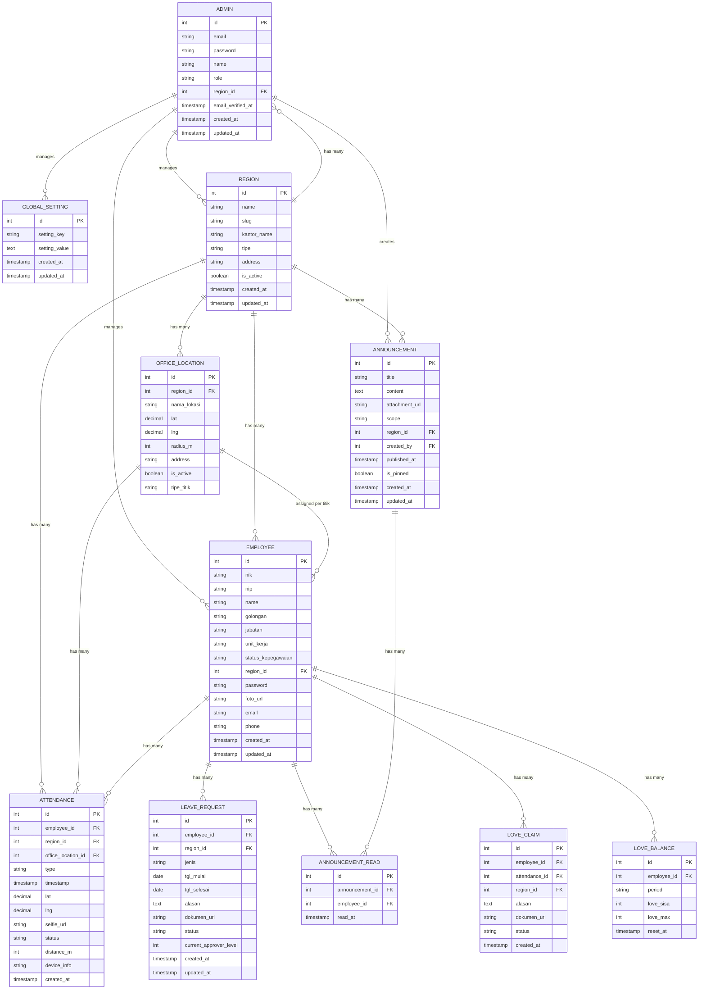

# DATABASE.md: BBWS Pompengan Jeneberang

## Entity Relationship Diagram



## Table Definitions

### ADMIN — Opsi B: Pisah Guard super_admin vs wilayah (SUPER_ADMIN_PATH vs WILAYAH_PATH)
Stores administrator accounts with role & region scoping (Super Admin vs Admin Wilayah). **Opsi B pisah URL**: `super_admin` → `SUPER_ADMIN_PATH` (dev `/super-admin`, `auth:super_admin`, `region_id=NULL`, unscoped) vs `admin_wilayah` → `WILAYAH_PATH` (dev `/wilayah`, `auth:wilayah`, `region_id=FK`, write own region) — tidak cross-login; legacy `admin` guard alias ke `super_admin`. Tiga URL obfuscated `SUPER_ADMIN_PATH` / `WILAYAH_PATH` / `KARYAWAN_PATH` via env.

|:---|:---|:---|:---|

### REGION
Stores Kantor BBWS PJ per wilayah — **24 Wilayah** (Kota Makassar pusat + 23 Wilayah). Tiap wilayah punya **N titik proyek** (`office_locations` / `project_sites`), masing-masing dengan radius fleksibel — di-input admin.

|:---|:---|:---|:---|

> **Catatan:** `lat/lng/radius_m` **tidak lagi di `regions`** — dipindah ke **per titik proyek** (`office_locations`). Region hanya sebagai wadah N titik.

### OFFICE_LOCATION / PROJECT_SITE — N Titik Proyek per Wilayah (1 Karyawan = 1 Titik + Dedicated Page)
Stores **N titik proyek per wilayah** — contoh **Bendungan A, Jembatan B, Embung C, Irigasi D** — fleksibel radius per titik, di-input Super Admin / Admin Wilayah (own region) via Leaflet map picker + radius slider (draggable marker+circle). **1 karyawan = 1 titik (`office_location_id`)** — absen valid hanya `distance <= radius_m(titik assigned)` via `GeofenceService::isWithinAssignedSite`; tanpa titik (`NULL`) 422 tidak bisa absen; di luar assigned 422 ditolak (bukan `isWithinAnySite`).

|:---|:---|:---|:---|

**Aturan:** Minimal 1 titik per wilayah (validasi saat create wilayah); **maks praktis N≤20**, **hapus titik terakhir diblokir 422**. Tiap titik punya dedicated page `GET /regions/{region}/sites/{site}` (`Admin/SiteDetail`) dengan Leaflet draggable+circle + anggota per titik saja. Admin Wilayah tambah `Jembatan B` di wilayahnya yang sudah punya `Bendungan A` via `POST /regions/{regionId}/office-locations` (own region). **Geofence: `GeofenceService::isWithinAssignedSite(employeeLat,Lng, assigned OfficeLocation) → within = dist <= radius_m(assigned)`** — bukan `isWithinAnySite`; `employee.office_location_id IS NULL` → 422 belum di-assign titik (tidak bisa absen/Love); di luar assigned 422 ditolak.

**Catatan domain Sulsel:** Seed awal 24 wilayah: Kantor Pusat (Kota Makassar) + 21 Kabupaten (Bantaeng, Barru, Bone, Bulukumba, Enrekang, Gowa, Jeneponto, Kepulauan Selayar, Luwu, Luwu Timur, Luwu Utara, Maros, Pangkajene dan Kepulauan, Pinrang, Sinjai, Sidenreng Rappang (Sidrap), Soppeng, Takalar, Tana Toraja, Toraja Utara, Wajo) + 2 Kota selain Makassar (Parepare, Palopo) — total 24. Seeder: `database/seeders/RegionSeeder.php` + `OfficeLocationSeeder.php` (tiap wilayah seed 1–2 titik contoh seperti Bendungan/Jembatan). Super Admin CRUD semua wilayah + N titik; **Admin Wilayah dapat tambah/edit/hapus N titik proyek di wilayahnya sendiri** (contoh tambah Bendungan A lalu Jembatan B) dan view wilayah lain read-only.

### EMPLOYEE — 1 Karyawan = 1 Titik Proyek (per titik saja)
Stores karyawan Lengkap HR data, linked to region + **assigned 1 titik proyek saja** (`office_location_id`), auth via email+password. Own-data-only + titik-assigned policy.

|:---|:---|:---|---|

> **Aturan penempatan:** 1 karyawan = 1 titik (`office_location_id`). Mock PWA `MOCK_KARYAWAN_ID=1` Andi Saputra assigned site 201 Bendungan Bili-Bili — Kab. Gowa 200m. Daftar "Tambah Anggota" di halaman titik hanya menampilkan karyawan `region_id` sama **dan** `office_location_id IS NULL` (kandidatTambah); tanpa titik tidak bisa absen 422 + warning PWA. Pindah titik via aksi `Pindah` di halaman titik. Absen/Love valid hanya jika `distance <= radius_m(assigned site)` via `isWithinAssignedSite` **dan** `employee.office_location_id == attendance.office_location_id`.

### ATTENDANCE — Tercatat Hanya ke Titik Assigned (1 Karyawan = 1 Titik)
Stores GPS+selfie absensi records, region-scoped + linked to **titik proyek assigned karyawan** (`office_location_id == employee.office_location_id`). Tanpa titik atau di luar assigned ditolak 422 tidak tercatat.

|:---|:---|:---|:---|

### LEAVE_REQUEST
Stores cuti berjenjang requests.

|:---|:---|:---|:---|

### ANNOUNCEMENT
Stores pengumuman broadcast or wilayah-targeted.

|:---|:---|:---|:---|

### ANNOUNCEMENT_READ
Pivot for read/unread status per karyawan.

|:---|:---|:---|:---|

### LOVE_BALANCE — Reset 1st 00:00 WITA, Dalam Radius Titik Assigned (1=1)
Stores per-employee per-month Love balance, reset bulanan (1st 00:00 WITA), fleksibel total love (`global_settings.love_max_default` 1–10 default 4), berlaku sebulan (hari beda boleh) — **claim hanya jika `distance <= radius_m(titik assigned)` (1 karyawan=1 titik)**, tanpa titik tidak bisa claim.

|:---|:---|:---|:---|

### LOVE_CLAIM — Dalam Radius Titik Assigned Saja (1 Karyawan = 1 Titik)
Stores Love Claim for late **dalam radius titik assigned** (`distance <= radius_m(assigned)` via `isWithinAssignedSite`), 1 level Admin Wilayah approval, bulan yang sama (hari beda boleh). Tanpa titik (`employee.office_location_id IS NULL`) tidak bisa claim; di luar assigned ditolak.

|:---|:---|:---|:---|

### GLOBAL_SETTING
Stores site-wide configuration settings (company name, logo, contact info, social links, **and global jam kerja**).

|:---|:---|:---|:---|

**Global Jam Kerja (WITA):** Keys `jam_masuk` (TIME 07:30 default), `jam_pulang` (16:00), `toleransi_late_menit` (15), `hari_kerja` (JSON array), `timezone` (Asia/Makassar). Only Super Admin Pusat can edit; cached Redis `settings:jam_kerja`. Used server-side to compute attendance status: `check-in <= jam_masuk+toleransi → on_time` else `late`; `check-out < jam_pulang → early_leave`; absensi di non-hari_kerja flagged/rejected.

### ATTENDANCE_SETTINGS (Alternative explicit table for jam kerja global)
If prefer explicit table over global_settings keys, use:

|:---|:---|:---|:---|

## Prisma Schema

```prisma
// This is your Prisma schema file,
// learn more about it in the docs: https://pris.ly/d/prisma-schema

generator client {
  provider = "prisma-client-js"
}

datasource db {
  provider = "mysql"
  url      = env("DATABASE_URL") // MySQL 8.4 LTS / 9.x - Laravel 13 + PHP 8.4+
}

model Admin {
  id                Int       @id @default(autoincrement())
  email             String    @unique
  password          String
  name              String
  role              String    @default("admin_wilayah") // super_admin | admin_wilayah
  regionId          Int?      @map("region_id")
  emailVerifiedAt   DateTime? @map("email_verified_at")
  createdAt         DateTime  @default(now()) @map("created_at")
  updatedAt         DateTime  @updatedAt @map("updated_at")

  region            Region?   @relation(fields: [regionId], references: [id], onDelete: SetNull)
  contentVersions   ContentVersion[]

  @@map("admin")
}

model Region {
  id                Int       @id @default(autoincrement())
  name              String    // e.g., Kabupaten Gowa
  slug              String    @unique // gowa
  kantorName        String    @map("kantor_name") // Kantor BBWS PJ Kab. Gowa — wadah N titik
  tipe              String    @default("cabang") // pusat | cabang — pusat hanya Makassar
  address           String?   @db.Text // alamat kantor induk
  isActive          Boolean   @default(true) @map("is_active")
  createdAt         DateTime  @default(now()) @map("created_at")
  updatedAt         DateTime  @updatedAt @map("updated_at")

  admins            Admin[]
  employees         Employee[]
  attendances       Attendance[]
  announcements     Announcement[]
  loveClaims        LoveClaim[]
  officeLocations   OfficeLocation[] // N titik proyek: Bendungan A, Jembatan B, ...

  @@map("region")
}

model Employee {
  id                Int       @id @default(autoincrement())
  nik               String    @unique // 16 digits
  nip               String?   @unique
  name              String
  golongan          String?
  jabatan           String
  unitKerja         String    @map("unit_kerja")
  statusKepegawaian String    @map("status_kepegawaian") // PNS | PPPK | Kontrak | Honorer
  regionId          Int       @map("region_id")
  officeLocationId  Int?      @map("office_location_id") // 1 karyawan = 1 titik; null = belum assign
  password          String
  fotoUrl           String?   @map("foto_url")
  email             String?
  phone             String?
  createdAt         DateTime  @default(now()) @map("created_at")
  updatedAt         DateTime  @updatedAt @map("updated_at")

  region            Region    @relation(fields: [regionId], references: [id], onDelete: Cascade)
  officeLocation    OfficeLocation? @relation(fields: [officeLocationId], references: [id], onDelete: SetNull)
  attendances       Attendance[]
  leaveRequests     LeaveRequest[]
  announcementReads AnnouncementRead[]
  loveBalances      LoveBalance[]
  loveClaims        LoveClaim[]

  @@map("employee")
}

model Attendance {
  id                Int       @id @default(autoincrement())
  employeeId        Int       @map("employee_id")
  regionId          Int       @map("region_id")
  officeLocationId  Int?      @map("office_location_id") // titik terdekat saat absen
  type              String    // in | out
  timestamp         DateTime
  lat               Decimal   @db.Decimal(10,8)
  lng               Decimal   @db.Decimal(11,8)
  selfieUrl         String    @map("selfie_url")
  status            String    // on_time | late | early_leave — di luar semua titik ditolak 422
  distanceM         Int?      @map("distance_m")
  deviceInfo        String?   @map("device_info")
  createdAt         DateTime  @default(now()) @map("created_at")

  employee          Employee  @relation(fields: [employeeId], references: [id], onDelete: Cascade)
  region            Region    @relation(fields: [regionId], references: [id], onDelete: Cascade)
  officeLocation    OfficeLocation? @relation(fields: [officeLocationId], references: [id], onDelete: SetNull)
  loveClaim         LoveClaim?

  @@map("attendance")
}

model LeaveRequest {
  id                    Int       @id @default(autoincrement())
  employeeId            Int       @map("employee_id")
  regionId              Int       @map("region_id")
  jenis                 String    // tahunan | sakit | besar | lainnya
  tglMulai              DateTime  @map("tgl_mulai") @db.Date
  tglSelesai            DateTime  @map("tgl_selesai") @db.Date
  alasan                String    @db.Text
  dokumenUrl            String?   @map("dokumen_url")
  status                String    @default("pending") // pending | approved_level1 | approved_level2 | approved | rejected
  currentApproverLevel  Int       @default(1) @map("current_approver_level")
  createdAt             DateTime  @default(now()) @map("created_at")
  updatedAt             DateTime  @updatedAt @map("updated_at")

  employee              Employee  @relation(fields: [employeeId], references: [id], onDelete: Cascade)
  region                Region    @relation(fields: [regionId], references: [id], onDelete: Cascade)

  @@map("leave_request")
}

model Announcement {
  id                Int       @id @default(autoincrement())
  title             String
  content           String    @db.LongText
  attachmentUrl     String?   @map("attachment_url")
  scope             String    // global | region
  regionId          Int?      @map("region_id")
  createdBy         Int       @map("created_by")
  publishedAt       DateTime? @map("published_at")
  isPinned          Boolean   @default(false) @map("is_pinned")
  createdAt         DateTime  @default(now()) @map("created_at")
  updatedAt         DateTime  @updatedAt @map("updated_at")

  region            Region?   @relation(fields: [regionId], references: [id], onDelete: Cascade)
  reads             AnnouncementRead[]

  @@map("announcement")
}

model AnnouncementRead {
  id                Int       @id @default(autoincrement())
  announcementId    Int       @map("announcement_id")
  employeeId        Int       @map("employee_id")
  readAt            DateTime  @map("read_at")

  announcement      Announcement @relation(fields: [announcementId], references: [id], onDelete: Cascade)
  employee          Employee  @relation(fields: [employeeId], references: [id], onDelete: Cascade)

  @@unique([announcementId, employeeId])
  @@map("announcement_read")
}

model OfficeLocation {
  id                Int       @id @default(autoincrement())
  regionId          Int       @map("region_id")
  namaLokasi        String    @map("nama_lokasi") // Bendungan A, Jembatan B, ...
  lat               Decimal   @db.Decimal(10,8)
  lng               Decimal   @db.Decimal(11,8)
  radiusM           Int       @default(200) @map("radius_m") // 50–1000 per titik
  address           String?   @db.Text
  isActive          Boolean   @default(true) @map("is_active")
  createdAt         DateTime  @default(now()) @map("created_at")
  updatedAt         DateTime  @updatedAt @map("updated_at")

  region            Region    @relation(fields: [regionId], references: [id], onDelete: Cascade)
  attendances       Attendance[]
  assignedEmployees Employee[]

  @@map("office_location")
}

model LoveBalance {
  id                Int       @id @default(autoincrement())
  employeeId        Int       @map("employee_id")
  period            String    // YYYY-MM
  loveSisa          Int       @default(4) @map("love_sisa")
  loveMax           Int       @default(4) @map("love_max")
  resetAt           DateTime  @map("reset_at")
  createdAt         DateTime  @default(now()) @map("created_at")
  updatedAt         DateTime  @updatedAt @map("updated_at")

  employee          Employee  @relation(fields: [employeeId], references: [id], onDelete: Cascade)

  @@unique([employeeId, period])
  @@map("love_balance")
}

model LoveClaim {
  id                Int       @id @default(autoincrement())
  employeeId        Int       @map("employee_id")
  attendanceId      Int       @unique @map("attendance_id")
  regionId          Int       @map("region_id")
  alasan            String    @db.Text
  dokumenUrl        String?   @map("dokumen_url")
  status            String    @default("pending") // pending | approved | rejected
  reviewedBy        Int?      @map("reviewed_by")
  reviewedAt        DateTime? @map("reviewed_at")
  createdAt         DateTime  @default(now()) @map("created_at")
  updatedAt         DateTime  @updatedAt @map("updated_at")

  employee          Employee  @relation(fields: [employeeId], references: [id], onDelete: Cascade)
  attendance        Attendance @relation(fields: [attendanceId], references: [id], onDelete: Cascade)
  region            Region    @relation(fields: [regionId], references: [id], onDelete: Cascade)

  @@map("love_claim")
}

model GlobalSetting {
  id                Int       @id @default(autoincrement())
  settingKey        String    @unique @map("setting_key") // company_name, jam_masuk, jam_pulang, toleransi_late_menit, hari_kerja, timezone
  settingValue      String    @db.Text @map("setting_value") // jam_masuk, jam_pulang, toleransi, hari_kerja, love_max_default
  createdAt         DateTime  @default(now()) @map("created_at")
  updatedAt         DateTime  @updatedAt @map("updated_at")

  @@map("global_setting")
}

model AttendanceSetting {
  id                  Int       @id @default(autoincrement())
  jamMasuk            String    @default("07:30") @map("jam_masuk") // TIME
  jamPulang           String    @default("16:00") @map("jam_pulang")
  toleransiLateMenit  Int       @default(15) @map("toleransi_late_menit")
  hariKerja           Json      @default("[\"Senin\",\"Selasa\",\"Rabu\",\"Kamis\",\"Jumat\"]") @map("hari_kerja")
  timezone            String    @default("Asia/Makassar")
  loveMaxDefault      Int       @default(4) @map("love_max_default") // 1-10, global Love total
  updatedBy           Int?      @map("updated_by")
  createdAt           DateTime  @default(now()) @map("created_at")
  updatedAt           DateTime  @updatedAt @map("updated_at")

  @@map("attendance_setting")
}
```

## Database Indexing Strategy

To optimize query performance, the following indexes are recommended beyond primary and foreign keys:

|:---|:---|:---|:---|

## Data Integrity & Constraints

- **Referential Integrity:** All foreign keys enforce CASCADE or RESTRICT delete policies to prevent orphaned records.
- **Unique Constraints:** Slugs are unique across their respective tables to ensure clean, predictable URLs.
- **Email Validation:** The ADMIN.email field must be validated as a valid email format at the application layer.
- **NIK Validation:** EMPLOYEE.nik must be 16 digits, unique, used for login; validated via regex + checksum if needed.
- **Region Scoping:** All region-scoped tables (employee, attendance, leave_request, announcement, love_balance, love_claim) enforce FK to regions; app layer adds `where region_id = auth region` for Admin Wilayah writes.
- **Own-Data-Only:** Karyawan policies enforce `employee_id == auth()->id()` at controller + policy layer; tests must cover cross-employee 403.
- **Enum Fields:** Status fields (blog_post.status, employee.status_kepegawaian, attendance.status, leave_request.status, announcement.scope) use ENUM to restrict values.
- **Timestamps:** All tables include created_at and updated_at timestamps for audit trails and sorting.
- **Unique Constraints:** (employee.nik), (employee.nip where not null), (love_balance employee_id+period), (love_claim attendance_id), (announcement_read composite) enforce business rules.

## Migration & Seeding

See ARCHITECTURE.md for migration strategy and seeding guidelines. Database migrations will be managed via Laravel 13's migration system (PHP 8.4+) with Prisma schema as the source of truth. Target MySQL 8.4 LTS / 9.x.

## Performance Considerations

- **Query Optimization:** Use eager loading (Prisma's `include`) to prevent N+1 queries when fetching related data (e.g., portfolio projects with images).
- **Pagination:** Implement cursor-based or offset-based pagination for large result sets (blog posts, portfolio projects).
- **Caching:** Cache frequently accessed data (global settings, published services, approved testimonials) using Redis to reduce database load.
- **Full-Text Search:** For blog post and portfolio project searches, consider adding MySQL FULLTEXT indexes on title and description fields.

## Security & Compliance

- **SQL Injection Prevention:** All queries must use parameterized statements via Prisma ORM.
- **Data Encryption:** Sensitive fields (admin password) are hashed using bcrypt. Consider encrypting S3 URLs if they contain sensitive metadata.
- **Access Control:** Database access is restricted to the Laravel application user with minimal required privileges (no DROP, ALTER on production). Region isolation is app-layer, not DB row-level security.
- **Audit Trail:** ContentVersion maintains page history; attendances/leave_requests/love_claims should log `created_by`/`approved_by` + timestamps for HR compliance.
- **PWA Offline Sync:** Attendances created offline must be queued client-side and validated server-side for geofence + duplicate prevention (unique per employee per day per type).